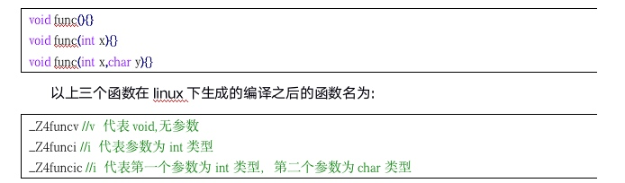

# c++概述
c++融合了3种不用的编程方式：
* c语言代表的过程性语言     
程序 = 数据结构 + 算法
* c++在c语言基础上添加的类代表的面向对象语言   
对象 = 数据结构+算法     
程序 = 对象 + 对象 + ...
* c++语言支持的泛型编程

# 1 ::作用域运算符

```cpp
int a = 10;
void func01(void) {
	int a = 20;
	cout << "a:" << a <<endl;  // std::cout std作用域
	// 访问被局部变量屏蔽的全局变量
	cout << "a:" << ::a << endl;  // ::前为空代表全局作用域
}
```

# 2 名字控制
## 2.1 c++命名空间:控制标识符的作用域，避免命名冲突

```cpp
// game1.h
#pragma once
#include <iostream>
using namespace std;
namespace kingGlory {
	void goAtk();
}
// game1.cpp
#include "game1.h"
void kingGlory::goAtk() {
	cout << "kingGlory goAtk" << endl;
}
// game2.h
#include <iostream>
using namespace std;
namespace LOL {
	void goAtk();
}
// game2.cpp
#include "game2.h"
void LOL::goAtk() {
	cout << "LOL goAtk" << endl;
}
// main.cpp
// 1.命名空间：控制标识符的作用域，避免命名冲突
void func02() {
	kingGlory::goAtk();
	LOL::goAtk();
}
// 2.命名空间中可以存放变量、结构体、函数、类...
namespace Test {
	int a = 2000;
	void func();
	struct Person {};
	class A {};
	// 3.命名空间嵌套命名空间
	namespace Test2 {
		int a;
	}
}
// 4.命名空间是开放的，可以随时添加新成员
namespace Test {
	int b = 100;
}
// 5.声明和实现可分离
void Test::func() {
	cout << "test func" << endl;
}

// 6.匿名命名空间内的标志符只能在本文件内访问
namespace {
	int m_a = 10000;
}
// 7.命名空间起别名
void func03() {
	namespace T = Test;  // namespace shortName = longName
	cout << T::a << endl;
}
```

## 2.2 using声明

```cpp
void func04() {
	using Test::a;
	// int a = 1;  // 二义性，相当于两个局部变量
	cout << a << endl;  // 可直接使用
}
```

## 2.3 using编译指令

```cpp
void func05() {
	int a = 1;  // 就近原则
	using namespace Test;
//	int a = 1;  // 就近原则
	// 相当于全局变量和局部变量
	cout << a << endl;  // 可直接使用
}
```

# 3 全局变量检测增强

```cpp
// 3 全局变量检测增强
int b;
//int b = 10;  // c可以，c++不行
```

# 4 函数检测增强
* 返回值检测
* 形参类型和个数检测

# 5 严格的类型转换

# 6 struct类型增强
* 可以放函数
* 创建变量时可以不加struct

```cpp
// 6 struct类型增强
struct Student {
	string name;
	int age;
	// 6.1 可以放函数
	void setAge(int num) {
		age = num;
	}
	void func(void) {
		age++;
	}
	void showStudent(void) {
		cout << name << " " << age << endl;
	}
};
void func06(void) {
	// 6.2 创建变量时不需要struct关键字
	Student Tom = { "Tom", 18 };
	Tom.showStudent();
	Tom.setAge(16);
	Tom.func();
	Tom.showStudent();
}
```

# 7 新增bool类型关键字
* 1字节 true flase
* 默认为0

```cpp
// 7 新增bool类型
void func07(void) {
	bool flag = 100;
	cout << flag << endl;  // 1
}
```

# 8 三目运算符功能增强
> Lvalue 与 Rvalue
> C语言中三目运算表达式返回值为右值（数值）
> C++中三目运算表达式返回值为左值（变量），可以赋值
> Location value ：内存可以寻址，可以赋值
> Read value ： 数值

* c语言中的实现
* 运算符优先级

```cpp
// 8 三目运算符功能增强
void func08(void) {
	int a = 100;
	int b = 200;
	// 运算符优先级
	int ret = a > b ? a : b = 3;  // b=3 ret=b
	int ret = (a > b ? a : b) = 3;  // ret = b =3
	cout << ret << endl;  // ret = b =3
//	// c中的实现
//	*(a>b?&a:&b) = 3
}
```
# 9 const增强
* const修饰的局部变量：符号表，以键值对的形式存放常量，可以当常量对待，间接修改的只是一块临时内存空间
* const在C++中默认内部链接属性，只能在本文件中使用，想提高作用域，需要加关键字extern，C语言默认外部链接属性，

```c
// C
// test.c
const int a = 1000;  // 默认前面有extern
// main.c
int main() {
    extern const int a;  // 外部链接  
}
```

```cpp
// test.c
extern const int a = 1000;  // const在C++中默认内部链接属性，只能在本文件中使用，想提高作用域，需要加关键字extern
// main.c
int main() {
    extern const int a;  
}
```

* 分配内存情况：
    * 对const修饰的局部变量取地址，分配临时内存空间
    * 使用变量初始化const修饰的局部变量，分配内存，可以间接修改    
    
    ```cpp
    int a = 100;
    const int MAX = a;
    const int *p = &MAX;
    *p = 200;
    ```
    
    * const修饰的自定义数据类型，分类内存

    ```cpp
    struct Student {
        string name;
        int age;
    };
    int main(void) {
        const Student P = {"person", 10};
        //	P.name = "person";
        //	P.age = 10;
    }
    ```
    
* 尽量用const代替define
因为define出的宏常量，没有作用域的限制，也没有数据类型

```cpp
#define MAX = 1024
void func(int a)
{
	cout << "func(int)调用" << endl;
}
void func(short a)
{
	cout << "func(short)调用" << endl;
}

void test01()
{
	//cout << MAX << endl;

	//提倡用const代替define
	const short m_A = 1024;

	//func(MAX);  // 分不清MAX是int还是short
	func(m_A);
}
```
# 10 引用
## 10.1 引用:给变量起别名

```cpp
// 10 引用:给变量起别名
void func10(void) {
	int a = 10;
	int &b = a;  // 引用必须初始化
	b = 100;
	cout << "a:" << a << endl;
	cout << "b:" << b << endl;
	int c = 20;
//	&b = c;  // 引用一旦初始化，就不可以引向别处
}
```

## 10.2 对数组的引用

```cpp
// 对数组的引用
void func11(void) {
	int arr[5] = { 1, 2, 3, 4, 5 };
	// 1.直接定义引用
	int (&arr1)[5] = arr;
	// 2.先定义数据类型，在定义引用
	typedef int(ARRAY_TYPE)[5];  // 数组数据类型
	ARRAY_TYPE &arr2 = arr;
	// 3.先定义数据引用类型，再定义引用
	typedef int(&ARRAY_REF_TYPE)[5];  // 数组引用数据类型
	ARRAY_REF_TYPE arr3 =arr;
	
	for (int i=0; i<5; i++) {
		cout << arr3[i] << endl;
	}
}
```

## 10.2 函数参数引用传递

```cpp
// 函数参数传递的三种方式
// 1.值传递
void valuePass(int a, int b) {
	int tmp = a;
	a = b;
	b = a;
}
// 2.地址传递
void addressPass(int *p_a, int *p_b) {
	int tmp = *p_a;
	*p_a = *p_b;
	*p_b = tmp;
}
// 3.引用传递
void referencePass(int &a, int &b) {
	int tmp = a;
	a = b;
	b = tmp;
}
void func12(void) {
	int a = 10;
	int b = 20;
//	valuePass(a, b);
//	addressPass(&a, &b);
	referencePass(a, b);
	cout << "a:" << a << endl << "b:" << b <<endl;
}
```

## 10.4 引用的注意事项

```cpp
// 4.引用的注意事项
// 4.1 引用必须引用合法的内存空间
// 4.2 不要返回局部变量的引用
// 4.3 返回变量引用时，函数可以做赋值表达式的左值
int &passFunc(void) {
	static int a = 0;  // 静态局部变量
	return a;
}
void func13() {
	int &a = passFunc();  // int &a 返回的是引用类型
	cout << "a:" << a << endl;
	passFunc() = 1999;
	cout << "a:" << a << endl;
}
```

## 10.5 引用的本质

```cpp
// 5.引用的本质：指针常量
void func14(void) {
	int a = 10;
	int &b = a;  // int * const b = a;
	b = 100;  // *b = 100;
	cout << "a:" << a << endl;
	cout << "b:" << b << endl;
}
```

## 10.6 指针的引用

```cpp
// 6.指针的引用
void allocateSpace(Student *&p) {
	p = (Student *)malloc(sizeof(struct Student));
	p->age = 18;
}
void func15(void) {
	Student *p = NULL;
	allocateSpace(p);
	cout << p->age << endl;
}
```

## 10.7 常量的引用

```cpp
// 7.常量的引用
void func16(void) {
	const int &a = 100;  // int tmp = 100; const int &a = tmp;
	// 间接修改
	int *p = (int *)&a;
	*p = 1000;
	cout << a << endl;
}
// 应用：const修饰形参，防止误修改数据
void showValue(const int &a) {
//	a = 1;
	cout << a << endl;
}
void func17(void) {
	int a = 10000;
	showValue(a);
}
```

# 11 内联函数
* 成员函数前都隐藏的加了关键字 inline
* 内联仅仅只是给编译器一个建议，编译器不一定会接受这种建议，如果你没有将函数声明为内联函数，那么编译器也可能将此函数做内联编译。一个好的编译器将会内联小的、简单的函数。             
* 以下情况编译器可能考虑不会将函数进行内联编译：
    * 存在循环语句
    * 存在过多的条件判断语句
    * 函数体过于庞大
    * 对函数进行取址操作

```cpp
// 内联函数：不会出现宏函数的缺陷，也有宏函数的优点，以空间换时间
#include <iostream>
using namespace std;
// 声明和定义要同时加inline
inline int func(int x, int y);
inline int func(int x, int y) {
	return x+y;
}

int main(int argc, char *argv[]) {
	int num1 = 100;
	int num2 = 200;
	cout << func(num1, num2) << endl;
	return 0;
} 
```

# 12 函数的默认参数和占位参数

```cpp
// 1 默认参数
// 函数的声明和定义只能有一个有默认参数
int func01(int x, int y);
int func01(int x, int y=20) {
	return x+y;
}
// 2 占位参数
// 只声明形参类型，不声明形参变量名，调用函数时必须传入数值
// 占位参数也可以设置默认值
// int func02(int x, int y, int = 10);
int func02(int x, int y, int) {
	return x+y;
}

int main(int argc, char *argv[]) {
	int x = 1;
	cout << func01(x) << endl;
	
	cout << func02(x, 10, 1) << endl;
	return 0;
}
```

# 13 函数重载（overload）
C++中允许出现同名的函数
原理：编译器用不同的参数类型来修饰不同的参数名


* 实现函数重载的条件：
    * 同一个作用域
    * 参数个数不同
    * 参数类型不同
    * 参数顺序不同
* 注意事项：
    * 形参用引用时，加const和不加const有区别
    * 形参用引用时，不要用值传递
    * 返回值不作为函数重载的依据
    * 函数重载和默认参数一起使用，容易产生二义性问题
    
# 14 extern "C"
* c函数: void MyFunc(){} ,被编译成函数: MyFunc
* c++函数: void MyFunc(){},被编译成函数: _Z6Myfuncv   
在c++中调用c的函数，需要按C的方式去编译链接这个函数，而不是c++的方式

```cpp
// func.h
// 如果是C++编译器运行，就用C的方式链接里面的函数
#ifdef __cplusplus
extern "C" {
#endif

#pragma once
#include <stdio.h>
void show();

#ifdef __cplusplus
}
#endif

//func.c
#include "func.h"

void show() {
	printf("hello, world");
}

// main.cpp
#include <iostream>
#include "func.h"
// 以C语言方式链接
//extern "C" void show();

using namespace std;
int main(int argc, char *argv[]) {
	show();
}
```    

    