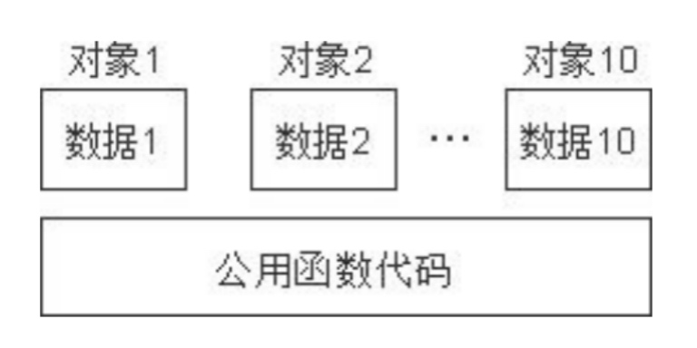

# 1 成员变量和成员函数的存储
* C++类对象中的变量和函数是分开存储的，成员函数和静态数据成员都不占对象的空间
* 类中的每一个非内联成员函数只会诞生一份函数实例，多个同类型的对象共用这一块代码


```cpp
class Myclass01 {
public:
	int m_num;
};

class Myclass02 {
public:
	int m_num;
	static int num;
};

class Myclass03 {
public:
	int m_num;
	static int num;
	void func() {
		this->m_num = 10;  // 哪个对象调用成员函数，this指针就指向谁
	}
};

class Myclass04 {
public:
	int m_num;
	static int num;
	void func() {
		int f_num = 10;
		cout << f_num << endl;
	}
	static void show_num() {
		cout << num << endl;
	}
};

class Myclass05 {
	
};

int main(int argc, char *argv[]) {
	Myclass01 mclass1;
	Myclass02 mclass2;
	Myclass03 mclass3;
	Myclass04 mclass4;
	Myclass05 mclass5;
	
	cout << sizeof(mclass1) << endl;  // 非静态数据成员保存在类对象中
	cout << sizeof(mclass2) << endl;  // 静态数据成员不保存在类对象中
	cout << sizeof(mclass3) << endl;  // 非静态成员函数不保存在类对象中 
	cout << sizeof(mclass4) << endl;  // 静态成员函数不保存在类对象中
	cout << sizeof(mclass5) << endl;  // 空类实例化占一字节，让每个实例在内存中都有独一无二的地址
	return 0;
}
```

# 2 this指针
* this指针是隐含在每个类中非静态成员函数中的一种指针，相当于一个形参，是一个指针常量 Person *const this
* 成员函数通过this指针知道自己操作的是哪个对象的数据，this指针永远指向对象
* 静态成员函数内没有this指针，因此无法操作非静态成员变量
* this指针的用法
    * 解决命名冲突
    * 返回对象本身的引用

```cpp
class Person {
public:
	Person(string name, int age) {
		this->name = name;  // 1.解决命名冲突
		this->age = age;
	}
	// 返回值->调用拷贝构造函数->临时对象
	Person addAge0(Person &person) {
		this->age += person.age;
		return *this;  // *this:person本身
	}
	// 2.返回对象本身的引用
	Person &addAge(Person &person) {
		this->age += person.age;
		return *this;  // *this:person本身
	}
public:
	string name;
	int age;
};

int main(int argc, char *argv[]) {
	Person p("tom", 13);
	// 链式编程思想
	p.addAge0(p).addAge0(p);  // 返回值，返回的是拷贝构造函数拷贝的新对象p',p'再进行操作，所以p只进行了一次操作
//	p.addAge(p).addAge(p);  // 52:返回引用是返回对象本身
	cout << p.age << endl; // 26 
	return 0;
}
```

# 3 空指针访问成员函数
* this指针为NULL时，可以访问不涉及成员变量的成员函数

```cpp
#include <iostream>
using namespace std;

class Person {
	int age;
public:
	Person(int age) {
		this->age = age;
	}
	void showPerson() {
		cout << "showPerson" << endl;
	}
	void showAge() {
	   // 判断是否为空指针
		if (this == NULL) {
			return;
		}
		cout << this->age << endl;
	}
};
int main(int argc, char *argv[]) {
	Person *p = NULL;  // this=NULL
	p->showPerson();
	p->showAge();
	return 0;
}
```

# 4 常函数和常对象
* this指针是一个指针常量，它的指向(对象)不可以修改，指向的值(对象的成员函数)可以修改
* 常函数 `void func() const {}`：无法修改成员变量的成员函数
    * const修饰this指针 -> `const Person *const this`
    * this指针的指向和指向的值(成员变量)都不可以修改
* 常对象 `const Person person();`
    * 常对象不可以直接修改成员变量
    * 常对象不可以调用普通成员函数，因为普通成员函数可能会修改成员变量
    * 常对象可以调用常函数，因为常函数不会修改成员变量
* mutable修饰的成员变量可以被常函数和常变量修改

```cpp
class Person {
public:
	void test01() {
//		this = NULl;  // 指针常量的指向不可以修改
		this->age = 10;  // 指针常量指向的值可以修改
	}
	// 常函数：this指针指向的值也不可以修改
	void test02() const {  // 修饰this指针:const Person *const this
//		this->age = 10;  
	}
public:
	int age;
	mutable int num;  // 在常函数中也可以修改该成员变量
};

int main(int argc, char *argv[]) {
	// 常对象
	const Person person();
	person.age = 20;  // 常对象不可以直接修改成员变量
	person.num = 20;  // mutable修饰的成员变量可以修改
	person.test01();  // 常函数不可以调用普通成员函数，因为普通成员函数可能会修改成员变量
	person.test02();  // 常函数可以调用常函数，因为常函数也不会修改成员变量
}
```

# 5 案例：数组类封装
