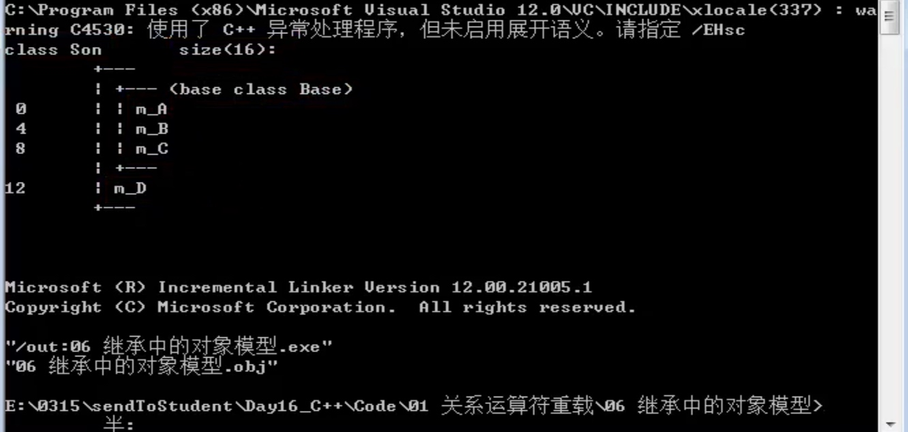
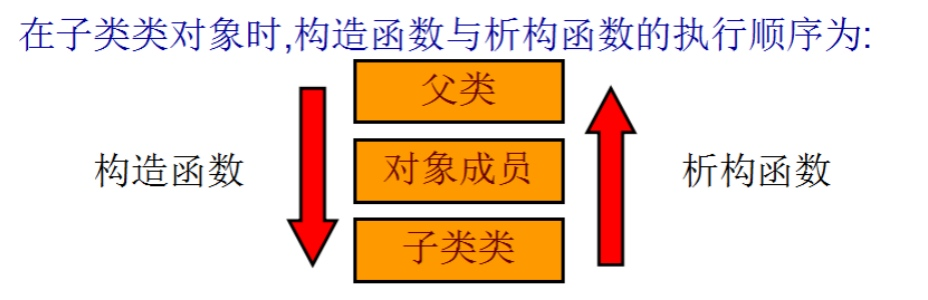
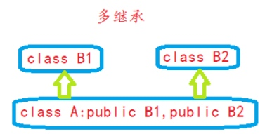
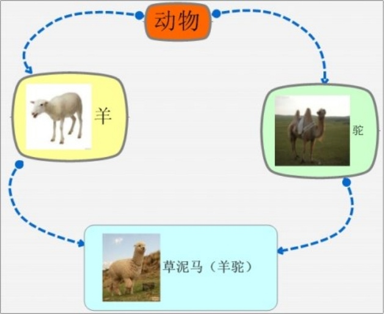
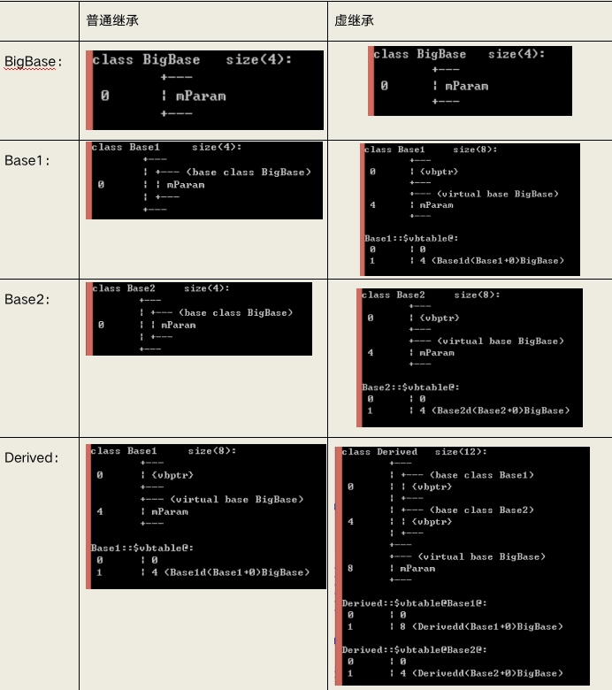

# 1 继承方式
派生类继承域基类，拥有基类的所有成员函数和成员方法（构造函数和析构函数和operator=除外），但是在派生类中，继承的成员不一定能够直接访问，不同的继承方式会导致不同的访问权限。
* 公共继承
    * pubilc -> public
    * protected -> protected
    * private -> 不可访问
* 保护继承
    * public -> protected
    * protected -> protected
    * private -> 不可访问
* 私有继承
    * public -> private
    * protected -> private
    * private -> 不可访问

# 2 继承中的对象模型
* 派生类继承了基类的所有成员变量，只是不同的继承方式导致成员变量的访问权限不同，
* 派生类也继承到了基类的私有变量，只是编译器做了保护，因此访问不到
* sizeof(子类) = 父类中的非静态成员属性大小 + 子类中的非静态成员属性大小

```cpp
class BaseClass {
 public:
	int num1;
 protected:
	int num2;
 private:
	int num3;
};

class SonClass1 : public BaseClass {
public:
	int num4;
	static int num5;
};

class SonClass2 : protected BaseClass {};
class SonClass3 : private BaseClass {};

int main(int argc, char *argv[]) {
	cout << sizeof(BaseClass) << endl;  // 12
	cout << sizeof(SonClass1) << endl;  // 16
	cout << sizeof(SonClass2) << endl;  // 12
	cout << sizeof(SonClass3) << endl;  // 12
	return 0;
}
```

## 2.1 vs中的开发人员命令提示工具
查看继承的对象模型
`cl /d1 reportSingleClassLayoutSon 文件名`



# 3 继承中的构造和析构
* 子类不会继承编译器为父类提供的4的默认函数：构造、析构、拷贝、operator=
* 当创建一个子类对象时，先调用父类构造函数，再调用类成员的构造函数，最后调用子类的构造函数，析构的顺序与构造相反     
 
* 当父类中有有参构造函数时，创建子类对象时需要使用初始化列表方法调用父类的有参构造函数

```cpp
class Info {
 public:
	Info() {
		cout << "Info的普通构造函数调用" << endl;
	}
	~Info() {
		cout << "Info的析构函数调用" << endl;
	}
 public:
	int id;
};

class BaseClass {
 public:
	BaseClass() {
		cout << "BaseClass的普通构造函数调用" << endl;
	}
	BaseClass(int n) : num(n) {
		cout << "BaseClass的有参构造函数调用" << endl;
	}
	~BaseClass() {
		cout << "BaseClass的析构函数调用" << endl;
	}
 private:
	int num;	
};

class SonClass : public BaseClass {
 public:
	SonClass() : BaseClass(100) {
		cout << "SonClass的普通构造函数调用" << endl;
	}
	SonClass(int num) : BaseClass(num) {
		cout << "SonClass的普通构造函数调用" << endl;
	}
	~SonClass() {
		cout << "SonClass的析构函数调用" << endl;
	}
 public:
	Info info;
};

int main(int argc, char *argv[]) {
	SonClass son;
//	SonClass son(100);
	return 0;
}
```

# 4 继承中的同名成员
* 非静态成员
    * 访问父类中同名的成员：加作用域
    * 父类中同名函数的重载函数也需要加作用域
* 静态成员
    * 1.通过类名访问：加作用域
    * 2.通过对象名访问：加作用域

```cpp
class BaseClass {
 public:
	BaseClass() {
		num = 10;
	}
	void func() {
		cout << "baseclass的func调用\n";
	}
	void func(int n) {
		cout << n << endl;
	}
	static void show() {
		cout << "baseclass的show调用\n";
	}
 public:
	int num;
	static int id;
};
int BaseClass::id = 1000;  // 类内声明，类外定义

class Son : public BaseClass {
 public:
	Son() {
		num = 100;
	}
	void func() {
		cout << "son的func调用\n";
	}
	static void show(int num) {
		cout << num << endl;
	}
 public:
	int num;
	static int id;
};
int Son::id = 20;

int main(int argc, char *argv[]) {
	Son son;
	cout << son.num << endl;
	son.func();
	// 1.访问父类中同名的成员：加作用域
	cout << son.BaseClass::num << endl;
	son.BaseClass::func();
	// 2.父类中同名函数的重载函数也需要加作用域
//	son.func(10);
	son.BaseClass::func(1000);
	// 1.通过对象访问同名静态成员
	son.show(30);
	cout << son.id << endl;
	
	son.BaseClass::show();
	cout << son.BaseClass::id << endl;
	// 2.通过类名访问同名静态成员
	Son::show(40);
	cout << Son::id << endl;
	
	Son::BaseClass::show();
	cout << Son::BaseClass::id << endl;
	return 0;
}
```

# 5 多继承

加作用域区分同名函数

```cpp
class BaseClass1 {
 public:
	BaseClass1() {
		num = 10;
	}
	int num;
};

class BaseClass2 {
 public:
	BaseClass2() {
		num = 20;
	}
	int num;
};

// 多继承
class Son : public BaseClass1, public BaseClass2 {
 public:
	Son() {
		num = 30;
	}
	int num;
};

int main(int argc, char *argv[]) {
	cout << sizeof(BaseClass1) << endl;
	cout << sizeof(BaseClass2) << endl;
	cout << sizeof(Son) << endl;
	cout << endl;
	Son s;
	cout << s.num << endl;
	cout << s.BaseClass1::num << endl;
	cout << s.BaseClass2::num << endl;
	return 0;
}
```

# 6 菱形继承产生的问题


* 重复继承，数据有两份
* 对重复继承的成员产生二义性

```cpp
class Animal {
 public:
	void func() {
		cout << "动物类\n";
	}
	int age;
};

class Sheep : public Animal {};
class Tuo : public Animal {};
class SheepTuo : public Sheep, public Tuo {};

int main(int argc, char *argv[]) {
	SheepTuo st;
//	st.func();  // 二义性
	st.Sheep::func();
	// 重复继承
	cout << sizeof(Animal) << endl;
	cout << sizeof(Sheep) << endl;
	cout << sizeof(Tuo) << endl;
	cout << sizeof(SheepTuo) << endl;
	return 0;
}
```

# 7 虚继承


* 虚继承的类中内存中增加了一个vbptr(virtual base pointer)，vbptr指向了一张表vbtable，表中保存了当前的虚指针对于虚基类的首地址偏移量，使他们共享一份数据
* 虚继承只能解决具备公共祖先的多继承所带来的二义性问题，不能解决没有公共祖先的多继承的.

```cpp
class Animal {
 public:
	void func() {
		cout << "动物类\n";
	}
	int age;
};

class Sheep : virtual public Animal {};
class Tuo : virtual public Animal {};
class SheepTuo : public Sheep, public Tuo {};  // 继承了两份vbptr指针

int main(int argc, char *argv[]) {
	SheepTuo st;
//	st.func();  // 二义性
	st.Sheep::func();
	// 重复继承
	cout << sizeof(Animal) << endl;  // 4
	cout << sizeof(Sheep) << endl;  // 4+8(指针)+4(表)
	cout << sizeof(Tuo) << endl;
	cout << sizeof(SheepTuo) << endl;  // 4+4+4+8+4(覆盖表)
	return 0;
}
```