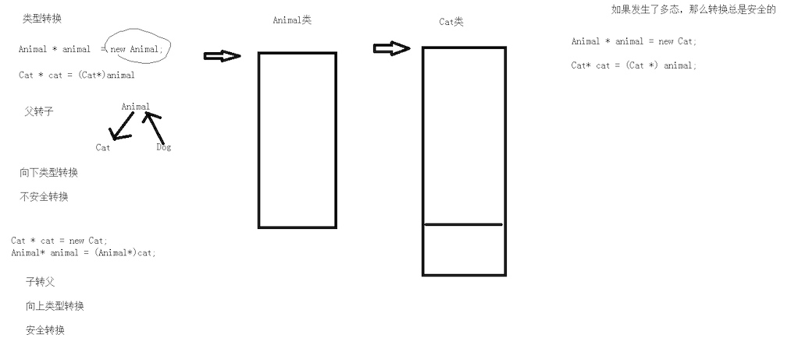
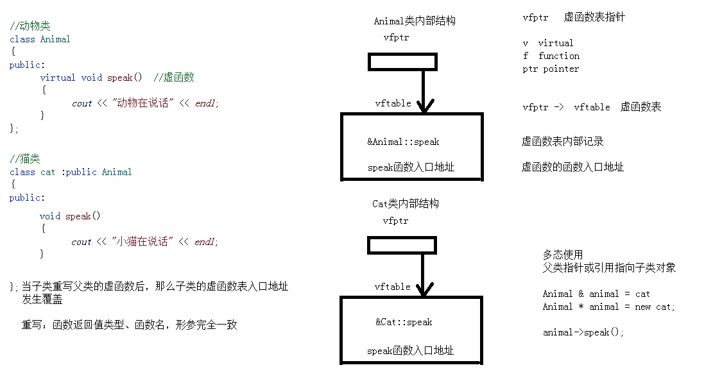

# 1 动态多态
* 面向对象的程序设计原则：开闭原则，对扩展开放，对修改关闭
* 静态多态（地址早绑定，静态联编，编译时多态）：编译时可以确定函数的代码
    * 运算符重载
    * 函数重载
* 动态多态（地址晚绑定，动态联编，运行时多态）：运行时才能确定函数的代码
    1. 满足继承关系
    2. 父类中有虚函数
    3. 子类中重写了父类中的虚函数
    4. 多态的使用：父类的指针或者引用指向子类的对象

```cpp
class Animal {
 public:
	// 虚函数
	virtual void speak() {
		cout << "动物说话\n";
	}	
};

class Cat : public Animal {
 public:
	virtual void speak() {
		cout << "猫说话\n";
	}	
};

class Dog : public Animal {
 public:
	virtual void speak() {
		cout << "狗说话\n";
	}	
};

void doSpeak(Animal &animal) {  // 父类的引用可以指向子类对象
	animal.speak();  // 如果传入参数是父类，地址早绑定，speak的函数地址已经确定
	// 如果传入参数是子类，地址晚绑定
}


int main(int argc, char *argv[]) {
	Cat cat;
	Dog dog;
	doSpeak(cat);
	doSpeak(dog);
	return 0;
}
``` 

# 2 静态绑定-向上类型转换
* 绑定：把函数体和函数调用相联系
    * 地址早绑定：绑定的是参数的函数地址，而不是传入对象的函数地址
    
## 2.1 父子间的类型转换

* 父转子：向下类型转换，不安全
* 子转父：向上类型转换，安全
* 多态中父子类的类型转换总是安全的，因为申请空间的大小的是子类的空间大小。

## 2.2 向上类型转换
* 向上类型转换：父类引用或指针指向子类对象，通过父类指针或引用来操作子类对象

```cpp
class Animal {
 public:
	void speak() {
		cout << "动物叫\n";
	}	
};

class Dog : public Animal {
 public:
	void speak() {
		cout << "狗叫\n";
	}	
};

// 绑定：把函数体和函数调用相联系
// 地址早绑定：绑定的的是Animal::speak(),而不是传入对象的speak()
void DoSpeak(Animal &animal) {
	animal.speak();
}

int main(int argc, char *argv[]) {
	Dog dog;
	DoSpeak(dog);
	return 0;
}
```

# 3 动态绑定-虚函数
* 动态绑定：如果类中有虚函数，编译器会创建一张虚函数表，存放虚函数的入口地址，并且在类中增加一个指针，指向虚函数表，在多态调用时根据指针找到虚函数表实现动态绑定
    * 编译阶段，vptr指针没有初始化指向虚函数表
    * 对象构建时，默认构造函数调用，初始化vptr指针指向本对象的虚函数表
    * 子类继承了基类的vptr指针，指针是指向基类虚函数表，当子类调用构造函数，指针指向子类的虚函数表
* 虚函数 `virtual func() {}`
    1. 如果一个函数在父类中被声明为虚函数，那么在所有子类中它都是虚函数，子类的(virtual)可选
    2. 子类中虚函数的重定义被称为重写(override)
    3. virtual只能修饰成员函数，只需要声明时加virtual,定义时不需要

```cpp
class Animal {
 public:
	virtual void speak() {
		cout << "动物叫\n";
	}	
};

class Dog : public Animal {
 public:
	void speak() {
		cout << "狗叫\n";
	}	
};

void DoSpeak(Animal &animal) {
	animal.speak();
}

int main(int argc, char *argv[]) {
	Dog dog;
	DoSpeak(dog);  // 回去dog指向的空间寻找vptr指针，通过指针找到子类重写的speak函数
	return 0;
}
```
    
# 4 抽象基类和纯虚函数
* 抽象基类：仅仅是派生类的一个接口，而不是希望用户创建一个基类的对象，在抽象基类中有纯虚函数为指定函数保留一个位置，而不需要具体实现。
    * 子类必须实现抽象基类所有的虚函数，否则子类也是抽象基类
* 纯虚函数     
`virtual func() = 0;` 
    * 只有声明
    * 抽象类：有纯虚函数就是抽象类，抽象类无法实例化对象     
    * 有纯虚函数，就要有虚析构函数
    * virtual void fun()=0; 功能声明，告诉编译器在虚函数表中为该函数保留一个位置，但是在这个指定位置中不放函数的地址

```cpp
class AbstractDrinking {
 public:
	void makeDrink() {
		boil();
		brew();
		pourInCup();
		putSomething();
	}
 private:
	virtual void boil() = 0;  // 烧水
	virtual void brew() = 0;  // 冲泡
	virtual void pourInCup() = 0;  // 倒入杯中
	virtual void putSomething() = 0;  // 加入辅料
};

class Tea : public AbstractDrinking {
	void boil() {
		cout << "煮80摄氏度的山泉水\n";
	}
	void brew() {
		cout << "加入极品大红袍\n";
	}
	void pourInCup() {
		cout << "将冲好的茶叶倒入品茗杯中\n";
	}
	void putSomething() {
		cout << "啥都不加\n";
	}
};

void doWork(AbstractDrinking &drink) {
	drink.makeDrink();
}

int main(int argc, char *argv[]) {
	Tea tea;
	doWork(tea);
	return 0;
}
```


# 5 多态的原理

>当父类中有了虚函数后：
> 内部存储的是vfptr(虚函数表指针)，指向vftable(虚函数表)，虚函数表中记录了虚函数的入口地址
> 当子类重写父类的虚函数时，子类的虚函数表的函数入口地址被覆盖为子类的虚函数入口地址
> 当多态使用时(父类指针或引用指向子类对象)虚函数时，实现地址晚绑定，vptr指针指向了子类的虚函数表。

# 6 虚析构函数和纯虚析构函数
 * 虚析构函数：解决多态不调用子类析构函数的问题
 * 纯虚析构函数(类内声明，类外定义)：有纯虚析构函数的类是抽象类

```cpp
 class Animal {
 public:
	Animal() {
		cout << "animal的构造函数调用\n";
	}
	// 如果不是虚析构函数，无法调用子类的析构函数
//	virtual ~Animal() {
//		cout << "animal的析构函数调用\n";
//	}
	virtual ~Animal() = 0;  // 纯虚析构函数
	virtual void speak() = 0;
	char *name;
};
// 纯虚析构函数的类外定义
Animal::~Animal() {
	cout << "animal的析构函数调用\n";
}

class Dog : public Animal {
 public:
	Dog(char *str) {
		cout << "dog的构造函数调用\n";
		this->name = new char[strlen(str)+1];
		strcpy(this->name, str);
	}
	~Dog() {
		cout << "dog的析构函数调用\n";
		if (NULL != this->name) {
			delete []name;
			name = NULL;
		}
	}
	void speak() {
		cout << name << "狗在叫\n";
	}
};

void test(void) {
	Animal *dog = new Dog("tom");
	dog->speak();
	delete dog;
}
```

# 7 重载、重定义和重写
* 重载(函数重载)：同一作用域的同名函数
    * 同一作用域
    * 参数个数、顺序、类型不用
    * 和函数返回值无关
    * 参数中的const也可以作为重载条件
* 重定义(隐藏)：子类重定义父类中的成员函数(非虚函数)
* 重写(覆盖)：子类重写父类中的虚函数