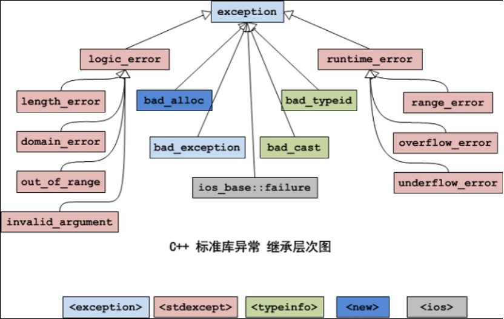

# 1 异常的语法
* `try {} catch () {}`
* 如果异常没有任何的处理，程序会自动调用terminate函数，使程序中断掉
* 栈解旋，try代码块中在栈上构造的所以对象在代码块结束后会自动析构，顺序与构造相反

```cpp
// 自定义异常类
class myException {
 public:
	void printError() {
		cout << "异常哦\n"; 
	}
};

class Test {
 public:
	Test() {
		cout << "构造对象" << endl;
	}
	~Test() {
		cout << "析构对象" << endl;
	}
};

double my_disivion(int num1, int num2) {
	if (num2 == 0) {
//		throw string("hello");  // 匿名对象，有参构造
		throw myException();
//		throw 1;
	}
	return num1/static_cast<double>(num2);
}

double my_add(int num1, int num2) {
	return my_disivion(num1, num2) + 100;
}

void test(void) {
	int ret = 0;
		// 异常被抛出后，从进入try块起，到异常被抛掷前，这期间在栈上构造的所有对象，都会被自动析构。析构的顺序与构造的顺序相反，这一过程称为栈的解旋
		try {
			int num =10000;
			Test test1;
			Test test2;
			ret = my_add(8, 0);
		} catch (string e) {
			cout << e << endl;
		} 
		// 没有捕获自定义类型的catch继续晚上抛
	//	cout << num << endl;  // error:被释放
		cout << ret << endl;
}


int main(void) {
	try {
		test();
	} catch (myException e) {
		e.printError();
	} catch(...) {  // 捕获其余类型异常
		cout << "其余异常\n";
	}
	// 如果异常没有任何的处理，程序会自动调用terminate函数，使程序中断掉
	return 0;
}
```

# 2 异常的接口声明
* `void func() throw() {}  不能抛出任何异常`

```cpp
void func(void) throw(int, double) {  // 只能抛出int,double异常
	throw 1;
}
```

# 3 异常对象的生命周期
* 推荐用法: `throw myException()`  -->  `catch(myException &e)`

```cpp
class myException {
 public:
	myException() {
		cout << "普通构造\n";
	}
	myException(const myException &e) {
		cout << "拷贝构造\n";
	}
	~myException() {
		cout << "析构\n";
	}
};

void func() {
	throw myException();  // 匿名函数，没人用自己释放
}


int main(int argc, char *argv[]) {
	try {
		func();
	} catch (myException &e) {  // 使用引用
		cout << "捕获到异常\n";
	}
	return 0;
}
```

# 4 异常的多态使用
* `throw(SonException())`  --> `catch(BaseException &e)`
* 父类引用接子类对象

```cpp
//异常的基类
class BaseException
{
public:
	virtual void printError() = 0;
};

//空指针异常
class NULLPointerException:public BaseException
{
public:
	virtual void printError()
	{
		cout << "空指针异常" << endl;
	}
};

//越界异常
class OutOfRangeException :public BaseException
{
public:
	virtual void printError()
	{
		cout << "越界异常" << endl;
	}
};


void doWork()
{
	//throw NULLPointerException();
	throw OutOfRangeException();  // 父类引用接子类对象
}

void test01()
{
	try
	{
		doWork();
	}
	catch (BaseException &e)
	{
		e.printError();
	}

}
```

# 5 C++标准异常库
## 5.1 异常库介绍

* 每个类都有提供了构造函数、复制构造函数、和赋值操作符重载
* logic_error类及其子类、runtime_error类及其子类，它们的构造函数是接受一个string类型的形式参数，用于异常信息的描述
* 所有的异常类都有一个what()方法，返回const char* 类型的值，描述异常信息。

## 5.2 标准异常类的具体描述：
* `exception`	所有标准异常类的父类
* `bad_alloc`	当operator new and operator new[]，请求分配内存失败时
* `bad_exception	` 这是个特殊的异常，如果函数的异常抛出列表里声明了bad_exception异常，当函数内部抛出了异常抛出列表中没有的异常，这是调用的unexpected函数中若抛出异常，不论什么类型，都会被替换为bad_exception类型
* `bad_typeid` 	使用typeid操作符，操作一个NULL指针，而该指针是带有虚函数的类，这时抛出bad_typeid异常
* `bad_cast`	使用dynamic_cast转换引用失败的时候
* `ios_base::failure`	io操作过程出现错误
* `logic_error` 	逻辑错误，可以在运行前检测的错误
* `runtime_error`		运行时错误，仅在运行时才可以检测的错误

* `logic_error`的子类：
    * `length_error`	试图生成一个超出该类型最大长度的对象时，例如vector的resize操作
    * `domain_error`	参数的值域错误，主要用在数学函数中。例如使用一个负值调用只能操作非负数的函数
    * `out_of_range`	超出有效范围
    * `invalid_argument`	参数不合适。在标准库中，当利用string对象构造bitset时，而string中的字符不是’0’或’1’的时候，抛出该异常
    
* `runtime_error`的子类：
    * `range_error`	计算结果超出了有意义的值域范围
    * `overflow_error`	算术计算上溢
    * `underflow_error`	算术计算下溢
    * `invalid_argument`	参数不合适。在标准库中，当利用string对象构造bitset时，而string中的字符不是’0’或’1’的时候，抛出该异常
    
## 5.3 标准库的使用

```cpp
class Person
{
public:
	Person(int age)
	{
		if (age < 0 || age > 150)
		{
			throw out_of_range("年龄越界，必须在0~150之间");  // 有参构造，异常信息的描述

			//throw length_error("长度出错！");
		}
		this->m_Age = age;
	}

	int m_Age;
};


void test01()
{
	try
	{
		Person p1(1000);
	}
	catch (exception & e)  // 父类引用
	{
		cout << e.what() << endl;  // what()方法描述异常信息
	}

}
```

# 6 编写自己的异常类
 * 必须重写exception类的虚析构函数和what()函数
 * const char * 可以隐式转换为string，反之不行
 * string转换为 const char * : 调用string类的c_str()方法

```cpp
 class myException : public exception {
 public:
	// 提供string和 const char * 两种类型的有参构造
	myException(const char *str) : m_error(str) {}
	myException(string str) : m_error(str) {}
	virtual ~myException() _NOEXCEPT {};
	virtual const char *what() const _NOEXCEPT {  // 常函数，无法修改成员变量
		return m_error.c_str();
	}
 private:
	string m_error;
};

void func() {
	throw myException("爬");
}


int main(int argc, char *argv[]) {
	try {
		func();
	} catch (exception &e) {
		cout << e.what() << endl;
	}
	return 0;
}
```