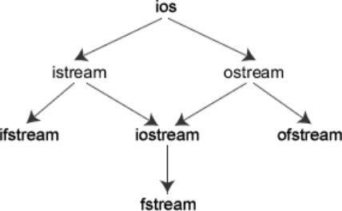
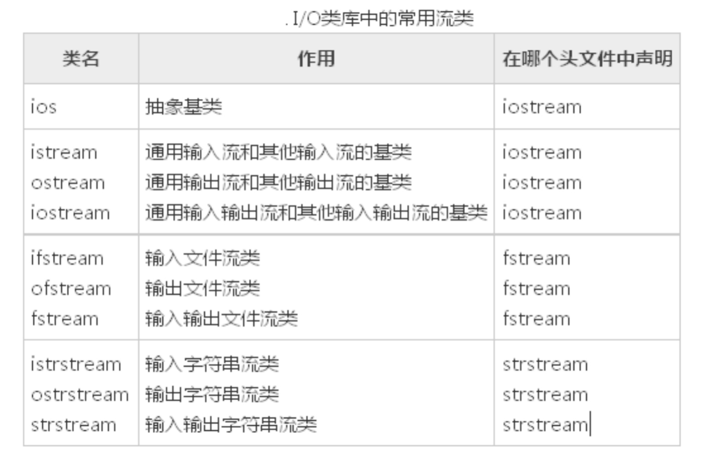
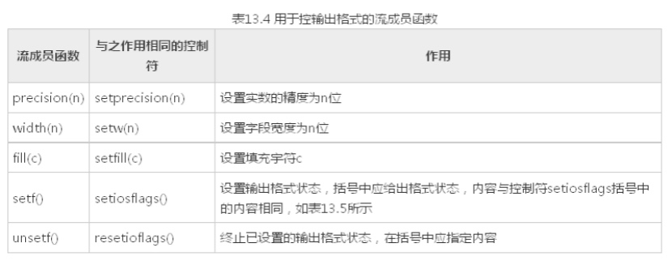
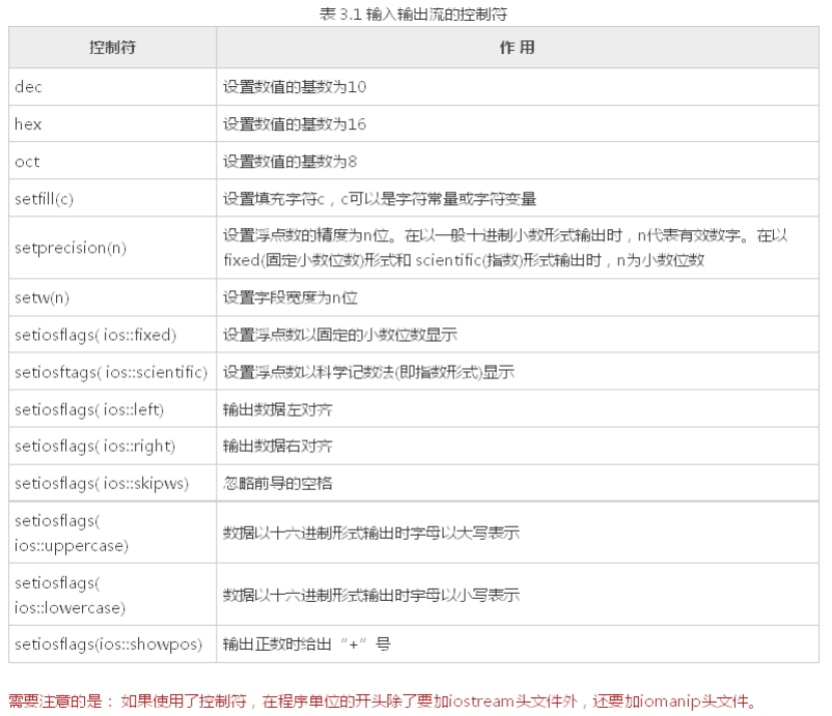

# 1 流类库
##1.1 C++的输入输出
    * 标准I/O:以标准设备为对象
    * 文件I/O:以外存磁盘文件为对象
    * 串I/O:以内存中的指定空间为对象(字符数组)

## 1.2 iostream类库
* 继承关系    



# 2 标准输入流
* `cin.get() //一次只能读取一个字符`

```cpp
void test01() {
	// as ，第一次获取a  ，第二次获取s，第三次获取换行，第四次等待输入
	char ch = cin.get();
	cout << "ch = " << ch << endl;
	ch = cin.get();
	// cin.get(ch)
	cout << "ch = " << ch << endl;
	ch = cin.get();
	cout << "ch = " << ch << endl;
	ch = cin.get();
	cout << "ch = " << ch << endl;
}
```

* `cin.get()`重载 获取字符串

```cpp
void test02()
{
	char buf[1024] = "";
	cin.get(buf, sizeof(buf));//换行符遗留在缓冲区中
	char ch = cin.get();
	if (ch == '\n')
	{
		cout << "换行符遗留在缓冲区中" << endl;
	}
	else
	{
		cout << "换行符未遗留在缓冲区中" << endl;
	}
	cout << "buf = " << buf << endl;
}
```

* `cin.getline()`获取字符串

```cpp
void test03()
{
	char buf[1024] = "";
	//换行符不会遗留在缓冲区中，并且从缓冲区中扔掉
	cin.getline(buf, sizeof(buf));  // 最大字节数
	char ch = cin.get();
	if (ch == '\n')
	{
		cout << "换行符遗留在缓冲区中" << endl;
	}
	else
	{
		cout << "换行符未遗留在缓冲区中" << endl;
	}
	cout << "buf = " << buf << endl;
}
```

* `cin.ignore()`忽略

```cpp
void test04()
{
	cin.ignore(3); //默认忽略1个缓冲区中的字符（包括换行符），可以填写忽略个数
	char ch = cin.get();
	cout << "ch = " << ch << endl;
}
```

* `cin.peek()` 偷窥

```
void test05()
{
	//查看缓冲区中第一个字符，并不取走
	char ch = cin.peek();
	cout << "ch = " << ch << endl;
	ch = cin.get();
	cout << "ch = " << ch << endl;
	ch = cin.get();
	cout << "ch = " << ch << endl;
}
```

* `cin.putback()` 放回

```cpp
void test06()
{
	char ch = cin.get();
	cin.putback(ch); //将ch放回到缓冲区中,并且放回原位
	char buf[1024] = { 0 };
	cin.getline(buf, sizeof(buf));
	cout << "buf = " << buf << endl;
}
```

* 案例一：判断用户输入的是字符串还是数字

```cpp
void test07() {
	cout << "请输入字符串或者数字:\n";
	char ch = cin.peek();
	if (ch > '0' & ch < '9') {
		int num;
		cin >> num;
		cout << "您输入的是数字:" << num << endl;
	} else {
		char buf[1024] = "";
		cin.getline(buf, sizeof(buf));
		cout << "您输入的是字符串:" << buf << endl;
	}
}
```

* 案例二：让用户输入1～10之间的数字，若输入有误重新输入

```cpp
void test08() {
	while (true) {
		cout << "请输入1～10之间的数字\n";
		int num;
		cin >> num;
		if (num >= 1 & num <=10 ) {
			cout << "您输入的数字是:" << num << endl;;
			cout << cin.fail() << endl;  // 判断流操作是否失败
			break;
		}
		cin.clear();  // 清除错误状态
		cin.sync();  // 清空缓存区,如果用户输入的是字符，那么这个字符会一直待在缓冲区中造成无限循环
		cout << cin.fail() << endl;
		cout << "请重新输入";
	}
}
```

# 3 标准输出流
## 3.1 普通输出
* `cout.put()` //向缓冲区写字符
* `cout.write()` //从buffer中写num个字节到当前输出流中。

```cpp
void test01()
{
	//cout.put('h').put('e').put('l');

	//char buf[] = "hello world";
	//cout.write(buf, sizeof(buf));

	cout << "hello world" << endl;
}
```

## 3.2 格式化输出
* 通过流成员函数



```cpp
void test02(){
	int number = 99;
	cout.width(10); //设置宽度
	cout.fill('*'); //填充
	cout.setf(ios::left);  //设置左对齐格式
	cout.unsetf(ios::dec); //卸载十进制
	cout.setf(ios::hex);  //设置十六进制   63
	cout.setf(ios::showbase); //显示基数 0x (十六进制)  0 （八进制）
	cout.unsetf(ios::hex); //卸载十六进制
	cout.setf(ios::oct);  //设置八进制  
	cout << number << endl;
}
```

* 使用控制符


```cpp
#include <iomanip>
void test03()
{
	//使用控制符
	int number = 99;
	cout << setw(20)   //设置宽度
		 << setfill('~') //填充
		 << setiosflags(ios::showbase) //显示基数
		<< setiosflags(ios::left)  //左对齐
		<< hex  //设置十六进制
		<< number
		<< endl;
}
```
