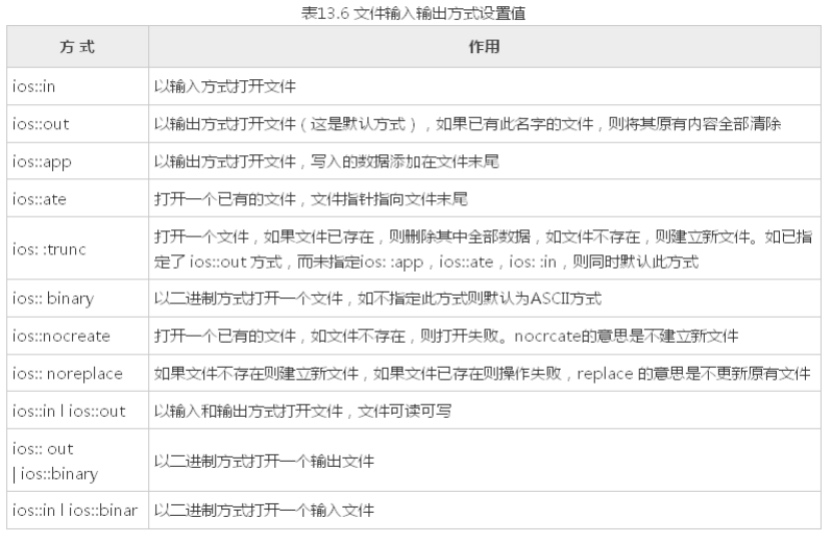

# 1 文件写

```cpp
#include<iostream>
#include <fstream> //文件读写 头文件
#include <string>
using namespace std;

//写文件
void test01()
{
	//ofstream ofs("./test.txt",ios::out | ios::trunc);

	ofstream ofs;  // 创建对象
	ofs.open("./test.txt", ios::out | ios::trunc);  // 按位异或：将两位都置为1

	//判断对象是否打开成功
	if (!ofs.is_open())
	{
		cout << "文件打开失败" << endl;
		return;
	}

	ofs << "姓名：Tom" << endl;
	ofs << "年龄：100" << endl;
	ofs << "性别：男" << endl;

	//关闭对象
	ofs.close();
}

int main(){
	test01();
	return 0;
}
```

# 2 文件读

```cpp
#include <iostream>
#include <fstream>
using namespace std;

void test()
{
	ifstream ifs;
	ifs.open("./test.txt", ios::in);

	if (!ifs.is_open())
	{
		cout << "文件打开失败" << endl;
		return;
	}

	//第一种方式
	char buf[1024] = {0};

	while (ifs >> buf)
	{
		cout << buf << endl;
	}

	//第二种方式
	//char buf[1024] = { 0 };
	//while (ifs.getline(buf,sizeof(buf)))
	//{
	//	cout << buf << endl;
	//}


	//第三种方式
	//string buf;
	//while (getline(ifs,buf))
	//{
	//	cout << buf << endl;
	//}

	//第四种方式  不推荐
//	char c;
//	while ( (c = ifs.get() ) != EOF)
//	{
//		cout << c;
//	}
//
//	ifs.close();
}

int main(int argc, char *argv[]) {
	test();
	return 0;
}
```