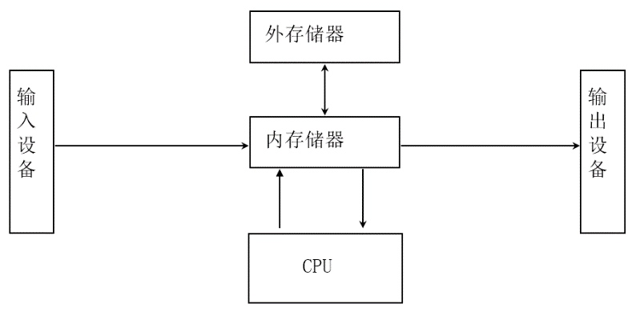
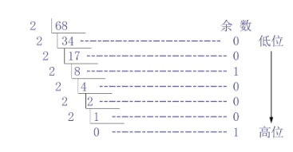
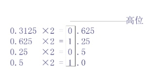

> 本文为清华大学郑莉老师2015年于线上开设的[C++语言程序设计基础课程](https://next.xuetangx.com/course/THU08091000247/1515741)**第一章**的学习笔记，对应C++语言程序设计教材上**第一章**内容。

## 1 计算机基础
### 1.1 计算机系统
* 硬件

* 软件（有序的数据和指令的集合） = 程序 + 文档
    * 系统软件
    * 应用软件
    * 中间件
* 指令系统：硬件和软件的界面

### 1.2 计算机中的信息
* 控制信息——指挥计算机操作
* 数据信息——计算机程序加工的对象
    * 数值信息
        * 定点数
        * 浮点数
    * 非数值信息
        * 字符数据
        * 逻辑数据

### 1.3 计算机的基本功能
* 算数运算
* 逻辑运算
       
### 1.2 计算机语言
* 机器语言
* 汇编语言 —— 助记符
* 高级语言 —— 英语单词和语句

> 自上而下不断抽象

## 2 数据的表示、存储与转换
### 2.1 二进制的编码表示

* 原码
* 反码（中间码）：原码符号不变，其他位取反
* 补码：反码+1

> 原码转换为补码运算后在求补码得结果
> 如果负+负=正，正+正=负，说明数值溢出

### 2.2 内存中的整数、小数与字符的存储
* 小数——小数点浮动: $N = M * 2^E$ 
* 字符
    * ASCII编码：1字节，可表示2^7=128个字符
    * GB18030-2005编码：中国标准
    * Unicode编码：8位、16位、24位、32位
    
### 2.3 进制转换

* 十进制 ==> R进制

整数 —— 除R取余

小数 —— 乘R取余

* R进制 ==> 二进制
各位数字与她的权重相乘的积相加
  
## 3 C++
> 支持面向过程、面向对象、泛型程序设计方法

### 3.1 面向对象的编程
* 类：根据对象的属性和方法将其抽象为类
* 继承：根据类创建实例对象（唯一），继承类的属性和方法
* 多态：对象之间通过消息来交互，不同对象收到同一消息可以产生不同结果

### 3.2 开发过程
1. 算法设计
2. 源程序编辑
3. 编译
    C: `clang -o filename file.c -lcs50` or `make filename`    
    C++: `g++ -o filename file.cpp` or `make filename`
4. 连接
5. 测试调试

### 3.3 翻译软件
> 翻译过程：源程序(.cpp) == _编译器_ ==>  目标程序(.out) + 其他目标程序 + 库文件 == _链接器_ ==> 可执行程序

* 汇编软件：汇编语言 ==> 机器语言
* 编译软件：高级软件 ==> 机器语言（编译一次）
* 翻译软件：边编译边执行（效率低）
Java：半编译半翻译语言

