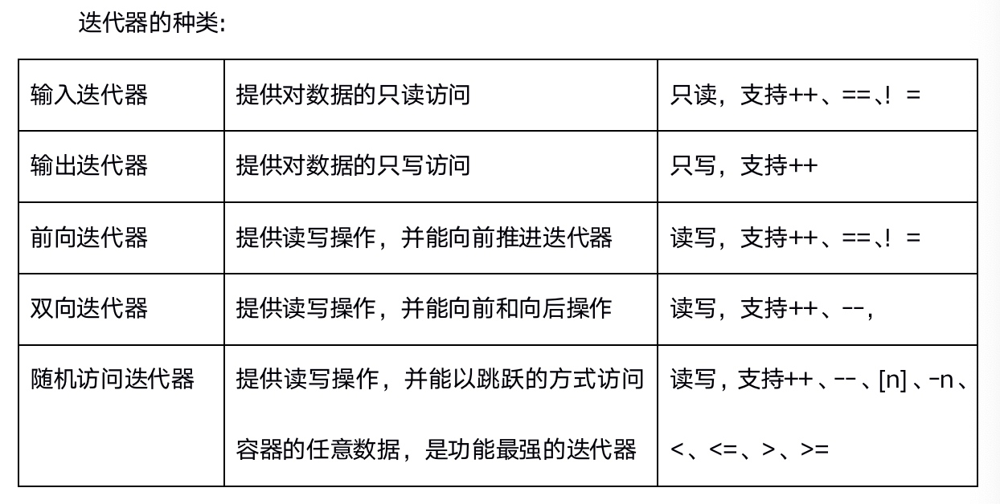

# 1 STL六大组件
* STL(Standard Template Library 标准模板库)
    * 容器：各种数据结构:vector、list、deque、set、map，从实现角度来看，是一种class template
    * 算法：sort、find、copy、for_each，从实现角度来看，是一种function template
    * 迭代器：容器与算法之间的胶合剂，共有五种类型，从实现角度来看，迭代器是一种将`operator*`, `operator->`, `operator++`,`operator--`等指针相关操作予以重载的class template.      
    所有STL容器都附带有自己专属的迭代器，只有容器的设计者才知道如何遍历自己的元素。     
    **原生指针也是一种迭代器**。
    * 仿函数：行为类似函数，可作为算法的某种策略。从实现角度来看，仿函数是一种重载了`operator()`的class 或者class template
    * 适配器：种用来修饰容器或者仿函数或迭代器接口的东西。
    * 空间配置器：负责**空间的配置与管理**。从实现角度看，配置器是一个实现了动态空间配置、空间管理、空间释放的class tempalte.
    
* 关系：
    * **容器**通过**空间配置器**取得数据存储空间
    * **算法**通过**迭代器**存储**容器**中的内存
    * **仿函数**协助**算法**完成不同策略的变化
    * **适配器**修饰**仿函数**
    
> STL将数据和操作分离。数据由容器加以管理，操作则由可定制的算法定义。迭代器在两者之间充当“粘合剂”,以使算法可以和容器交互运作

# 2 STL三大组件
## 2.1 容器 vector
* 常用的数据结构：数组(array),链表(list),tree(树)，栈(stack),队列(queue),集合(set),映射表(map)
    * 序列式容器：强调值的排序，每个元素都有固定的位置。
        * vector
        * deque
        * list
    * 关联式容器：二叉树结构，元素间没有严格的顺序关系，元素在容器中并没有保存元素置入容器时的逻辑顺序，在值中选择一个值作为关键字key，这个关键字对值起到索引的作用。
        * set
        * map

## 2.2 算法 algorithms
* 质变算法：运算过程中会更改容器中元素的内容
    * 拷贝
    * 替换
    * 删除
* 非质变算法：不会改变容器中元素的内容
    * 查找
    * 计数
    * 遍历
    * 寻找极值

## 2.3 迭代器
提供一种方法，使之能够依序寻访某个容器所含的各个元素，而又无需暴露该容器的内部表示方式

