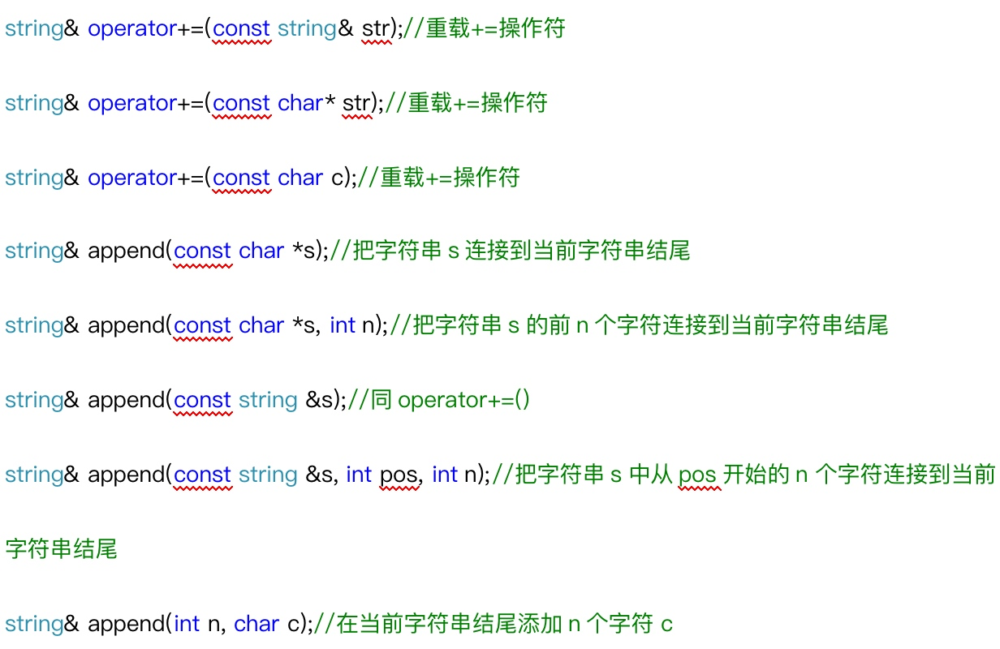
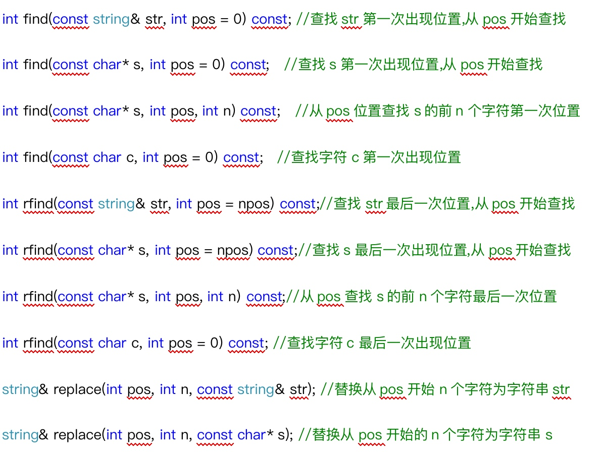
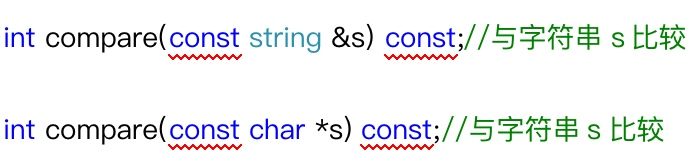
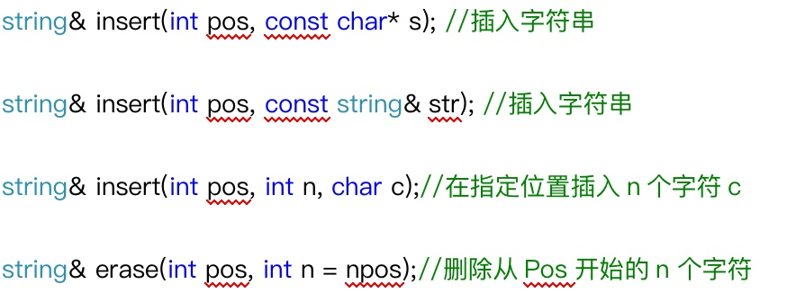

> string类封装在头文件<string>中，封装了`char *`，负责管理字符串，是一个`char *`型的容器
> string类负责维护`char *`所分配的内存，不需要担心越界问题

# 1 string构造函数
* `string();` 创建一个空的字符串 例如: string str;      
* `string(const string& str);` 使用一个string对象初始化另一个string对象
* `string(const char* s);` 使用字符串s初始化
* `string(int n, char c);` 使用n个字符c初始化 

# 2 string赋值操作
> `=`
> `string.assign()`

* `=`
    * `string& operator=(const char* s);` char*类型字符串 赋值给当前的字符串
    * `string& operator=(const string &s);` 把字符串s赋给当前的字符串
    * `string& operator=(char c);` 字符赋值给当前的字符串
* `string.assign()`
    * `string& assign(const char *s);`//把字符串s赋给当前的字符串
    * `string& assign(const char *s, int n);` 把字符串s的前n个字符赋给当前的字符串
    * `string& assign(const string &s);` 把字符串s赋给当前字符串
    * `string& assign(int n, char c);` 用n个字符c赋给当前字符串
    * `string& assign(const string &s, int start, int n);` 将s从start开始n个字符赋值给字符串

# 3 string存取字符操作
> `[]`
> `string.at()`
> []和at区别，[]访问越界 直接挂掉，at访问越界，抛出异常 out_of_range
    
* `char& operator[](int n);`c通过[]方式取字符
* `char& at(int n);` 通过at方法获取字符

# 4 string拼接操作
> `+=`
> `string.append()`



# 5 string查找和替换
> `string.find()` `string.rfind()` -1:未找到
> `string.replace()`



# 6 string比较操作
> `>`返回1，`<`返回-1，`==`返回0



# 7 string子串
`string substr(int pos = 0, int n = npos) const;`返回由pos开始的n个字符组成的字符串

```cpp
void test() {
	string website = "www.blog.xmingo.com";
	vector<string>v;
	
	int start = 0;
	int pos = -1;
	while (true) {
		pos = website.find('.', start);
		if (pos == -1) {
			string sub_str = website.substr(start, website.size() - start);
			v.push_back(sub_str);
			break;
		}
		string sub_str = website.substr(start, pos - start);
		v.push_back(sub_str);
		start = pos + 1;
	}
	for (vector<string>::iterator p = v.begin(); p!=v.end(); p++) {
		cout << *p << endl;
    }
}
```

# 8 string插入和删除
> `string.insert()`
> `string_erase()`



# 9 string 和 const char * 间的转换
`str.c_str()`

```cpp
void test09() {
	// 1 const char * --> string
	string str = "hello";  // 隐式类型转换
	// 2 string --> const char *
	const char *str2 = str.c_str();
	cout << str2 << endl;
}
```

# 10 string字符串对象的重新分配
> 为了修改string字符串的内容，下标操作符[]和at都会返回字符的引用。但当字符串的内存被重新分配之后，可能发生错误.

```cpp
void test10() {
	string str = "abcdefg";
	char &c = str[2];
	char &d = str[3];
	c = '1';
	d = '2';
	cout << str << endl;
	cout << (int *)str.c_str() << endl;
	
	str = "helloaaaaaaaaaaaaaaaaaaaaaaaaaaaaaaaaaaaaaaaa";  // 重新分配内存
	//a和b不可以再使用了
//	a = '1';
//	b = '2';
	cout << str << endl;
	cout << (int *)str.c_str() << endl;
}
```

# 11 string大小写转换
`ch = ch.toupper(ch)`
`ch = ch.tolower(ch)`

```cpp
string &convert_string(string &str) {
	for (int i=0; i<str.size(); i++) {
//		if (str[i] >= 97 & str[i] <= 122) {
//			str[i] -= 32;
//		}
		str[i] = toupper(str[i]);
//		str[i] = tolower(str[i]);
	}
	return str;
}

void test() {
	string str = "Hello World!";
	cout << convert_string(str) << endl;
}
```