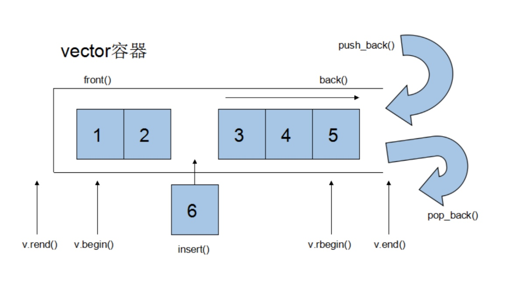

> 1.vector是动态空间，随着元素的加入，它的内部机制会自动扩充以容纳新空间
> 2.vector迭代器可以看作是一个普通指针。`vector<int>::iterator p`; `p`的类型其实就是`int *`
> 3.一旦vector的动态空间重新配置，指向原vector的所有迭代器都会失效

## 1 构造函数
1. `vector<T> v;` //采用模板实现类实现，默认构造函数
2. `vector(v.begin(), v.end());`//将v[begin(), end())区间中的元素拷贝给本身。
3. `vector(n, elem);`//构造函数将n个elem拷贝给本身。
4. `vector(const vector &vec)`;//拷贝构造函数

```cpp
void test() {
	vector<int>v;  // 1
	
	vector<int>v2(5, 6);  // 3
	print_vector(v2);
	
	vector<int>v3(v2.begin(), v2.end());  // 2
	print_vector(v3);
	
	char arr[] = {3, 4, 5, 6, 7};
	vector<int>v4(arr, arr+3);  // 指针 2
	print_vector(v4);
	
	vector<int>v5(v4);  // 4
	print_vector(v5);
}

```

## 2 赋值操作
1. `assign(beg, end);`//将[beg, end)区间中的数据拷贝赋值给本身。
2. `assign(n, elem);`//将n个elem拷贝赋值给本身。
3. `vector& operator=(const vector  &vec);`//重载等号操作符
4. `swap(vec);`// 将vec与本身的元素互换，按照元素个数重新开辟空间

```cpp
void test() {
	int arr[] = {1,2,3,4,5};
	vector<int>v(arr, arr+sizeof(arr)/sizeof(arr[0]));
	
	vector<int>v1;
	v1.assign(arr, arr+sizeof(arr)/sizeof(arr[0]));  // 1
	print_vector(v1);
	
	v1.assign(5, 6);  // 2
	print_vector(v1);
	
	v1 = v;  // 3
	print_vector(v1);
	
	v1.assign(5, 6);
	v1.swap(v);  // 4
	print_vector(v1);
	print_vector(v);
}

```

## 3 大小操作
1. `size();`//返回容器中元素的个数
2. `empty();`//判断容器是否为空
3. `resize(int num);`//重新指定容器的长度为num，若容器变长，则以默认值填充新位置。如果容器变短，则末尾超出容器长度的元素被删除。
4. `resize(int num, elem);`//重新指定容器的长度为num，若容器变长，则以elem值填充新位置。如果容器变短，则末尾超出容器长>度的元素被删除。
5. `capacity();`//容器的容量
6. `reserve(int len);`//容器预留len个元素长度，预留位置不初始化，元素不可访问。


```cpp
void test() {
	int arr[] = {1,2,3,4,5,6};
	vector<int>v(arr, arr+sizeof(arr)/sizeof(arr[0]));
	
	cout << "capacity:" << v.capacity() << endl;  // 5
	
	cout << "size:" << v.size() << endl;  // 1
	
	cout << "empty:" << v.empty() << endl;  // 2
	
	v.resize(10, 0); // 4:12
	cout << "resize capacity:" << v.capacity() << endl;
	
	v.reserve(20);  // 6
	cout << "reserve capacity:" << v.capacity() << endl;
}

```

## 4 数据存取操作
1. `at(int idx);` //返回索引idx所指的数据，如果idx越界，抛出out_of_range异常。
2. `operator[];`//返回索引idx所指的数据，越界时，运行直接报错
3. `front();`//返回容器中第一个数据元素
4. `back();`//返回容器中最后一个数据元素

```cpp
void test() {
	int arr[] = {1,2,3,4,5,6};
	vector<int>v(arr, arr+sizeof(arr)/sizeof(arr[0]));
	
	cout << "v[0]=" << v.front() << endl;  // 3
	cout << "v[0]=" << v.at(0) << endl;  // 1
	cout << "v[0]=" << v[0] << endl;  // 2
	cout << "v[-1]=" << v.back() << endl;  // 4
	cout << "v[-1]=" << v.at(v.size()-1) << endl;
	cout << "v[-1]=" << v[v.size()-1] << endl;
}
```

## 5 插入和删除操作
1. `insert(const_iterator pos, int count,ele);`//迭代器指向位置pos插入count个元素ele.
2. `push_back(ele);` //尾部插入元素ele
3. `pop_back();`//删除最后一个元素
4. `erase(const_iterator start, const_iterator end);`//删除迭代器从start到end之间的元素
5. `erase(const_iterator pos);`//删除迭代器指向的元素
6. `clear();`//删除容器中所有元素

```cpp
void test() {
	int arr[] = {1,2,3,4,5,6};
	vector<int>v(arr, arr+sizeof(arr)/sizeof(arr[0]));
	
	v.insert(v.begin(), 2, 100);  // 1
	print_vector(v);
	
	v.pop_back();  // 3
	v.push_back(7);  // 2
	v.erase(v.begin(), v.begin()+2);  //4
	print_vector(v);
	
	v.erase(v.end()-1);  // 5
	print_vector(v);
	
	v.clear();  // 6
	cout << v.size() << endl;
}
```

## 6 使用swap收缩内存
> 大容量容器resize成小size容器时，使用匿名函数拷贝构造出小容量容器与原容器swap`vector<int>(v).swap(v);`

```cpp
void test() {
	vector<int>v1;
	for (int i=0;i<100000;i++) {
		v1.push_back(i);
	}
	cout << "size:" << v1.size() << endl;
	cout << "capacity:" << v1.capacity() << endl;
	
	v1.resize(3);
	cout << "resize size:" << v1.size() << endl;
	cout << "resize capacity:" << v1.capacity() << endl;  // 容量没变
	print_vector(v1);
	
	// 巧用swap收缩内存
	vector<int>(v1).swap(v1);  // 匿名对象拷贝构造按照v.size()大小构造后与v交换，随后大容量匿名对象被自动释放
	cout << "resize size:" << v1.size() << endl;
	cout << "resize capacity:" << v1.capacity() << endl;
	
}
```

## 7 使用reserve预留内存空间
> 创建容器时使用reserve预留好空间，以免数据存放时多次重新分配空间浪费资源

```cpp
void test() {
	vector<int>v;  // 事先预留好空间，不需要多次开辟浪费时间
	v.reserve(100000);
	int num = 0;
	int *p = NULL;
	for (int i=0;i<100000;i++) {
		v.push_back(i);
		if (p != &v[0]) {
			p = &v[0];
			num++;
		}
	}
	// 添加100000次数据，重新开辟空间的次数
	cout << num << endl;
}
```

## 9 逆序遍历
* 反转迭代器 `for (vector<int>::reverse_iterator p=v.rbegin(); p!=v.rend(); p++) {}`

```cpp
void test() {
	vector<int>v;
	for (int i=0;i<100000;i++) {
		v.push_back(i);
	}
	for (vector<int>::reverse_iterator p=v.rbegin(); p!=v.rend(); p++) {  // 反转迭代器
		cout << *p << endl;
	}
}
```

