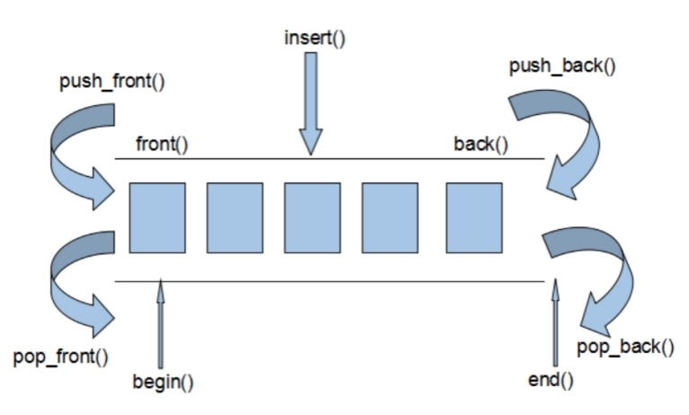
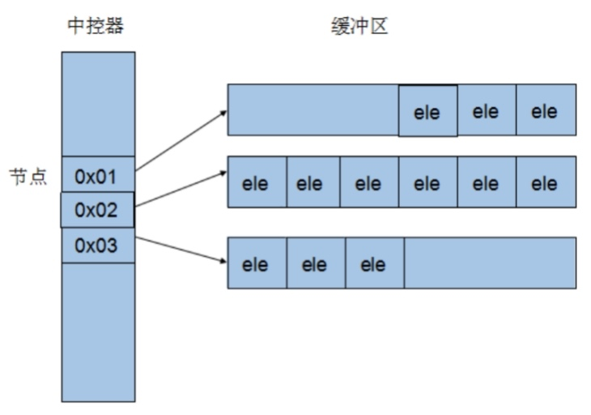
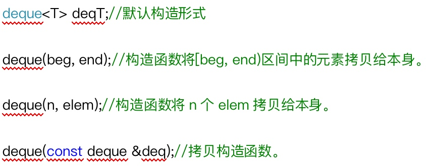
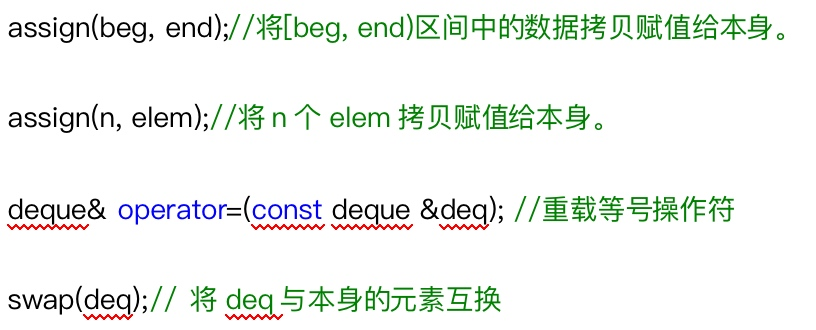
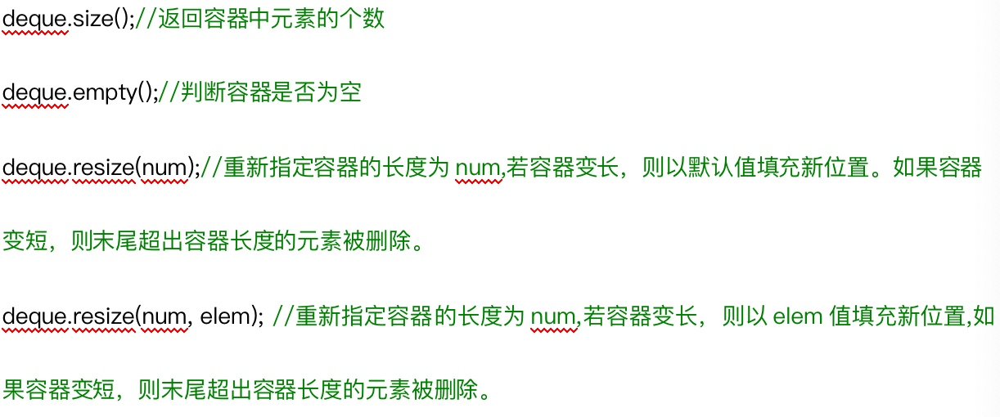
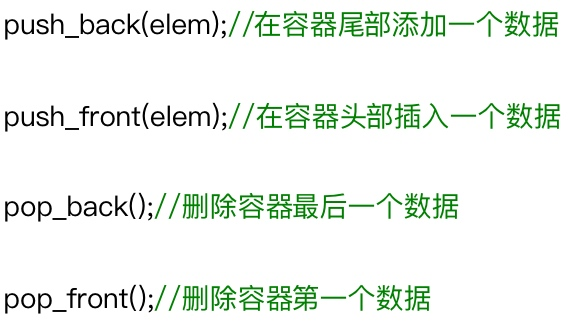
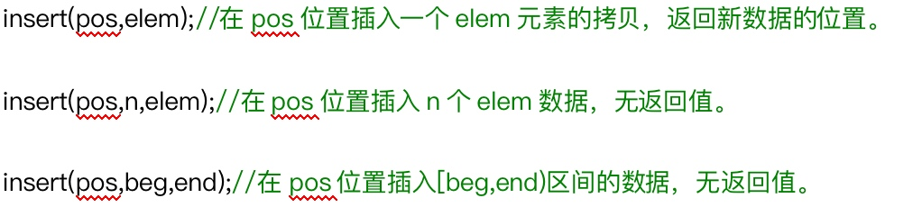
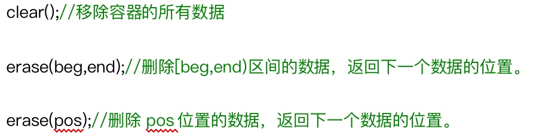
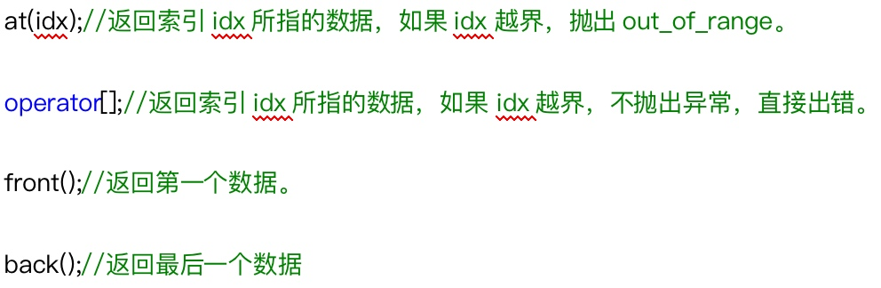

> deque容器是一种双向开口连续线性的空间

## 1 deque容器介绍
### 1.1 deque容器和vector容器的区别
* deque容器允许使用常数项时间对头端进行元素的插入和删除
* deque没有容器的概念，它是由动态的分段连续空间组合而成，随时可以增加一段新空间并链接起来
* deque的迭代器很复杂，为了效率，对deque排序时先将其复制到一个vector中，排序后再复制回deque

### 1.2 deque容器的实现原理
> Deque是由一段一段的定量的连续空间构成，随时可以增加一段新空间并链接起来，避开了重新配置空间，复制，释放的轮回，代价就是复杂的迭代器架构

Deque采取一块所谓的map(注意，不是STL的map容器)作为**主控**，这里所谓的map是一小块连续的内存空间，其中每一个元素(此处成为一个**结点**)都是一个指针，指向另一段连续性内存空间，称作**缓冲区**。缓冲区才是deque的存储空间的主体。

## 2 构造函数

## 3 赋值操作

## 4 大小操作
˛

## 5 双端插入和删除操作

## 6 数据读取操作

˛