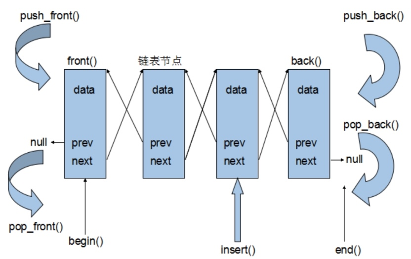
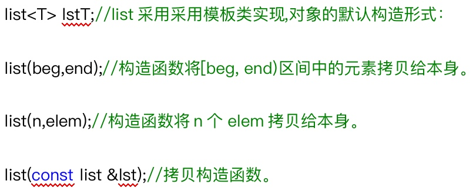
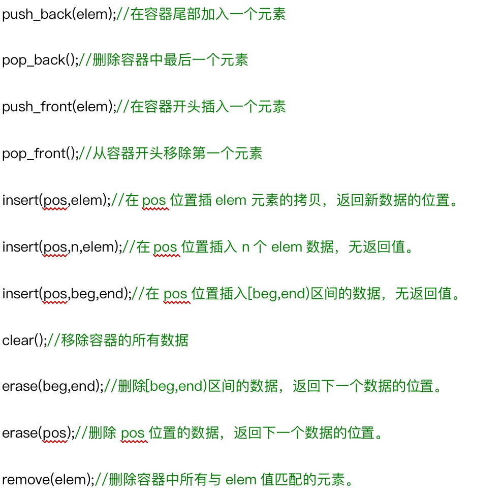
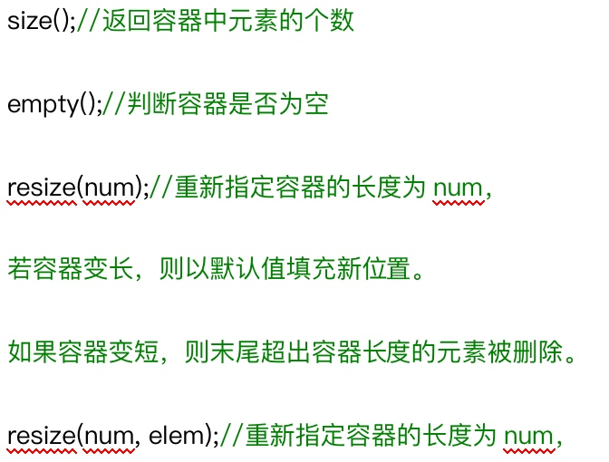
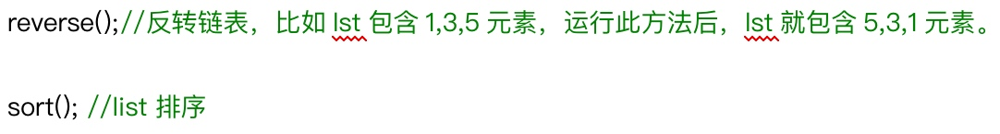

> 链表是一种物理存储单元上非连续、非顺序的存储结构，数据元素的逻辑顺序是通过链表中的指针链接次序实现的。链表由一系列结点（链表中每一个元素称为结点）组成，结点可以在运行时动态生成。每个结点包括两个部分：一个是存储数据元素的数据域，另一个是存储下一个结点地址的指针域。



## 1 list容器
* list容器是一个双向循环列表
* list容器提供的是双向迭代器，而且插入和删除操作不会造成原来list迭代器的失效。

```cpp
int main(){
	list<int> myList;
	for (int i = 0; i < 10; i ++){
		myList.push_back(i);
	}

	list<int>::_Nodeptr node =  myList._Myhead->_Next;  // 结点

	for (int i = 0; i < myList._Mysize * 2;i++){
		cout << "Node:" << node->_Myval << endl;
		node = node->_Next;
		if (node == myList._Myhead){
			node = node->_Next;
		}
	}

	return 0;
}
```

## 2 构造函数


## 3 赋值操作


## 4 插入和删除操作


## 5 大小操作


## 6 反转和排序


* 标准算法适用于 只支持随机访问迭代器的容器
* 不支持随机访问迭代器的容器，内部会对应提供一些算法

```cpp
void print_list(list<int> &mylist) {
	for (list<int>::iterator p_list = mylist.begin();p_list!=mylist.end();p_list++) {
		cout << *p_list << endl;
	}
}

int my_compare(int v1, int v2) {
	return v1>v2;
}

void test() {
	list<int> myList;
	for (int i = 0; i < 10; i++){
		myList.push_back(i);
	}
	myList.sort(my_compare);
	print_list(myList);
}

int main(int argc, char *argv[]) {
	test();
	return 0;
}
```