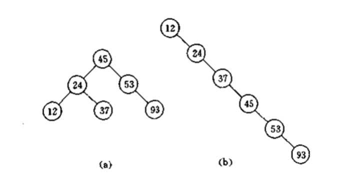
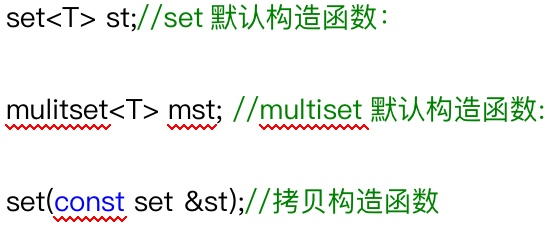
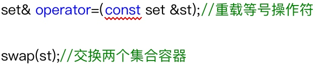
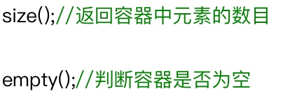
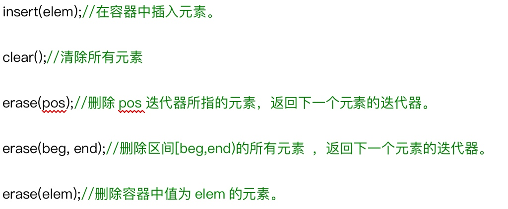
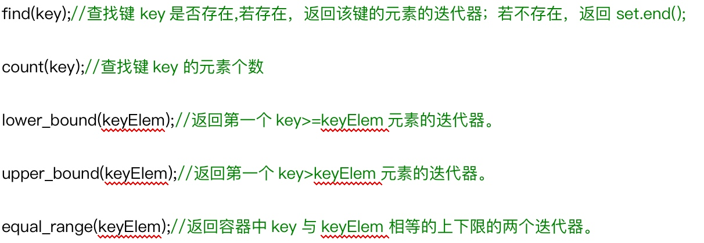

> set容器中的所有元素都会根据元素的键值**自动被排序**。set**不允许两个元素有相同的键值**。
> set的元素即是键值又是实值。不可以通过set的迭代器改变set元素的值，因为set元素值就是其键值，关系到set元素的排序规则。如果任意改变set元素值，会严重破坏set组织。换句话说，**set的iterator是一种const_iterator**.
> 插入和删除操作不会造成原来set迭代器的失效。
> multiset容器允许键值重复。set和multiset的底层实现是红黑树，红黑树为平衡二叉树的一种。

## 1 平衡二叉树
### 1.1 二叉搜索树

二叉搜索树，是指二叉树中的节点按照一定的规则进行排序，使得对二叉树中元素访问更加高效。二叉搜索树的放置规则是：**任何节点的元素值一定大于其左子树中的每一个节点的元素值，并且小于其右子树的值。**

### 1.2 平衡二叉树

由于我们的输入或者经过我们插入或者删除操作，二叉树失去平衡，造成搜索效率降低。
**树的左子树的高度和右子树的高度的差值不能大于1，并且所有子树也必须都是平衡二叉树。**

## 2 构造函数


## 3 赋值操作


## 4 大小操作


## 5 插入和删除操作


```cpp
// set.insert() 返回pair< set<T>::iterator, bool >
void test() {
	set<int>my_set;
	pair< set<int>::iterator, bool > ret = my_set.insert(10);
	if (ret.second) {
		cout << "第一次插入成功" << endl;
	} else {
		cout << "第一次插入失败" << endl;
	}
	
	ret = my_set.insert(10);
	if (ret.second) {
			cout << "第二次插入成功" << endl;
		} else {
			cout << "第二次插入失败" << endl;
		}
}
```

## 6 查找操作


### 6.1 对组
> 对组(pair)将一对值组合成一个值，这一对值可以具有不同的数据类型，两个值可以分别用pair的两个公有属性first和second访问。
> 类模板：template <class T1, class T2> struct pair.

```cpp
void test(void) {
	pair<string, int>tom("tom", 15);
	cout << tom.first << endl << tom.second << endl;
	
	pair<string, int>jerry = make_pair("jerry", 18);
	cout << jerry.first << endl << jerry.second << endl;
	
	pair<string, int>jerry2 = jerry;
}

int main(void) {
	test();
	return 0;
}
```

## 7 multiset容器

```cpp
void print_multiset(multiset<int>&myset) {
	for (multiset<int>::iterator p=myset.begin(); p!=myset.end(); p++) {
		cout << *p <<endl;
	}
}

void test() {
	multiset<int>my_set;
	my_set.insert(10);  // 只返回迭代器
	my_set.insert(10);
	my_set.insert(10);
	my_set.insert(10);
	my_set.insert(10);
	
	print_multiset(my_set);
}
```

## 8 排序操作
> set容器的第二个模板参数可以设置排序规则，默认规则是less<_Kty>

```cpp
class MyCompare {
public:
	bool operator()(int v1, int v2) {
		return v1>v2;
	}
};

void print_set(set<int, MyCompare>&my_set) {
	for (set<int, MyCompare>::iterator p=my_set.begin();p!=my_set.end();p++) {
		cout << *p << endl;
	}
}

void test() {
	// 仿函数而不是回调函数，因为模版参数需要传入一个类型，仿函数本质就是一个类
	set<int, MyCompare>my_set;
	my_set.insert(10);
	my_set.insert(20);
	my_set.insert(30);
	my_set.insert(40);
	my_set.insert(50);
	print_set(my_set);
}
```