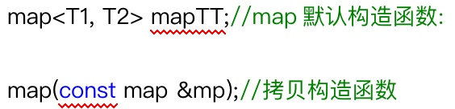
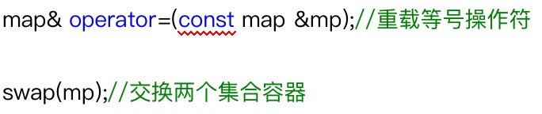
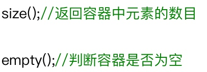
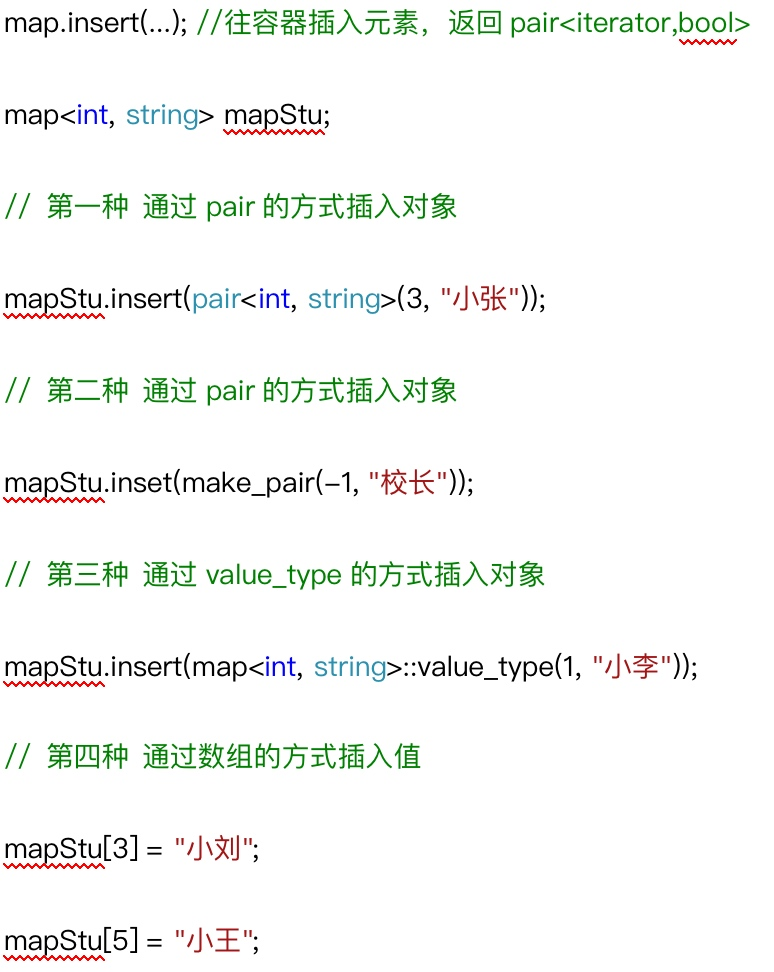
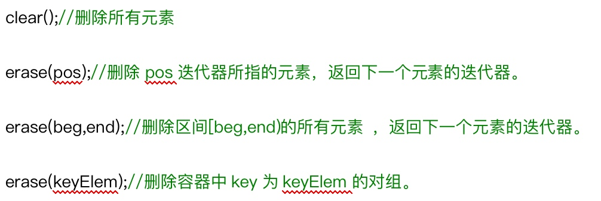
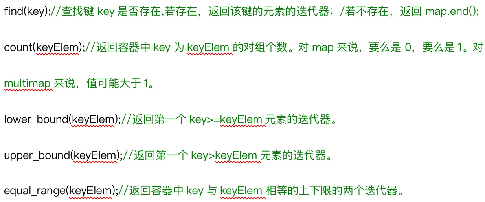
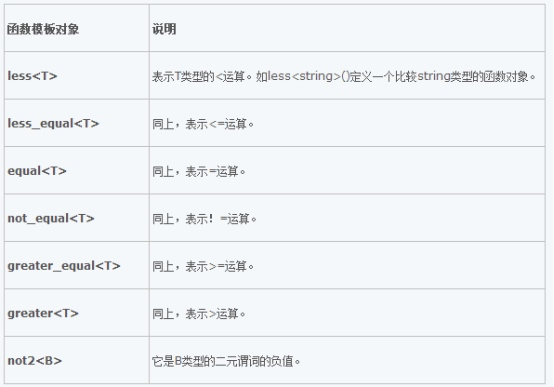

> map容器中所有元素都会根据元素的键值**自动排序**。Map所有的元素都是**pair**,同时拥有**实值和键值**，pair的第一元素被视为键值，第二元素被视为实值
> 插入和删除操作不会造成原来map迭代器的失效。

## 1 构造函数


## 2 赋值操作


## 3 大小操作


## 4 插入元素操作


## 5 删除操作


## 6 查找操作


## 7 排序操作


```cpp
void print_map(map<string, int, greater<string> >my_map) {
	for (map< string, int, greater<string> >::iterator p=my_map.begin();p!=my_map.end();p++) {
		cout << (*p).first << ":" << (*p).second << endl;
	}
}

void test() {
	map<string, int, greater<string> >stu_map;
	stu_map.insert(pair<string, int>("tom", 18));
	stu_map.insert(make_pair("jerry", 19));
	stu_map.insert(map<string, int, greater<string> >::value_type("jack", 20));
	stu_map["mary"] = 21;
	print_map(stu_map);
}
```