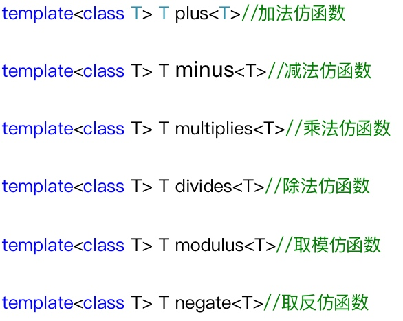
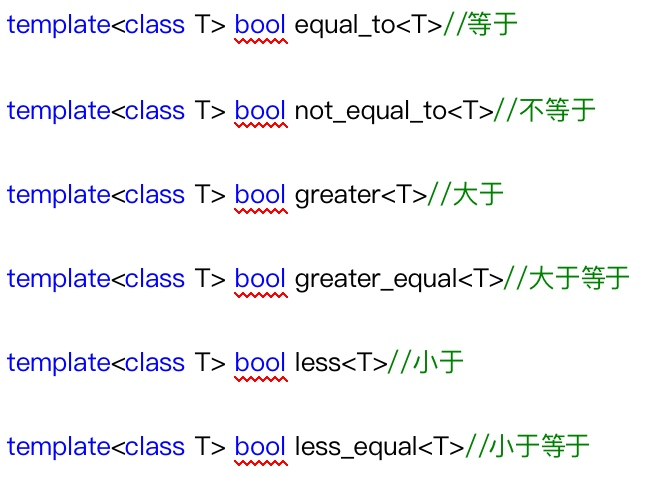
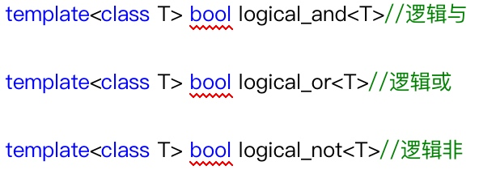

> 函数对象(仿函数):重载**函数调用运算符**的一个**类**，可以使类对象像函数一样被调用。

## 1 函数对象
* 作用：
    * 表示常用的运算 `MyAdd(2, 4);`
    * 通过做template参数的形式来改变算法的策略（谓词）
* 示例：
    * 仿函数可以通过类的成员变量来保存函数的调用状态
    
    ```cpp
        // 1 仿函数可以保存函数的调用状态
    template<class T>
    class MyPrint {
    public:
    	MyPrint() {m_count = 0;}
    	void operator()(T num) {
    		cout << num << endl;
    		m_count++;  // 调用次数
    	}
    	int get_count() {
    		return m_count;
    	}
    private:
    	int m_count;
    };
    
    void test01() {
    	MyPrint<int> my_print;
    	my_print(10);  // 是一个对象不是函数
    	my_print(10);
    	my_print(10);
    	my_print(10);
    	my_print(10);
    	cout << "已打印次数:" << my_print.get_count() << endl;
    }
    ```
    
    * 仿函数对象可以做普通函数的参数在函数内部调用仿函数
    
    ```cpp
        // 2 仿函数可以做普通函数的参数
    void doSomething(MyPrint<int> my_print, int num) {
    	my_print(num);
    }
    
    void test02() {
    	doSomething(MyPrint<int>(), 100);  // 匿名对象
    }
    ```
    
## 2 谓词
> 谓词：返回值是bool类型的函数对象

* 一元谓词做算法函数的参数来改变算法的策略

```cpp
class GreaterThanFive {
public:
	bool operator()(int num) {
		return num > 5;
	}
};

void test01() {
	vector<int>v;
	for (int i=0;i<10;i++) {
		v.push_back(i);
	}
	vector<int>::iterator pos = find_if(v.begin(), v.end(), GreaterThanFive());  // 一元谓词改变算法策略
	if (pos == v.end()) {
		cout << "没有找到" << endl;
	} else {
		cout << "找到了:" << *pos << endl;
	}
}
```

* 二元谓词做算法函数的参数来改变算法的策略

```cpp
class MyGreater {
public:
	bool operator()(int val1, int val2) {
		return val1>val2;
	}
};

void test02() {
	vector<int>v;
	for (int i=0;i<10;i++) {
		v.push_back(i);
	}
	sort(v.begin(), v.end(), MyGreater());  // 二元谓词改变算法策略
	for (vector<int>::iterator p=v.begin(); p!=v.end(); p++) {
		cout << *p << endl;
	}
}
```

## 3 内建函数对象
> `#include <functional>`

### 3.1 算数类函数对象(6)
> 取模运算:
> 5 mod 3 = 2
> 5 mod -3 = 2
> -5 mod 3 = -2
> -5 mod -3 = -2



```cpp
// 1 算数类函数对象
void test01() {
	plus<int> my_plus;  // 加法
	cout << my_plus(20, 10) << endl;
	
	modulus<int> my_mod;
	cout << my_mod(-5, -3) << endl;  // 取模运算 %
	
	negate<int> neg;
	cout << neg(20) << endl;  // 取反
}
```

### 3.2 关系运算类函数对象(6)


```cpp
// 2 关系运算类函数对象
void test02() {
	less_equal<int> less_e;
	cout << less_e(20,21) << endl;
}
```


### 3.3 逻辑运算类函数对象(3)


```cpp
// 3 逻辑运算类函数对象
void print_v(vector<bool> &v) {
	for (vector<bool>::iterator p=v.begin();p!=v.end();p++) {
		cout << *p << endl;
	}
}

void test03() {
//	logical_and<bool> my_and;
//	cout << my_and(5>3, 5>8) << endl;
	
	vector<bool>v;
	v.push_back(false);
	v.push_back(true);
	v.push_back(true);
	v.push_back(false);
	print_v(v);
	cout << "----------" << endl;
	vector<bool>v2;
	v2.resize(v.size());
	transform(v.begin(), v.end(), v2.begin(), logical_not<bool>());  // 匿名对象改变算法策略
	print_v(v2);
}
```