> <algorithm>:常用算法
> <functional>:模版类(内建函数对象)
> <numeric>:序列容器用的模板函数

## 1 遍历算法
### 1.1 for_each遍历算法
> 遍历容器元素，返回函数对象

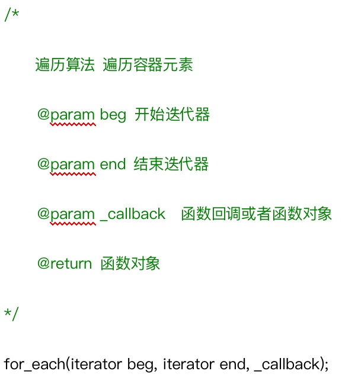

```cpp

// 1 for_each()
class PrintVector {
 public:
	PrintVector() {count = 0;}
	void operator()(int val) {
		cout << val << endl;
		count++;
	}
	int count;	
};

void test01() {
	vector<int>v;
	for (int i=0;i<10;i++) {
		v.push_back(i);
	}
	PrintVector pv = for_each(v.begin(), v.end(), PrintVector());  // 返回函数对象
	cout << "迭代次数:" << pv.count << endl;
}
```

### 1.2 transform搬运算法 
> 将指定容器区间元素搬运到另一容器中或将两个容器的值合并到第三个容器中
> 需提前给目标容器分配好空间

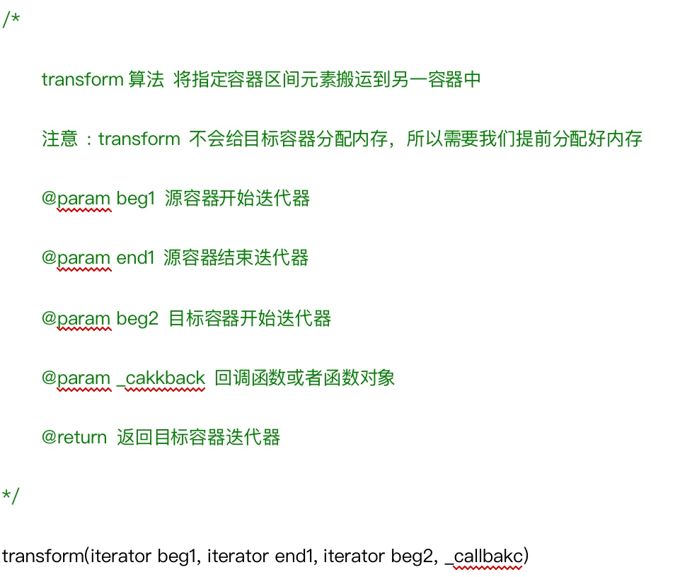

```cpp
// 2 transform()
class PlusVector {
 public:
	int operator()(int val1, int val2) {
		return val1+val2;
	}
};

void test02() {
	vector<int>v1;
	for (int i=0;i<10;i++) {
		v1.push_back(i);
	}
	vector<int>v2 = v1;
	vector<int>v3;
	v3.resize(v1.size());
	transform(v1.begin(), v1.end(), v2.begin(), v3.begin(), PlusVector());  // 返回目标容器迭代器
	for_each(v3.begin(), v3.end(), PrintVector());
}
```

## 2 查找算法
### 2.1 find查找算法
> 查找元素

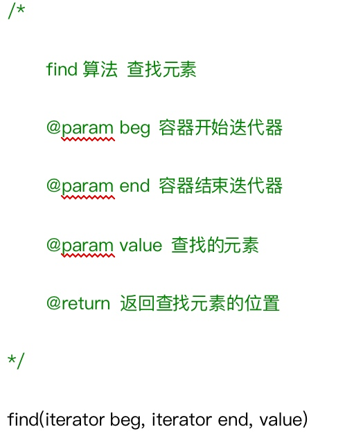

### 2.2 find_if条件查找算法
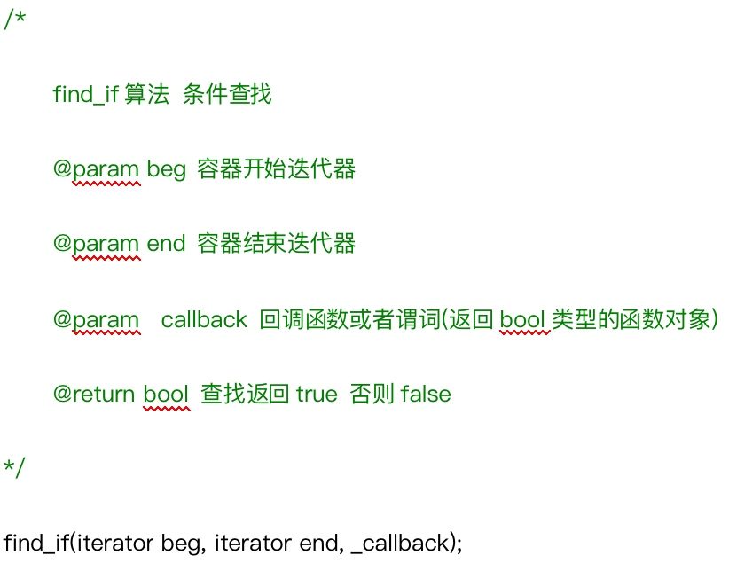

```cpp
class Student {
 public:
	Student(string name, int age) {
		this->name = name;
		this->age = age;
	}
	bool operator==(const Student &sd) {  // 重载==运算符
		return (sd.name==name && sd.age==age);
	}
	string name;
	int age;
};

class GreaterStudent : public binary_function<Student, Student, bool>{
 public:
	bool operator()(Student s1, Student s2) const {
		return s1.age>s2.age;
	}
};

// 1.普通查找和条件查找
void test01() {
	vector<Student>v;
	v.push_back(Student("tom", 18));
	v.push_back(Student("jerry", 19));
	v.push_back(Student("jack", 20));
	v.push_back(Student("mary", 21));
	v.push_back(Student("tony", 22));
	
	// 1 find()
	vector<Student>::iterator pos1 = find(v.begin(), v.end(), Student("tom", 18));
	if (pos1 == v.end()) {
		cout << "未找到" << endl;
	} else {
		cout << "找到了元素:" << pos1->name << endl;
	}
	
	// 2 find_if()
	Student jack("jack", 20);
	vector<Student>::iterator pos2 = find_if(v.begin(), v.end(), bind2nd(GreaterStudent(), jack));
	if (pos2 == v.end()) {
		cout << "未找到" << endl;
	} else {
		cout << "找到了元素:" << pos2->name << endl;
	}
}
```

### 2.3 adjacent_find查找相邻重复元素算法
> 返回相邻元素第一个位置的迭代器

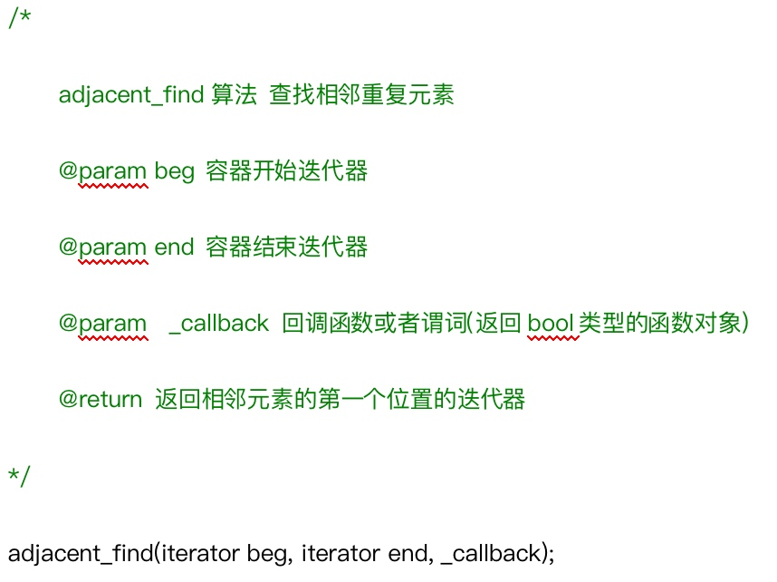

```cpp
// 2 adjacent_find() 查找相邻重复元素
void test02() {
	vector<int>v;
	v.push_back(1);
	v.push_back(2);
	v.push_back(3);
	v.push_back(3);
	v.push_back(4);
	v.push_back(4);
	vector<int>::iterator pos = adjacent_find(v.begin(), v.end());  // 返回相邻元素的第一个位置的迭代器
	if (pos == v.end()) {
		cout << "未找到" << endl;
	} else {
		cout << "找到了重复元素:" << *pos << endl;
	}
}
```

### 2.4 binary_search二分查找法
> 有序序列容器


```cpp
// 3 binary_search() 二分查找
void test03()
{
	vector<int>v;
	for (int i = 0; i < 10; i++) {
		v.push_back(i);
	}
	//v.push_back(3); 容器必须是有序序列！！
	bool ret = binary_search(v.begin(), v.end(), 9);
	if (ret) {
		cout << "找到了9" << endl;
	}
	else {
		cout << "未找到9" << endl;
	}
}
```

### 2.5 count/count_if统计元素出现次数算法
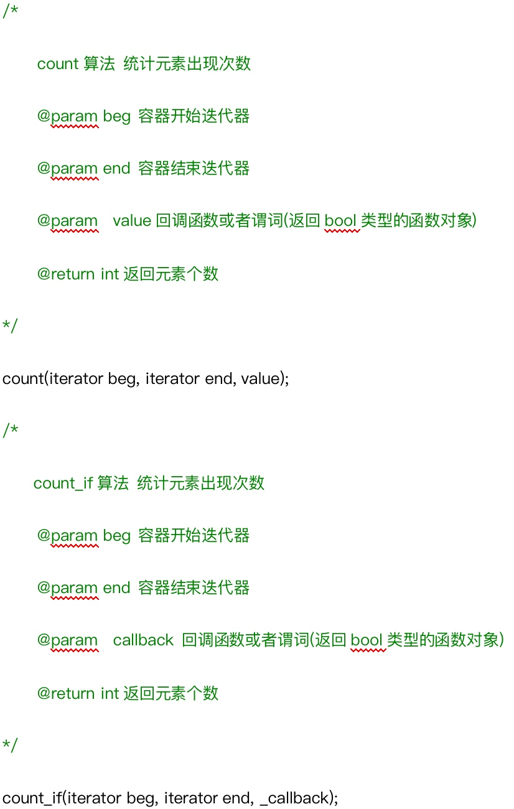

```cpp
// count() 统计元素出现次数
void test04()
{
	vector<int>v;
	for (int i = 0; i < 10; i++) {
		v.push_back(i);
	}
	v.push_back(5);
	v.push_back(5);
	v.push_back(5);
	v.push_back(5);
	
	int num1 = count(v.begin(), v.end(), 5);
	cout << "元素5的个数为:" << num1 << endl;
	
	int num2 = count_if(v.begin(), v.end(), bind2nd(greater<int>(), 3));  // count_if()
	cout << "大于3的元素个数为:" << num2 << endl;
}
```

## 3 排序算法
### 3.1 merge合并算法
> 两个容器必须是有序的,而且必须同序


```cpp
// 1 merge() 两个容器元素合并，并存储到另一容器中
// 两个容器必须是有序的,而且必须同序
void test01()
{
	vector<int>v1;
	vector<int>v2;

	for (int i = 0; i < 10;i++) {
		v1.push_back(i);
		v2.push_back(i+1);
	}

	vector<int>vTarget; //目标容器
	merge(v1.begin(), v1.end(), v2.begin(), v2.end(), vTarget.begin());

	// [](){} 匿名函数  lambda表达式
	for_each(vTarget.begin(), vTarget.end(), [](int val){cout << val << " ";});
	cout << endl;
}
```

### 3.2 sort排序算法
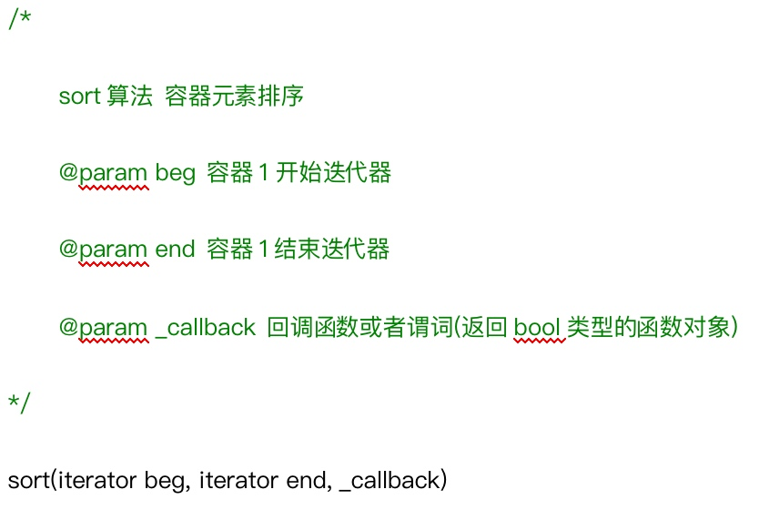


```cpp
// 2 sort() 排序算法
void test02()
{
	vector<int>v1;
	
	for (int i = 0; i < 10; i++) {
		v1.push_back(i);
	}
	//利用sort降序
	sort(v1.begin(), v1.end(), greater<int>());

	for_each(v1.begin(), v1.end(), [](int val){ cout << val << " "; });
	cout << endl;
}
```

### 3.3 random_shuffle随机调整次序算法
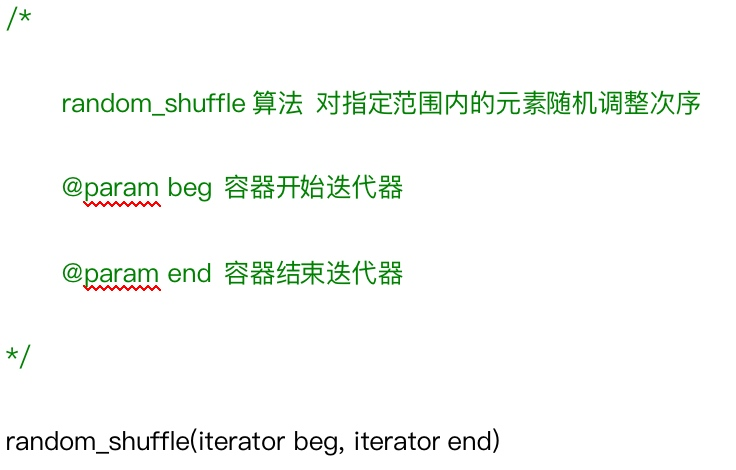

```cpp
// 3 random_shuffle算法 对指定范围内的元素随机调整次序
void test03()
{
	vector<int>v1;

	for (int i = 0; i < 10; i++) {
		v1.push_back(i);
	}
	
	random_shuffle(v1.begin(), v1.end());
	for_each(v1.begin(), v1.end(), [](int val){ cout << val << " "; });
	cout << endl;
}
```

### 3.4 reversef反转算法
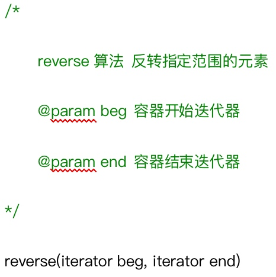


```cpp
// 4 reverse算法 反转指定范围的元素
void test04()
{
	vector<int>v1;

	for (int i = 0; i < 10; i++)
	{
		v1.push_back(i);
	}

	cout << "反转前遍历结果： " << endl;
	for_each(v1.begin(), v1.end(), [](int val){ cout << val << " "; });
	cout << endl;

	reverse(v1.begin(), v1.end());  // 反转
	
	cout << "反转后遍历结果： " << endl;
	for_each(v1.begin(), v1.end(), [](int val){ cout << val << " "; });
	cout << endl;

}
```

## 4 拷贝和替换算法
### 4.1 copy拷贝算法
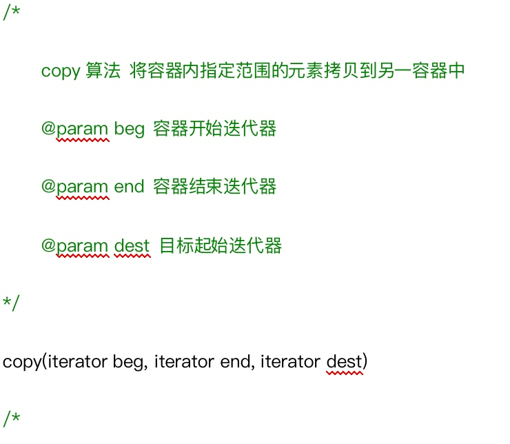

```cpp
// 1 copy算法 将容器内指定范围的元素拷贝到另一容器中
void test01()
{
	vector<int>v;
	for (int i = 0; i < 10;i++) {
		v.push_back(i);
	}

	vector<int>v2;
	v2.resize(v.size());
	copy(v.begin(), v.end(), v2.begin());

	//for_each(v2.begin(), v2.end(), [](int val){cout << val << " "; });
	//cout << endl;

	copy(v.begin(), v.end(), ostream_iterator<int>(cout, " "));  // 利用流输出迭代器遍历容器中的元素
	cout << endl;
}
```

### 4.2 replace/replace_if替换算法
> replace算法 将容器内指定范围的旧元素修改为新元素
> replace_if算法 将容器内指定范围满足条件的元素替换为新元素

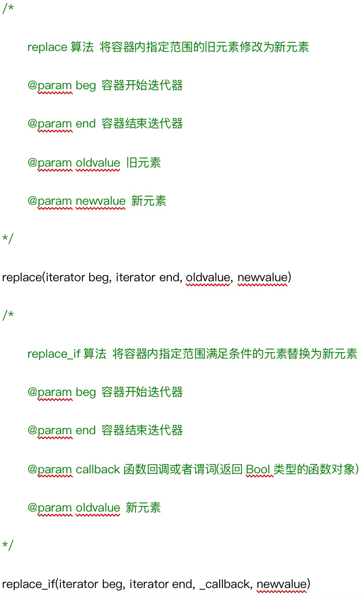

```cpp
void test02()
{
	vector<int>v;
	for (int i = 0; i < 10; i++) {
		v.push_back(i);
	}

	//将容器中的3  替换为 3000
	replace(v.begin(), v.end(), 3, 3000);
	copy(v.begin(), v.end(), ostream_iterator<int>(cout, " "));
	cout << endl;

	//将所有大于3的值 替换为30000
	replace_if(v.begin(), v.end(), bind2nd(greater<int>(), 3), 30000);
	// // 0 1 2 30000  30000 ....
	copy(v.begin(), v.end(), ostream_iterator<int>(cout, " "));
	cout << endl;
}
```

### 4.3 swap互换算法
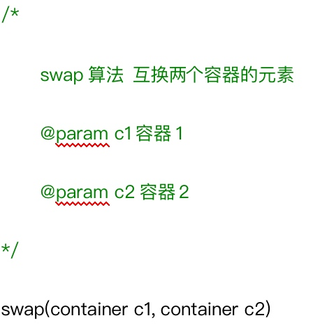

```cpp
// 3 swap算法 互换两个容器的元素
void test03() {
	vector<int>v1;
	vector<int>v2;
	for (int i = 0; i < 10;i++) {
		v1.push_back(i);
		v2.push_back(i+10);
	}

	cout << "交换前的结果为：" << endl;
	copy(v1.begin(), v1.end(), ostream_iterator<int>(cout, " "));
	cout << endl;
	copy(v2.begin(), v2.end(), ostream_iterator<int>(cout, " "));
	cout << endl;

	swap(v1, v2);
	
	cout << "交换后的结果为：" << endl;
	copy(v1.begin(), v1.end(), ostream_iterator<int>(cout, " "));
	cout << endl;
	copy(v2.begin(), v2.end(), ostream_iterator<int>(cout, " "));
	cout << endl;
}
```

## 5 算数生成算法
### 5.1 fill算法: 向容器中添加元素
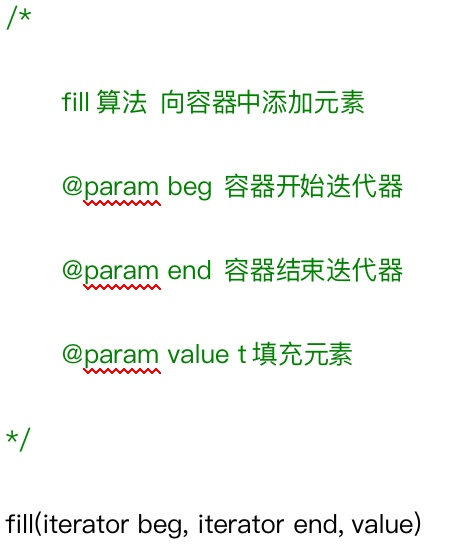

```cpp
// 1 fill算法: 向容器中添加元素
void test01() {
	vector<int>v;
	v.resize(10);
	fill(v.begin(), v.end(), 1000);
	copy(v.begin(), v.end(), ostream_iterator<int>(cout, " "));
}
```

### 5.2 accumulate算法:计算容器元素累计总和
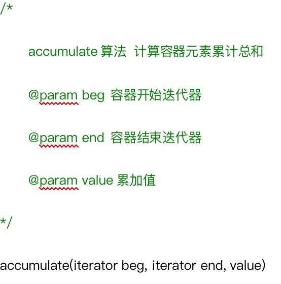

```cpp
// 2 accumulate算法 计算容器元素累计总和
void test02() {
	vector<int>v;
	for (int i=1;i<10;i++) {
		v.push_back(i);
	}
	int num = accumulate(v.begin(), v.end(), 0);  // 累加起始值
	cout << num << endl;
}
```

## 6 集合算法
### 6.1 set_intersection算法:求两个set集合的交集
> 注意:两个集合必须是有序序列

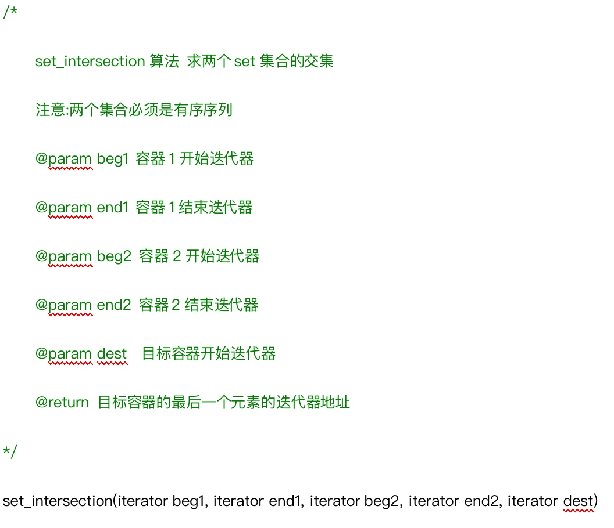

```cpp
// 1. set_intersection算法 求两个set集合的交集
// 注意:两个集合必须是有序序列
void test01() {
	vector<int>v1;
	vector<int>v2;
	for (int i = 0; i < 10; i++) {
		v1.push_back(i);
		v2.push_back(i + 5);
	}

	vector<int>vTarget;
	vTarget.resize(min(v1.size(), v2.size()));
	vector<int>::iterator itEnd = set_intersection(v1.begin(), v1.end(), v2.begin(), v2.end(), vTarget.begin());  // 返回目标容器的最后一个元素的迭代器地址

	copy(vTarget.begin(), itEnd, ostream_iterator<int>(cout, " "));
	cout << endl;
}
```

### 6.2 set_union算法:求两个set集合的并集
> 注意:两个集合必须是有序序列

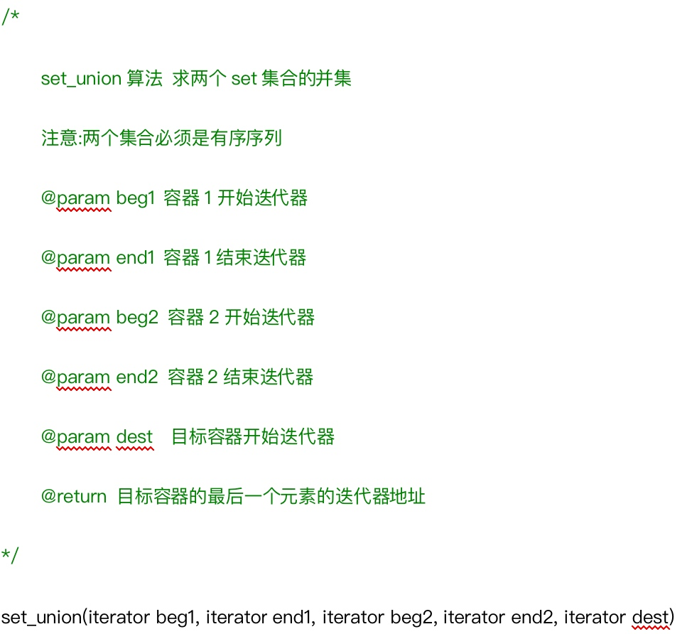

```cpp
// 2. set_union算法 求两个set集合的并集
// 注意:两个集合必须是有序序列
void test02() {
	vector<int>v1;
	vector<int>v2;
	for (int i = 0; i < 10; i++) {
		v1.push_back(i);
		v2.push_back(i + 5);
	}

	vector<int>vTarget;
	vTarget.resize( v1.size() + v2.size() );
	vector<int>::iterator itEnd = set_union(v1.begin(), v1.end(), v2.begin(), v2.end(), vTarget.begin());

	copy(vTarget.begin(), itEnd, ostream_iterator<int>(cout, " "));
	cout << endl;
}
```

### 6.3 set_difference算法:求两个set集合的差集
> 注意:两个集合必须是有序序列

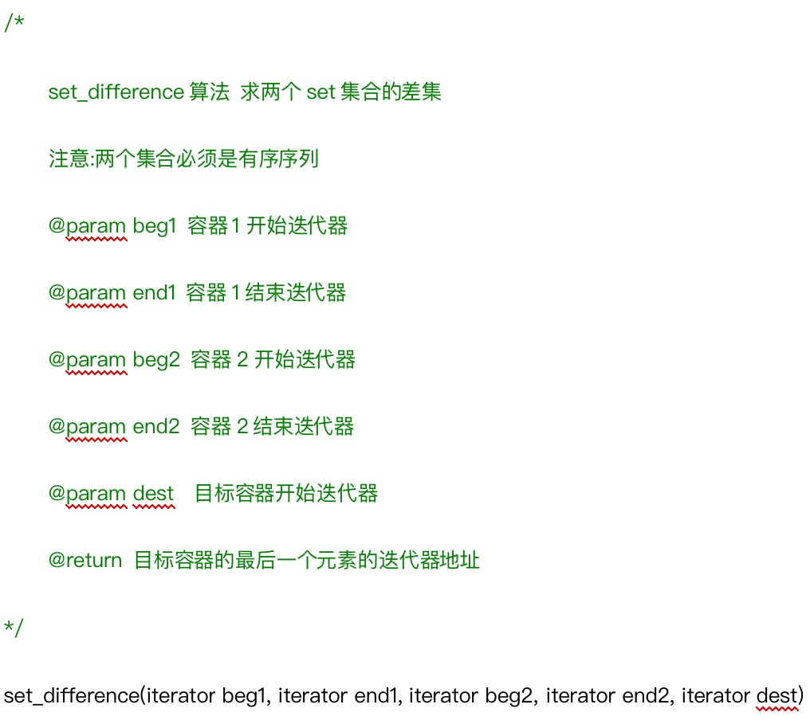

```cpp
// 3 set_difference算法 求两个set集合的差集
// 注意:两个集合必须是有序序列
void test03() {
	vector<int>v1;
	vector<int>v2;
	for (int i = 0; i < 10; i++) {
		v1.push_back(i);
		v2.push_back(i + 5);
	}

	vector<int>vTarget;
	vTarget.resize( max(v1.size(),v2.size()) );
	vector<int>::iterator itEnd = set_difference(v1.begin(), v1.end(), v2.begin(), v2.end(), vTarget.begin());
	copy(vTarget.begin(), itEnd, ostream_iterator<int>(cout, " "));
	cout << endl;


	itEnd = set_difference(v2.begin(), v2.end(), v1.begin(), v1.end(), vTarget.begin());
	copy(vTarget.begin(), itEnd, ostream_iterator<int>(cout, " "));
	cout << endl;
}
```