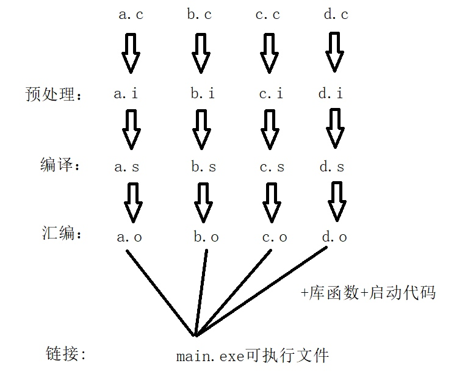
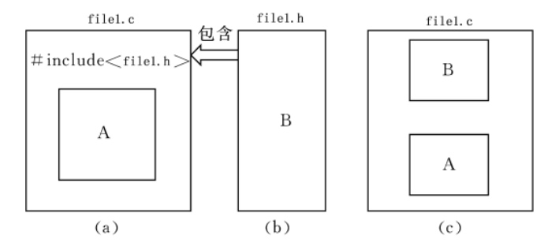
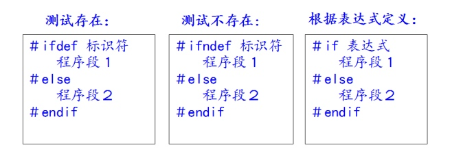

## 1. 环境变量
指定可执行文件的搜索路径

## 2. 编译过程
`gcc main.c -o main`


### 2.1 预处理
`gcc -E main.c -o main.i`
#### 2.1.1 头文件包含：源文件将另一个文件的全部内容包含进来
`#include`可以包含任意格式的文件(.c .h)，但一般用于头文件包含


#### 2.1.2 宏替换：将宏名替换成字符串
1. 宏常量      
    `#define PI 3.14`
    * 大写
    * 不加;
    * 宏定义可以是常数、表达式
    * 不重视作用域，有效范围从定义到本文件结束，可以用`#undef`结束
    * 宏定义中可以引用已定义的宏名
2. 宏函数     
    `#define SUM(x,y)((x)+(y))
    * 用括号括住每一个参数，保证函数的整体定义

#### 2.1.3 条件编译：部分行只在满足一定条件时才会编译

* 防止头文件被重复包含引用

```c
// #pragma onece
#ifndef FUNC_H
#define FUNC_H

// code

#endif
```

* 一些特殊的预定义宏

```c
__FILE__  // 所在文件名
__LINE__  // 行号
__DATE__  // 编译日期
__TIME__  // 编译时间
```

### 2.2 编译(语法检查)
预处理好的文件 ==> 汇编文件
`gcc -S main.c -o main.s`
### 2.3 汇编
汇编文件 ==> 二进制文件（目标文件）
`gcc -c main.c -o main.o`
### 2.4 链接
各个二进制文件 + 库函数 + 启动代码 ==> 可执行文件
`gcc main.o -o main`

## 3 在C语言中运行终端命令

```c
#include <stdio.h>
#include <stdlib.h>  // 标准库头文件

void test(void) {
	system("ping baidu.com");  // system()函数
}

int main(int argc, char const *argv[])
{
	test();
	return 0;
}
```
