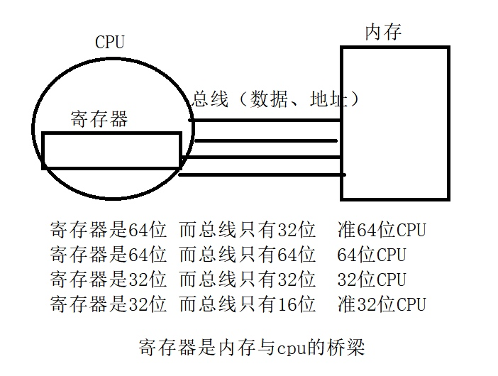
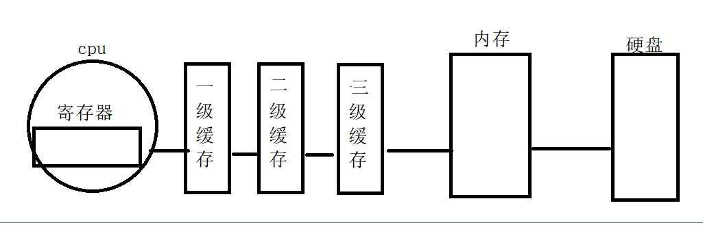
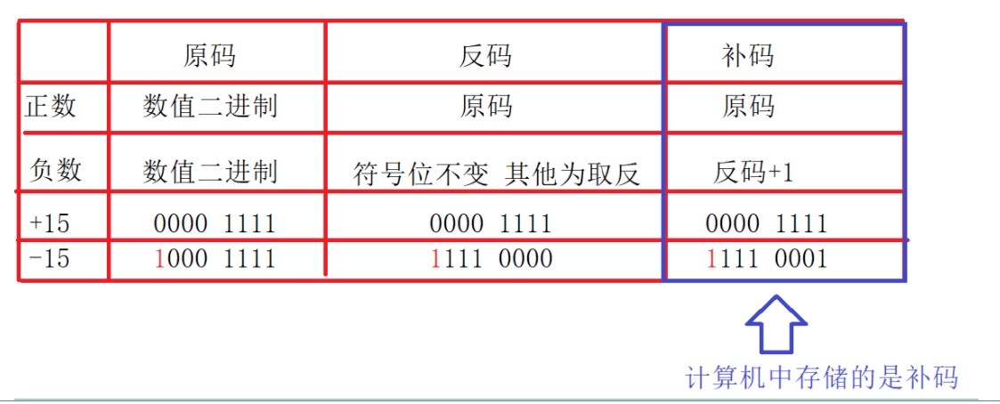
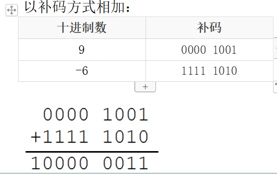
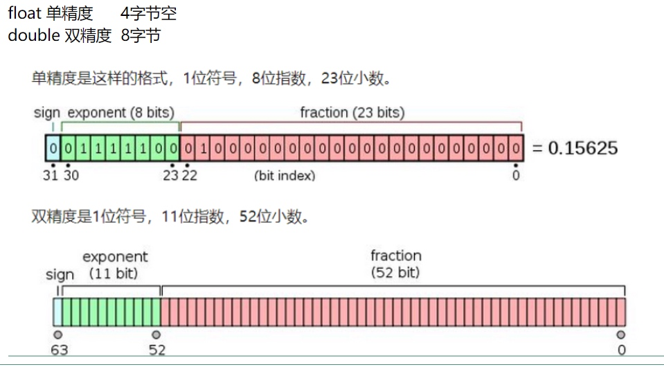
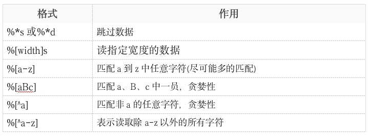

## 1 数据类型
### 1.1 ASCII编码
`NULL` : 0   // int a = 0
`'0'` : 48   // char a = '0'
`'A'` : 65
`'a'` : 97
`'a'` = `'A'` + 32
`sizeof('a') = sizeof(97) = sizeof(int) = 4byte`

### 1.2 字符串常量

```c
printf("%s", "hello");  // hello\0
printf("%p", "hello");  // 字符串首元素地址
printf("%s", "hello");  // ello
```

> `0 == '\0'  // 空字符ASCII`
> `'0' == 60`
> `"0" == "0\0"`

### 1.3 特殊限定符
* `const`
只读变量，必须初始化
* `register` 寄存器变量     
`register int num;  // 将num放入寄存器，不能&num取地址`
* `volatile` 防止编译器优化        
`volatile int num; // 强制访问内存`

> 编译器优化
> * 如果频繁使用某一变量，编译器将变量复制到寄存器中，cpu从寄存集中访问变量，但是寄存器中变量不是实时更新。
> * 如果对一变量连续赋值，编译器会直接编译最后一次赋值，忽略其他赋值语句。

### 1.4 转义输出
* 整型
    * 八进制    
    `printf("%#o", num);  //  十进制转换成八进制`    
    `printf("%c", '\063');  // 八进制转义字符 '\063' == '3' == 48`
    * 十六进制   
    `printf("%#x", num);`
    `printf("%d", '\x12');  // 十六进制转义字符 '\x12' == 'A' == 65`
* 字符串
    `printf("%s", "65");  // A` 
    * 八进制转义
    `printf("%s", "\101");`
    * 十六进制转义
    `printf("%s", "\x41");`
    
### 1.5 `printf()` 输出格式

```c
printf(%5d, 123);  // 位宽5 右对齐
printf(%50d, 123);  // 位宽5 0填充
printf(%-5d, 123);  // 位宽5 左对齐
printf(%5.2f, 3.1415926);  // 位宽5 小数点保留2位
```

## 2 变量的定义、声明和调用
* 变量定义:在内存**开辟空间**    
`int a = 1;  // 变量初始化`
* 变量声明
    * 自动声明（变量定义在前）
    * 显示声明:告诉编译器该变量已经存在，通过编译，不会开辟空间
    
    ```c
    #include <stdio.h>
    
    int main(int argc, char const *argv[])
    {
    	extern char c;
    	printf("%c\n", c);
    }
    
    char c = 'a';
    ```
* 变量调用：操作空间

## 3 变量与内存
### 3.1 cpu、寄存器、内存、硬盘的关系



### 3.2 数值在内存中的存取
### 3.2.1 存
计算机系统中，数值一律用补码来存储
* 补码
    * 0 —— 原码
    * 正数 —— 原码
    * 负数 —— 补码

* 将减法运算转换为加法运算
* 补码相加，如果最高位有进位，舍弃进位


### 3.2.2 取
* %d —— 有符号取
* %ud —— 无符号取
负数的补码当成原码输出正数

### 3.2.3 将char变量按照int形式取出

```c
// char 与 int 在内存中的存取
#include <stdio.h>

int main(int argc, char const *argv[])
{
	char num = 0x9b;  // 1001 1011
	// num占一字节，以int形式读取时前面位自动补1
	printf("%u\n", num);  // 11111111 11111111 11111111 10011011 ==> 4294967195
	printf("%u\n", num & 0x000000ff); // 按位与 ==> 00000000 00000000 00000000 10011011 ==> 155
	printf("%d\n", num);  // 10000000 00000000 00000000 01100101 ==> -101
	printf("%x\n", num);  // 11111111 11111111 11111111 10011011 ==> ffffff9b

	int num_2 = 0x9b;
	printf("%u\n", num_2);  // 00000000 00000000 00000000 10011011 ==> 155
	printf("%d\n", num_2);  // 00000000 00000000 00000000 01100101 ==> 155
	printf("%x\n", num_2);  // 00000000 00000000 00000000 10011011 ==> ffffff9b

	return 0;
}
```

### 3.2.4 数值溢出

```c
// 数值溢出
#include <stdio.h>

int main(int argc, char const *argv[])
{
	int num = 0x7fffffff;  // 01111111 11111111 11111111 11111111 ==> 2147483647
	printf("%d\n", num);
	printf("%d\n", num+1);  // 10000000 00000000 00000000 00000000 ==> -2147483648


	unsigned int num_2 = 0xffffffff;

	printf("%u\n", num_2); //  11111111 11111111 11111111 11111111 ==> 4294967295
	printf("%u\n", num_2+1); //  1 00000000 00000000 00000000 00000000 ==> 0

	return 0;
}
```

### 3.3 浮点型在内存中的存储
* 常量定义为double
* float变量定义：   
`float f = 3.14f；`   
* float存储
1位符号 + 8位指数 + 23位小数
* double存储
1位符号 + 11位指数 + 52位小数


## 4 字符串的操作
### 4.1 拷贝、拼接和比较
* 拷贝、拼接

```c
void func2(void) {
    // 1 拷贝
    char buf1[32] = "";
    strcpy(buf1, "hello world!");  // strcpy
    printf("strcpy:%s\n", buf1);

    char buf2[32] = "";
    strncpy(buf2, "hello world!", 5);
    printf("strncpy:%s\n", buf2);  // strnpy

    // 2 拼接
    char buf3[32] = "hello ";
    char buf4[] = "world!";
    strcat(buf3, buf4);  // strcat
    printf("strcat:%s\n", buf3);

    char buf5[32] = "hello ";
    char buf6[] = "world!";
    strncat(buf5, buf6, 3);  // strncat
    printf("strncat:%s\n", buf5);
}
```

* 比较 `int strcmp(str, str);`

```c
// strcmp()
void func3(void) {
    char buf1[] = "hello,world!";
    char buf2[32] = "";
    fgets(buf2, sizeof(buf2), stdin);
    buf2[strlen(buf2)-1] = 0;

    if (strcmp(buf1, buf2) == 0) {
        printf("0");
    } else {
        printf("%d", strcmp(buf1, buf2));  // 返回a-b值
    }
}

// strncmp()
void func4(void) {
    char buf1[] = "hello,world!";
    char buf2[32] = "";
    fgets(buf2, sizeof(buf2), stdin);
    buf2[strlen(buf2)-1] = 0;

    if (strncmp(buf1, buf2, 3) == 0) {
        printf("0");
    } else {
        printf("%d", strncmp(buf1, buf2, 3));
    }
}
```

### 4.2 格式化字符串：字符串的组包和解宝
* 组包 `int sprintf(char *str, const char *format, ...);  // 返回成功格式化字符串的字符数（不包括0）`

```c
void func5(void) {
    int year = 2020;
    int month = 4;
    int day = 11;
    char buf[32] = "";
    int len = sprintf(buf, "%d/%d/%d", year, month, day);
    printf("%s %d", buf, len);
    // 1 利用解包拼接字符串
    int str1[] = "hello";
    int str2[] = "world!";
    int str3[32] = ""; 
    int len_str = sprintf(str3, "%s %s", str1, str2);  // 11
    // 2 数字转字符串
    int num = 100;
    char str_num[32] = "";
    int len_num = sprintf(str_num, "%d", num);
    sprintf(str_num, "0x%x", num);  // 十六进制字符串
    sprintf(str_num, "0%o", num);  // 十六进制字符串
    // 3 设置右对齐
    menset(str_num, 0, 32);
    sprintf(str_num, "%8d", num);
    // 4 设置左对齐
    menset(str_num, 0, 32);
    sprintf(str_num, "%-8d", num);
}
```

* 解包 `sscanf(const char *str, const char *format, ...);  // 成功返回参数个数`


```c
void func6(void) {
    char information[64] = "tel:15666881866:2020/4/11/zuoyiming";
    unsigned long long tel = 0;
    int year = 0, month = 0, day = 0;
    char name[32] = "";
    sscanf(information, "tel:%llu:%d/%d/%d/%s", &tel, &year, &month, &day, name);
    printf("%llu\n", tel);
    printf("%d\n", year);
    printf("%d\n", month);
    printf("%d\n", day);
    printf("%s\n", name);
    // 1 跳过数据
    char buf[32] = "";
    sscanf("123456hello", "%*d%s", buf);
    sscanf("hello 123456", "%*s%s", buf);  // 遇到空格或者'\t'停止 123456也是字符串
    sscanf("hello123456", "%*[a-z]s%s", buf);  // 跳过指定数据
    // 2 读指定宽度的数据
    sscanf("123456hello", "%7s", buf);  // "123456h"
    // 3 匹配a-z中任意字符
    // 从第一个字符开始匹配，如果不是停止匹配
    sscanf("hel5lo", "%[a-z]", buf);  // "hel"
    // 4 匹配指定字符
    sscanf("hel5lo", "%[eh]", buf);  // "he"
    // 5 匹配非指定字符外的任意字符
    sscanf("hel5lo", "%[^oy]", buf);  // "hel5l"
    sscanf("5dsfglo", "%[^a-z]", buf);  // "5"
}
```

#### 4.2.1 案例：从字符串中取出字符

```c
// 案例：从字符串中取出myname
void func01(void) {
    char buf[] = "123abcd$myname@000qwe";
    char buf1[32] = "";
    sscanf(buf, "%*[^$]$%[^@]", buf1);
    printf("%s\n", buf1);
}
```

### 4.3 字符查找和字符串查找
* 字符查找 `int char *strchr(str, chr);  // 未找到返回NULL`

```c
void func7(void) {
    char buf[32] = "zuoyimingzuoyiming";
    char *ret = NULL;  // 索引指针，存储函数返回的字符地址
    char *s = buf;  // 进行多次查找
    ret = strchr(s, 'z');
    while (ret) {
        printf("%ld\n", ret-buf);
        *ret = '*';  // 替换字符
        s = ret + 1;  // 继续查找下个字符
        printf("%s\n", s);
        ret = strchr(s, 'z');
    }
    printf("%s\n", buf);
}
```

* 字符串查找 `int char *strstr(str, str);`

```c
void func8(void) {
    char buf[32] = "";
    fgets(buf, sizeof(buf), stdin);
    char *ret = NULL;
    char *s = buf;
    ret = strstr(s, "sb");
    while (ret) {
        printf("%ld\n", ret - buf);
        strncpy(ret, "**", 2);  // 替换字符
        s = ret + strlen("**");  // 继续下一个查找
        ret = strstr(s, "sb");
    }
    printf("%s", buf);
}
```

### 4.4 字符串切割 `char *strtok(char *str, const char *delim);`

```c
void func5(void) {
    char str[] = "haha:hehe:xixi:henhen:wuwu:lala";
    char *arr[32] = {NULL};  // 字符串指针变量数组初始化全为NULL

    int i = 0;
    // 使用'\0'替换切割字符
    // 第一次调用，给予字符串参数
    arr[i] = strtok(str, ":");  // 赋给一个字符串指针变量
    while (arr[i] != NULL) {
        // 继续切割使用NULL替换被切割字符串
        arr[++i] = strtok(NULL, ":");  // 切割失败返回NULL
    }
    i = 0;
    while (arr[i] != NULL) {
        printf("%s\n", arr[i++]);
    }
}

// 优化
void func6(void) {
    char str[] = "haha:hehe####xixi****henhen@@@@wuwu$$$lala";  // 多个分隔符
    char *arr[32] = {str, NULL};
    int i =0;
    // 切割一次后字符串已经被记住，继续切割使用NULL
    while ((arr[i] = strtok(arr[i], ":#$@*")) && ++i) {
//        i++;
    }
    i = 0;
    while (arr[i] != NULL) {
        printf("%s\n", arr[i++]);
    }
}
```

### 4.5 字符串转换为数值 `int atoi(char *str);`

```c
// atoi 将字符串转化为数值
void func7(void) {
    printf("%d\n", "123456");  // 首元素地址
    printf("%d\n", atoi("123456"));
    printf("%d\n", atoi("123456abcdefg"));
    // sscanf(灵活)替代atoi
    int num01 = 0;
    int num02 = 0;
    sscanf("12 34", "%d %d", &num01, &num02);
    printf("%d\n%d", num01, num02);
}
```

## 5 sizeof 操作符
* sizeof本质是运算符
* sizeof的返回值是unsigned int型

```
unsigned int a = 10;
printf("%d", (a - 20));  // a-20>0 unsigned int 和 int 运算时统一转换为unsign int
```

* 参数是数组名时返回数组大小

```c
void func(int arr[]) {  // 数组名传入函数时，数组名被退化为一个指针，指向数组第一个元素地址
    printf("%d", typeof(arr))  // 4
}
```
