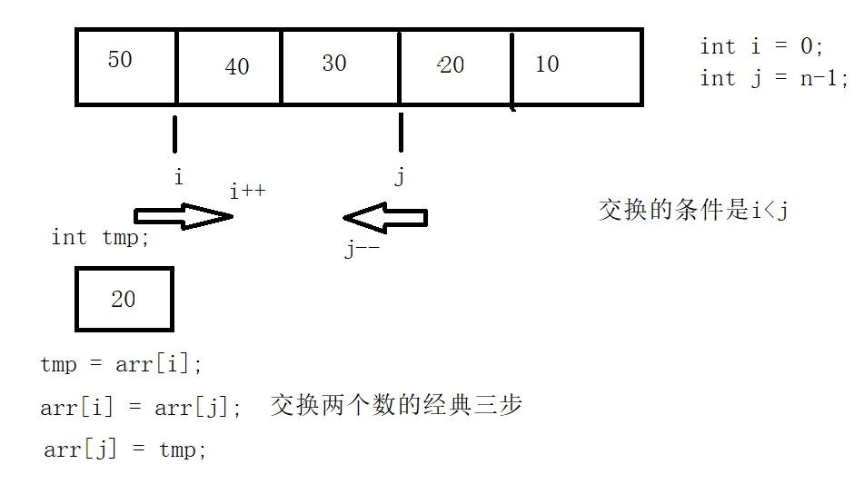

## 1 程序结构
### 1.1 三目运算符
`a > b ? printf("%d", a) : printf("%d", b)`
### 1.22 `goto` 语句

```c
printf("1");
A:
printf("2");
printf("3");
printf("4");
printf("5");
printf("6");
goto A;
printf("7");
```

## 2 一维数组
### 2.1 一维数组名
* 数组名是一个指针常量(不能++)，也就是数组第一个元素的地址，它的类型取决于数组元素的类型，如果数组元素是`int`，那么数组名的类型就是`指向int的常量指针`(int *[10])。
* `sizeof(数组名)`返回整个数组的长度
* `&数组名`返回的是一个指向数组的指针，`数组名`是一个指向数组首元素的指针常量
* 数组名和指针的区别
    * 数组名：`int arr[];` 声明一个数组时，编译器先根据声明指定的元素数量为数组分配内存空间，然后再创建数组名，指向这段空间的起始位置。
    * 指针：`int *arr;` 声明一个指针变量时，编译器只为指针本身分配内存空间，并不为任何整形变量分配空间，指针并未初始化指向任何现有的内存空间。

```c
#include <stdio.h>

int main(void) {
    int arr[10] = {1, 2, 3, 4, 5};

    printf("%p\n", arr);  // 指针常量(int * const p)：数组首元素的地址
    printf("%d\n", sizeof(arr));  // 20 返回数组大小
    printf("%p\n", &arr[0]);
    printf("%p\n", &arr[1]);
    printf("%p\n", &arr[0]+1);
    printf("%p\n", arr+1);  // 数组首元素+1: 第二个元素地址
    
    int *p = arr;  // 将数组名指针常量赋给一个指针变量（数组名做函数形参）
    printf("%lu\n", sizeof(p));  // 8
    
    printf("%p\n", &arr);  // 指针：数组的地址
    printf("%s\n", typeid(&arr).name());  // 返回int *[10]而不是int *
    printf("%p\n", &arr+1);  // 数组地址+1: 跳过整个数组
    return 0;
}
```

#### 2.1.1 一维数组名做函数的参数
* `int func(int *arr, int len);`
* `int func(int arr[], int len);`

> 形参只是一个指针，调用时传递给被调函数的是一份指针的拷贝，并不需要为数组分配内存，节省空间，但是在被调函数中arr退化为指针变量，`sizeof(arr)`返回的是指针的长度，所以必须显式传递一个长度参数给被调函数

```c
void func(int *arr, int len) {
    printf("%d", sizeof(arr))  // 4
}
int main(void) {
    int arr[5] = {10, 20, 30, 40, 50};
    func(arr, len);
    return 0;
}
```

### 2.2 一维数组初始化

```c
int arr[5] = {1, 2};  // 部分初始化，其余元素自动补0
int arr[5] = {0};  // 全部初始化为0
int arr[5] = {[3]=2, [1]=3};  // 指定下标初始化，其余元素自动补0
int arr[] = {1, 2, 3, 4, 5};  // 自动初始化
```

### 2.3 案例：数组逆置


```c
// 数组逆置
#include <stdio.h>

int main(void) {
    int arr[5] = {0};
    int n = sizeof(arr) / sizeof(arr[0]);

    for (int i = 0; i < n ; i++) {
        scanf("%d", &arr[i]);
    }

    for (int i = 0, j = n - 1; i < j; i++, j--) {
        int tmp = 0;
        tmp = arr[i];
        arr[i] = arr[j];
        arr[j] = tmp;
    }

    for (int i = 0; i < n; i++) {
        printf("%d\n", arr[i]);
    }

    return 0;
}
```

### 2.4 案例：冒泡排序

```c
// 冒泡排序
#include <stdio.h>

int main(void) {
    int arr[10] = {4, 3, 8, 5, 10, 8, 3, 6, 2, 7};
    int n = sizeof(arr) / sizeof(arr[0]);

//    for (int i = 0; i < n ; i++) {
//        scanf("%d", &arr[i]);
//    }

    for (int i = 0; i < n-1 ; i++) {
        for (int j = i + 1; j < n; j++) {
            if (arr[i] > arr[j]) {
                int tmp = arr[i];
                arr[i] = arr[j];
                arr[j] = tmp;
            }
        }
    }

    for (int i = 0; i < n ; i++) {
        printf("%d", arr[i]);
    }

    return 0;
}
```

## 3 数组指针：指向数组的指针
* 数组名`arr`
* 数组指针 `&arr`

1. 先定义数组类型，再创建数组指针变量

```c
void func01(void) {	
	typedef int(ARRAY)[5];
	int arr[5] = {10, 20, 30, 40, 50};
	ARRAY *p =  &arr;
	printf("%d", (*p)[0]);
}
```

2. 先定义数组指针类型，再创建数组指针变量

```c
void func02(void) {
	typedef int(*P_ARRAY)[5];
	int arr[5] = {10, 20, 30, 40, 50};
	P_ARRAY p =  &arr;
	printf("%d", (*p)[1]);
}
```

3. 直接创建数组类型变量

```c
void func03(void) {
	int arr[5] = {10, 20, 30, 40, 50};
	int (*p)[5] = &arr;
	printf("%d", (*p)[2]);
}
```

## 4 二维数组
### 4.1 二维数组名
`int arr[3][10];`
二维数组名也是指向数组第一个元素的指针常量，但是二维数组的第一个元素是一个数组，所以`arr`是指向一个包含10个整型元素数组的指针。

```c
void func01(void){
	int arr[3][4] = {
		{1, 2, 3, 0}, 
		{4, 5, 6, 0}, 
		{7, 8, 9, 0} };
	int (*p)[4] = arr;  // 一般情况下，二维数组名指向第一行数组指针，p是指向第一个行数组的数组指针(arr)
//	int (*p) = &arr // 一位数组，p是指向数组的指针
	
	printf("%d\n", *(*p+6));  // p是一个数组指针，*p是一个数组
	printf("%d\n", *(*(p+1)+2));  // p+1 指向第二个行数组的数组指针，*(p+1)第二个行数组首元素
	printf("%d\n", p[1][2]); // p == arr
}
```
#### 4.1.1 二维数组名做函数的参数

```c
//void printf_arr2(int (*p)[4], int row, int col) {
void printf_arr2(int p[3][4], int row, int col) {
	for (int i=0; i<row; i++) {
		for (int j=0; j<col; j++) {
			printf("%d ", p[i][j]);
		}
		printf("\n");
	}
}

int main(int argc, char *argv[]) {
	int arr[3][4] = {
		{1, 2, 3, 0}, 
		{4, 5, 6, 0}, 
		{7, 8, 9, 0} };	
	printf_arr2(arr, 3, 4);
}
```

### 4.2 二维数组的初始化

```c
int arr[3][4] = { {1, 2}, {3} };  // 分段初始化
int arr[3][4] = {1, 2, 3};  // 连续初始化
int arr[][4] = {1, 2, 3, 4, 5}  // 省略行数
```

### 4.3 二维数组的地址

```c
// 二维数组地址
#include <stdio.h>

int main(void) {
    int arr[3][4] = {0};
    int row = sizeof(arr) / sizeof(arr[0]);
    int col = sizeof(arr[0]) / sizeof(arr[0][0]);
    int n = sizeof(arr) / sizeof(arr[0][0]);

    printf("%p\n", arr);  // 二维数组的起始地址
    printf("%p\n", arr[1]);  // 二维数组第二行的起始地址

    return 0;
}
```

## 5 字符数组
### 5.1 字符数组的初始化和操作

```c
#include <stdio.h>

int main(void) {
    char arr[] = {'h', 'e', 'l', 'l', 'o'};  // 5个字节，但没有'\0'
    char arr[] = "hello world!";  // 12+1个字节
    char arr2[16] = "";  // 16个字节 清空字符数组：所有元素都是'\0'，"" - 空字符

    scanf("%s", arr2);  // 空格 or 回车 被认定为空字符
    printf("%s", arr2);

    return 0;
}
```
### 5.2 获取带有空格的字符串
* `gets()`（不安全）

```c
char arr2[16] = "";
gets(arr2);  // 可能因为操作非法内存产生段错误(编译不出错，运行出错)
printf("%s", arr2); 
```

* `fgets()`

```c
char arr2[16] = "";
fgets(arr, sizeof(arr), stdin);  // 标准输入文件(键盘)
$hello
printf(%lu, sizeof(arr2));  // 6(获取的字符包括回车)
printf("%s", arr2); 
```

### 5.3 其他操作

```c
#include <stdio.h>
#include <string.h>

int main(void) {
    char arr[] = "hello world";

    puts(arr);  // puts()
    fputs(arr, stdout);  // fputs()
    printf("\n%lu", strlen("\x43\1291"));  // strlen(arr):获取字符数(11)
    printf("\n%lu", sizeof(arr));  //sizeof(arr):获取数组元素数(12) 
    return 0;
}
```