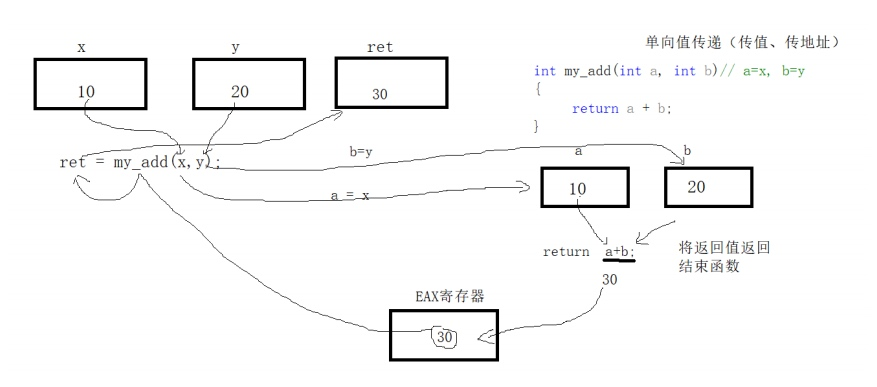
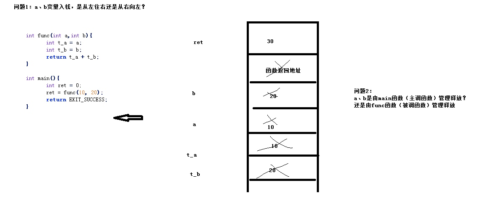
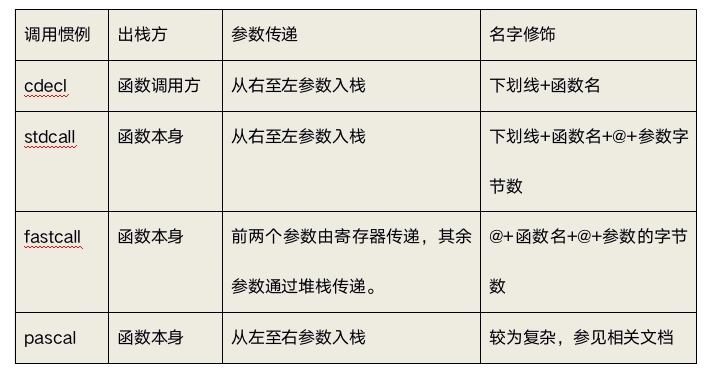
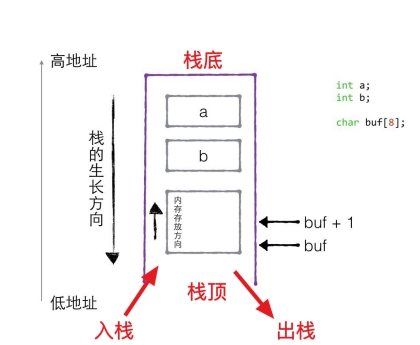
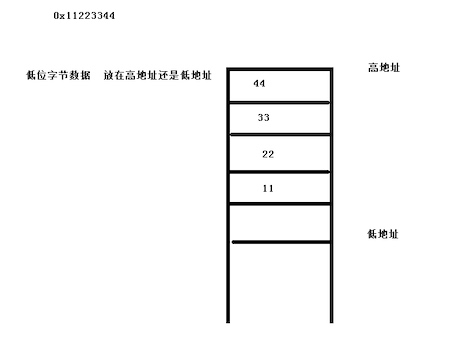
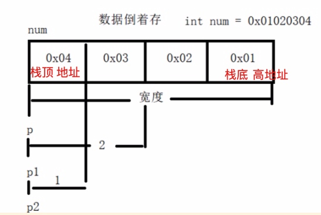
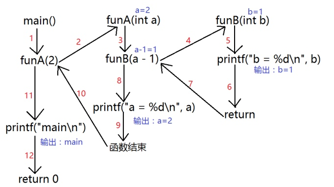
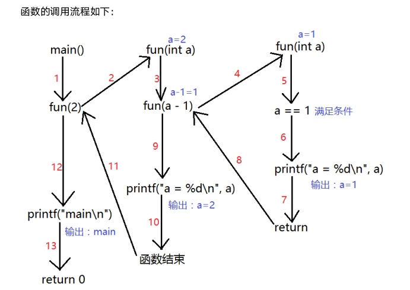

## 1 函数的定义、声明与调用
### 1.1 函数的形式参数
形参在函数定义时没有空间（定义时不能赋值），只有在调用函数时形参才有空间，函数调用时将**实参的值传入形参的空间**，函数调用完形参空间**自动释放**。

### 1.2 函数的调用流程
函数调用完成后`return`的值会先放入寄存器或内存中


## 2 多文件编程
### 2.1 func.h 函数声明

```c
// #pragma once  // 防止头文件重复

#ifndef C_FUNC_H
#define C_FUNC_H

extern int add(int x, int y);  // 外部声明：说明该函数存在，但定义在其他源文件中。

#endif //C_FUNC_H

```

### 2.2 func.h 函数定义

```c
int add(int x, int y) {
    return x + y;
}
```

### 2.3 main.c 函数调用

```c
#include <stdio.h>
#include "func.h"  // 先到当前目录寻找

int main(void) {
    int a = 10, b = 20;
    int ret = add(a, b);
    printf("%d", ret);
    return 0;
}
```

### 2.4 多文件链接
    `$gcc -o main main.c func.c`
    
## 3 `reture` 与 `exit`
* `reture;` 结束当前函数
* `exit(-1);` 结束当前进程

## 4 宏函数
适用于替换频繁使用短小的函数
用空间换取时间(函数出栈入栈)

```c
# define MYADD(x, y) ((x)+(y))  // 要保证完整型

int main(void) {
    int a=10, b=20;
    printf("%d", MYADD(a, b*2) * 2)  // a+b*2*2 ==> ((a)+(b*2))*2
}
```

## 5 函数的调用流程模型
### 5.1 栈（stack）
* 先入栈(push)后出栈(pop)：First In Last Out(FILO)
* 栈是向下增长的，入栈使得栈顶地址减小，出栈使得栈顶地址增大。
* 堆栈帧(Stack Frame)或活动记录(Activate Record)：栈保存一个函数调用所需要维护的信息
    * 函数的返回地址（在代码中）
    * 函数参数
    * 临时变量
    * 保存的上下文：包括在函数调用前后需要保持不变的寄存器
    
### 5.2 函数调用流程

### 5.3 函数调用惯例（Calling Convention）：主调函数和被调函数的一致约定，保证函数能被正确调用
* 函数参数的传递顺序和方式
    * 传递方式：栈传递，主调函数把参数压入栈中，被调函数从栈中将参数取出
    * 传递顺序：从左往右或从右往左
* 栈的维护方式
    * 出栈方：主调函数或被调函数在调用结束后把压入栈中的参数弹出，保证栈在函数调用前后保持一致
    * 名字修饰：对被调函数的名字进行修饰，在链接时对调用惯例进行修饰
* cdecl惯例
` int _cdecl func(int a, int b)  // 完整写法;`


### 5.4 函数变量传递分析
* 父函数在栈区和堆区开辟的内存，所有子函数均可以使用，反之不行。
* 子函数在全局区开辟的内存，父函数均可以使用。

### 5.5 栈的生长方向

### 5.6 栈中变量的存放方向




```c
int main(void) {
    int a = 0x11223344;  // 4B
    int *p = &a;
    printf("%x", *p)  // 0x44 低地址
    printf("%x", *p+1)  // 0x33
    printf("%x", *p+2)  // 0x22
    printf("%x", *p+3)  // 0x11
    return 0;
}
```

## 6 递归函数
### 6.1 普通函数调用

```c
void funB(int b){
	printf("b = %d\n", b);
}

void funA(int a){
	funB(a - 1);
	printf("a = %d\n", a);
}

int main(void){
	funA(2);
    printf("main\n");
	return 0;
}
```



### 6.2 递归函数调用
函数本身调用自己
**给定结束条件，从结束条件慢慢回传。**
效率不高：数据开辟在栈区

```c
void fun(int a){
	if (a == 1){
		printf("a = %d\n", a);
		return; //中断函数很重要
	}
	fun(a - 1);
	printf("a = %d\n", a);
}

int main(void){
	fun(2);
	printf("main\n");

	return 0;
}
```



### 6.3 案例一：按位打印数字

```c
#include <stdio.h>

void print_num(int num) {
	if (num < 10) {
		printf("%d\n", num);
		return;
	}
	print_num(num/10);  // 当num/10<10时，开始return
	printf("%d\n", num % 10);  // 假设已经回传，最后输出语句
}

int main(int argc, char *argv[]) {
	int num = 8793;
	print_num(num);
}
```

### 6.4 案例二：字符串反转

```c
#include <stdio.h>
#include <string.h>

// 打印
int reverse1(char *str) {
	if (str == NULL) {
		return -1;
	}
	if (*str == 0) {
		return 0;
	}
	// printf("%c", *str);  // 正序
	reverse1(str+1);
	printf("%c", *str);
	return 0;
}
// 保存
int reverse2(char *str, char *dst) {
	if (str == NULL || dst == NULL) {
		return -1;
	}
	if (*str == 0) {
		return 0;
	}
	reverse2(str+1, dst);
//	printf("%c\n", *str);
	strncat(dst, str, 1);  // 不断dst里拼接
	return 0;
}

int main(int argc, char *argv[]) {
	char str[64] = "hello";
	
//	reverse1(str)
	
	char dst[64] = "";
	reverse2(str, dst);
	printf("%s\n", dst);
	
	return 0;
}
```

### 6.5 斐波那契数列

```c
// 递归函数案例三：斐波那契数列
//  给定结束条件，从结束条件慢慢回传。
#include <stdio.h>

int fibonacci(int pos) {
	if (pos == 1 || pos == 2) {
		return 1;
	}
	return fibonacci(pos-1)+fibonacci(pos-2);
}

int main(int argc, char *argv[]) {
	int num = fibonacci(3);
	printf("%d\n", num);
	return 0;
}
```