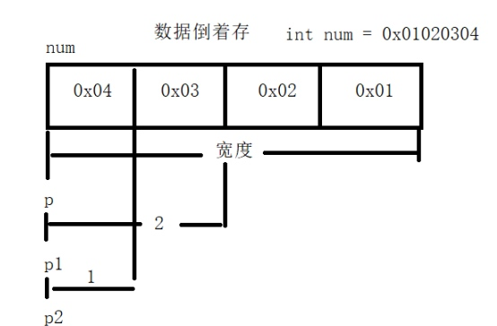

## 1 指针概述
* 指针：内存中的每一个字节的的地址编号
* 不同类型变量的指针个数
    
    |       | 空间大小  | 指针个数 |
    |-------|-------|------|
    | char  | 1byte | 1    |
    | short | 2byte | 2    |
    | Int   | 4byte | 4    |

* 32位系统与64位系统中的指针
    > x86:指针占32位，最大指针 $2^{32}=4GB$ ( $2^{30}=1GB$ )，所以32位系统支持的最大内存为4GB。
    > x64[x86-64:x86架构(逻辑结构)64位(运算能力)的CPU]:指针占64位，目前，电脑最大支持内存的瓶颈主要取决于主板性能。

## 2 指针变量
### 2.1 指针变量概述
* `*` 间接访问操作符
* `*p` 从指针p指向的内存中取值(*p:对指针p解引用)

```c
int num = 10;
int *p = NULL;  // 指针变量的初始化
// 指针变量p的类型为int *  指针变量p指向的类型为int
p = &num;  // 根据变量名取址
printf("%d", *p);  // 从指针指向的内存中取值(*p:对int *指针解引用)
```

* `num`:内存中的一块空间(4byte)
* `10`:`num`空间中存放的值
* `&num`:`num`空间的首地址

### 2.2 指针变量的取值宽度
指针变量的取值宽度取决与指向类型的长度

```c
int num = 0x01020304;
int *p = &num;  // *p=0x1020304
short *p1 = &num;  // *p1=0x304
char *p2 = &num;  // *p2=0x4
```



### 2.3 指针变量的跨度
指针变量的跨度取决与指向类型的大小

```c
int num = 0x01020304;
int *p = &num;  // *p=0x1020304
short *p1 = &num;  // *(p1+1)=0x102
char *p2 = &num;  // *(p2+1)=0x3
```

### 2.4 void修饰指针变量和指针类型转换
* void不能用来定义变量
* void用来限定函数参数和返回值
> 万能指针`void *p;`可以保存任意类型的地址，只要作为函数形参。

```c
void *p = NULL;
int num = 10;
p = &num;  // void 判断不出指针变量指向值的宽度
printf("%d", *(int *)p);  // 类型转换取出值
```

### 2.5 指针变量操作注意事项
* 不要操作野指针（未初始化的指针）
* 不要操作`NULL`指针
* 不要操作自定义指针

### 2.6 `const`修饰指针变量：保护指针指向的空间数据不被修改
1. 常量指针（指向常量）：`const int *p = 100;  // *p只读`
只要有可能，函数的指针形参都应该声明为const，保护指向的数据不被修改。
2. 指针常量（数组名做函数形参）：`int * const p1 = 100;  // p只读`
3. `const int * const p1 = 100  // *p只读 p只读;`

```c
struct PEOPLE {
    char name[64];  // 0-63
    int age;  // 64-67
    int Id;  // 68-71
    double score; // 72-79
};

// 调用时需要为实参开辟空间拷贝数据,效率低，应该用指针
void myprint1(struct PEOPLE people) {
    printf("%s %d %d %.2f", people.name, people.age, people.Id, people.score);
}

// 使用指针，节省空间(80 => 4),但是可能会不小心修改原数据(const 保护)
void myprint2(const struct PEOPLE *p) {  // 指针指向的数据只读
    printf("%s %d %d %.2f", p->name, p->age, p->Id, p->score);
}

int main(int argc, char *argv[]) {
    struct PEOPLE xiaohong = {"xiaohong", 18, 001, 99.99};
    // my_print1(xiaohong);
    my_print2(&xiaohong);
    return 0;
}
```

## 3 数组中的指针
### 3.1 一维数组名表示数组首元素地址
`*(p+q) = q[p] = p[q]`
`*(arr+1) = arr[1] = 1[arr]`
`*(arr+0) = arr[0]`
`*arr = arr[0]`
`arr = &arr[0]`

### 3.2 数组元素的指针
定义一个数组元素的指针变量，用来表示其他元素

```c
int arr[] = {10, 20, 30, 40, 50};
int *p = &arr[1];

printf("%d", p[-1]);  // 10 p[-1] = *(p-1) != p-1
```

> 指向同一数组的两个元素指针变量相减，得出两指针变量间元素的个数

## 4 指针数组

```c
int num1 = 10, num2 = 20, num3 = 30, num4 = 40;
int *arr[] = {&num1, &num2, &num3, &num4};

printf("%d", *arr[1])  // 20
```

### 4.1 选择排序

```c
#include <stdio.h>

void my_sort(int arr[], int len) {
	for (int i = 0; i < len; i++) {
		int min = i;
		for (int j = i+1; j < len; j++) {
			if (arr[min] > arr[j]) {  // 更新min
				min = j;
			}
		}
		if (min != i) {
			int tmp = arr[i];
			arr[i] = arr[min];
			arr[min] = tmp;
		}
	}
}

void print_arr(int arr[], int len) {
	for (int i = 0; i < len; i++) {
		printf("%d ", arr[i]);
	}
}


int main(int argc, char *argv[]) {
	int arr[] = {5, 3, 6, 1, 8, 2, 9, 4};
	int len = sizeof(arr) / sizeof(arr[0]);
	my_sort(arr, len);
	print_arr(arr, len);
	
	return 0;
}
```

### 4.2 指针数组排序

```c
#include <stdio.h>

// 选择排序
void my_sort(char *p[], int len) {
	for (int i = 0; i < len; i++) {
		int min = i;
		for (int j = i+1;j < len; j++) {
			if (*p[min] <  *p[j]) {
				min = j;
			}
		}
		if (min != i) {
			char *tmp = p[i];
			p[i] = p[min];
			p[min] = tmp;
		}
	}
}

void print_arr(char *p[], int len) {
	for (int i = 0; i < len; i++) {
		printf("%s ", p[i]);
	}
}

int main(int argc, char *argv[]) {
	char *pArr[] = { "aaa", "bbb", "ccc", "ddd", "fff", "eee"};
	int len = sizeof(pArr) / sizeof(pArr[0]);
	my_sort(pArr, len);
	print_arr(pArr, len);
	
	return 0;
}
```

## 5 二级指针

```c
int num = 10;
int *p = &num;
int **q = &p;  // int **
```

### 5.1 二级函数做函数参数的输入输出特性
* 输入特性：主调函数分配内存，被调函数使用

```c
// 二级指针做函数参数的输入特性
void print_pp(int **p, int len) {
    for (int i = 0; i < len; i++) {
        printf("%d\n", *p[i]);
    }
}

// 在栈上开辟空间存放二级指针，指向堆区
int main01(void) {
    int *p[5] = {NULL};  // int *p[]: int **p

    for (int i = 0; i < 5; i++) {
        p[i] = (int *)malloc(sizeof(int *));  // 主调函数开辟内存空间
        *p[i] = i + 10;
    }
    // p[]定义可以， **定义不可以
    int len = sizeof(p) / sizeof(p[0]);  // 5
//    printf("%d\n", len);
    print_pp(p, len);

    for (int i = 0; i < len; i++) {
        if (p[i] != NULL) {
            free(p[i]);
            p[i] = NULL;
        }
    }
    return 0;
}

// 在堆区开辟空间存放二级指针，指向栈区
int main02(void) {
    int **p = (int **)malloc(sizeof(int *) * 5);  // p指向的是int *， 本身是int **
    int num[5] = {10, 20, 30, 40, 50};

    for (int i = 0; i < 5; i++) {
        p[i] = num+i;  // *p+i = num+i
    }

//    int len = sizeof(p) / sizeof(p[0]);  // 1 == sizeof(p) == sizeof(p[0])
//    printf("%d\n", len);
    print_pp(p, 5);

    if (p != NULL) {
        free(p);
        p = NULL;
    }

    return 0;
}
```

* 输出特性：被调函数分配内存，主调函数使用

```c
// 二级指针做函数参数的输出特性
void my_allocate(int **p, int n){
    *p = (int *)malloc(sizeof(int) * n);  // 被调函数开辟内存空间
}

void func02(void) {
    int *p = NULL;
    my_allocate(&p, 1);
    *p = 100;
    printf("%d\n", *p);
    if (p != NULL) {
        free(p);
        p = NULL;
    }
}
```

### 5.2 案例

```c
/* 1 从文件中获取数据
 * 2 获取文件有效行数
 * 3 在堆区开辟数组维护文件中的数据
 * 4 打印堆区数据
 * 5 解决换行问题
 * 6 释放堆区数据
 * 7 关闭文件指针 */

// 2 获取文件有效行数
int get_lines(FILE *fp) {
    if (fp == NULL) {
        return -1;
    }
    int lines = 0;
    char buf[32] = "";
//    printf("%s", fgets(buf, sizeof(buf), fp));
//    fflush(stdout);
    while (fgets(buf, sizeof(buf), fp)) {
//        printf("%s", buf);
        lines += 1;
//        memset(buf, 0, sizeof(buf));  // 清空字符串
    }
    printf("[1]获取到文件共%d行数据\n", lines);
    // 文件流指针复位
    fseek(fp, 0, SEEK_SET);
    return lines;
}
// 3 在堆区开辟数组维护文件中的数据
int allocate_lines(char **p, FILE *fp, int lines) {
    if ( p == NULL || fp == NULL || lines <= 0) {
        return -1;
    }
    char buf[32] = "";
    int i = 0;
    while (fgets(buf, sizeof(buf), fp)) {
        int len = strlen(buf) + 1;  // 获取的字符串应该分配的字节数
        // 5 解决换行问题
        buf[strlen(buf)-1] = '\0';  // 去除回车
        char *p_line = (char *)malloc(sizeof(char) * len);  // 申请空间
        strcpy(p_line, buf);   // 将字符串拷贝到新空间
        p[i++] = p_line;
        memset(buf, 0, sizeof(buf));  // 清空字符串
    }
    printf("[2]数据读取到堆区成功\n");
    // 文件流指针复位
    fseek(fp, 0, SEEK_SET);
    return 0;
}
// 4 打印堆区数据
int show_lines(char **p, int lines) {
    if ( p == NULL || lines <= 0) {
        return -1;
    }
    printf("[3]开始打印数据\n");
    for (int i = 0; i < lines; i++) {
        printf("%d:%s\n", i+1, p[i]);
    }
    return 0;
}
// 6 释放堆区数据
int free_all(char **p, int lines) {
    if ( p == NULL || lines <= 0) {
        return -1;
    }
    printf("[4]开始释放堆区空间\n");
    for (int i = 0; i < lines; i++) {
        printf("%d:%p空间释放\n", i+1, p[i]);
        free(p[i]);
        p[i] = NULL;
    }
    printf("p:%p空间释放\n", p);
    free(p);
    p = NULL;
    return 0;
}

int main(void) {
    // 1 从文件中获取数据
    FILE *fp = NULL;
    fp = fopen("./answer.txt", "r");
    if (fp == NULL) {
        perror("fopen");
        return;
    }
    // 2 获取文件有效行数
    int lines = get_lines(fp);
//    printf("%d\n", lines);
    // 在堆区申请一个二级指针存放一级指针数组
    char **p = (char **)malloc(sizeof(int *) * lines);
    // 3 在堆区开辟数组维护文件中的数据
    allocate_lines(p,fp, lines);
    // 4 打印堆区数据
    show_lines(p,lines);
    // 6 释放堆区数据
    free_all(p, lines);
    // 7 关闭文件指针
    fclose(fp);
    
    return;
}
```

## 6 指针作为函数的参数
### 6.1 普通变量作为函数的参数（传值，无法修改外部变量）

```c
void func(int a);
int num;
func(num);
```

* `int a` 形参，无法修改外部变量的值
* `func(num)` 为形参`int a`开辟空间，传入`num`的值，调用结束后释放空间，无法修改`num`的值
    
### 6.2 间接赋值指针变量作为函数的参数（传址，在函数内部修改外部变量）
用n级指针形参，去间接修改n-1级指针(实参)的值

```c
// 输出键盘输入值
#include <stdio.h>

void func(void *p) {
    scanf("%d", (int*)p);
}

int main(void) {
    int num = 0;
    func(&num);
    printf("%d", num);
}
```

## 7 数组名作为函数的参数

```c
// 求数组中元素最大值
#include <stdio.h>

void my_input(int *arr, int n) {
    for (size_t i = 0;i < n; i++) {
        scanf("%d", arr+i);
    }
}

void my_max(int *arr, int n, int *max) {
    *max = arr[0];
    for (size_t i = 0;i < n; i++) {
        if (arr[i] > *max) {
            *max = arr[i];
        }
    }
}

int main(void) {
    const int n = 5;
    int num[n] = {0};
    int max = 0;

    my_input(num, n);
    my_max(num, n, &max);
    printf("%d", max);
}
```
    
## 8 主函数传参
    
```c
#include <stdio.h>
    
// 字符指针数组
int main(int argc, char *argv[]) {
    printf("argc=%d\n", argc);
    for (int i = 0; i < argc; i++) {
        printf("arg[%d]=%s\n", i, argv[i]);
    }
    return 0;
}
```
    
### 8.1 字符指针数组
    
```c
void fuc1(void) {
    char *arr[] = {"hello", "world", "!"};
    
    printf("%lu\n", sizeof(arr));  // 8*3=24
    printf("%lu\n", sizeof(arr[0]));  // 8(char *)
    // arr是字符指针数组，存储的是多个字符串指针变量
    printf("%s\n", arr[1]);  // world
    printf("%p\n", arr[1]);  // 0x10c41af9a
    // arr[1]是其中一个字符串指针变量，存储的是字符串首字符地址
    printf("%c\n", *arr[1]);  // w
    printf("%c\n", *(arr[1]+1));  // o
    printf("%c\n", arr[1][2]);  // r
}
```
    
    
### 8.2 字符串指针变量和字符数组
    
* 字符串指针变量
`char *arr = "hello";`      
    * 字符串 `"hello"` 在文字常量区(只读)开辟空间(6B)
    * 指针变量 `arr` 在栈区(全局区)开辟空间(8B)，存入 `'h'` 地址。
* 字符数组    
`char arr[] = "hello";`
    * 数组名(**指针常量**，不能++) `arr[]` 根据字符串 `"hello"` 在栈区开辟空间(6B),并存入字符串。
    
## 9 函数指针和回调函数
### 9.1 函数指针
函数名代表函数的入口地址
* 函数类型：由它的返回值和参数类型决定
* 函数指针：指向函数的入口地址
* 指针函数：返回类型是指针的函数

```c
typedef int(FUNC)(int, int)  // FUNC是函数类型
FUNC *p = func  // p是函数指针，指向的函数返回值是int，参数是(int, int)
p();
```

```c
#include <stdio.h>

int func(int a, int b) {
	printf("%d\n", a+b);
	return 0;
}

int main(int argc, char *argv[]) {
	func(10, 20);
	printf("%p\n", func);  // 函数名：函数入口的地址
//	int (*p)(int, int) = (int (*)(int, int))0x10e1c2ef0;  // 函数指针：指向函数入口地址的指针
	int (*p)(int, int) = func;
	p(10, 20);
	
	return 0;
}
```

### 9.2 函数指针的定义
* 先typedef定义函数类型，根据函数类型创建函数指针变量
* 先typedef定义函数指针类型，根据函数指针类型创建函数指针变量
* 直接创建函数指针变量

```c
#include <stdio.h>

int add(int x, int y) {
	return x+y;
}

int main(int argc, char *argv[]) {
	printf("add(10, 20)=%d\n", add(10, 20));
	// 1 先定义函数类型，根据类型定义函数指针变量
	typedef int(FUNC)(int, int);  // 未函数类型重命名
	FUNC *p1 = add;
	printf("p1(10, 20)=%d\n", p1(10, 20));
	// 2 先定义函数指针类型，根据类型定义函数指针变量
	typedef int(*P_FUNC)(int, int);  // 未函数类型重命名
	P_FUNC p2 = add;
	printf("p2(10, 20)=%d\n", p1(10, 20));
	// 3 直接定义函数指针变量
//	int *p3 = add;  // 看警告
	int(*p3)(int, int) = add;
	printf("p3(10, 20)=%d\n", p3(10, 20));
	
	return 0;
}
```

### 9.3 函数指针数组定义
`typedef int (*P_TYPE[5])(int int);`

```c
#include <stdio.h>

void func01() {
	printf("这里是func01。\n");
}

void func02() {
	printf("这里是func02。\n");
}
void func03() {
	printf("这里是func03。\n");
}

int main(int argc, char *argv[]) {
	void(*p_func[3])() = {func01, func02, func03};  // 函数指针数组定义
#if 0
	void(*p_func[3])();
	p_func[0] = func01;
	p_func[1] = func02;
	p_func[2] = func03;
#endif
	int len = sizeof(p_func)/sizeof(p_func[0]);
	for(int i=0; i<len; i++) {
		p_func[i]();
	}
	return 0;
}
```

### 9.4 回调函数
做函数参数的函数指针

* 案例一：打印任意类型的变量

```c
// 案例：自定函数：打印任意类型的变量
#include <stdio.h>
// 回调函数
struct Person {
	char name[64];
	int age;
};

void print_int(void *p_data) {
	printf("%d\n", *(int *)p_data);
}

void print_float(void *p_data) {
	printf("%.2f\n", *(float *)p_data);
}

void print_Person(void *p_data) {
	struct Person *p = (struct Person *)p_data;
	printf("name:%s age:%d\n", p->name, p->age);
}


void print(void *p_data, void(*p_func)(void *p_data)) {  // 函数指针做函数参数
	p_func(p_data);
}

int main(int argc, char *argv[]) {
	// 打印变量
	int data01 = 10;
	print(&data01, print_int);  // print_int(&data)
	
	float data02 = 2.22;
	print(&data02, print_float);  // print_float(&data)
	
	struct Person jerry = { "jerry", 18	};
	print(&jerry, print_Person);  // print_Person(&jerry)
	
	return 0;
}
```

* 案例二：打印任意类型的数组

```c
// 案例2：自定函数，打印任意类型的数组
#include <stdio.h>

struct Person {
	char name[64];
	int age;
};
// 回调函数
void print_int(void *p_data) {
	int *p = p_data;
	printf("%d ", *p);
}

void print_float(void *p_data) {
	float *p = p_data;
	printf("%.2f ", *p);
}

void print_Person(void *p_data) {
	struct Person *p = p_data;
	printf("name:%s age:%d\n", p->name, p->age);
}

void print_arr(void *p_arr, int len, int size, void(*p_func)(void *p_data)) {
	for (int i=0; i<len; i++) {
		void *p = p_arr + i * size;  // 每一个数组元素的首地址
		p_func(p);  // 调用函数指针打印不同类型的变量
	}
	printf("\n");
	
}

int main(int argc, char *argv[]) {
	int arr_int[5] = {10, 20, 30, 40, 50};
	print_arr(arr_int, 5, sizeof(int), print_int);
	
	float arr_float[5] = {11.11, 22.22, 33.33, 44.44, 55.55};
	print_arr(arr_float, 5, sizeof(float), print_float);
	
	struct Person class[5] = {
		{ "tom", 16 },
		{ "jerry", 17 },
		{ "jack", 18 },
		{ "tony", 19 },
		{ "pony", 20 }
	};
	print_arr(class, 5, sizeof(struct Person), print_Person);
}
```

* 案例三：查找结构体数组中成员，存在返回1，不存在返回0

```c
// 案例：自定函数，查找结构体数组中成员，存在返回1，不存在返回0。
#include <stdio.h>
#include <string.h>

struct Person {
	char name[64];
	int age;
};

int compare_all(void *p_data, void *p_src) {
	struct Person *p1 = p_data;
	struct Person *p2 = p_src;
	if (strcmp(p1->name, p2->name)==0 && p1->age==p2->age) {
		return 1;
	} else {
		return 0;
	}
}

int compare_name(void *p_data, void *p_src) {
	struct Person *p1 = p_data;
	char *p2 = p_src;
	if (strcmp(p1->name, p2)==0) {
		return 1;
	} else {
		return 0;
	}
}

int find_arr(void *p_struct, int len, int size, void *p_src, int(*p_func)(void *, void *)) {
	for (int i=0; i<len; i++) {
		void *p = p_struct + i*size;
		if (p_func(p, p_src)) {
			return 1;
		}
	}
	return 0;
}

int main(int argc, char *argv[]) {
	struct Person class[5] = {
		{ "tom", 16 },
		{ "jerry", 17 },
		{ "jack", 18 },
		{ "tony", 19 },
		{ "pony", 20 }
	};
	struct Person person = { "tony", 19 };
//	int ret = find_arr(class, 5, sizeof(struct Person), &person, compare_all);  // 查找成员
	int ret = find_arr(class, 5, sizeof(struct Person), "jack", compare_name);  // 查找成员姓名
	if (ret) {
		printf("存在\n");
	} else {
		printf("不存在\n");
	}
	return 0;
}
```

* 案例四：实现任意数组排序（冒泡排序、选择排序）

```c
/* 案例四：实现任意数组排序（冒泡排序、选择排序）
 * 1. 通过(数组指针+size*i)找到第i个元素的指针
 * 1. 申请size字节的堆区空间存放中间值
 * 2. 通过内存拷贝size字节实现数组中的元素交换
 */
#include <stdio.h>
#include <stdlib.h>
#include <string.h>

struct Person {
	char name[64];
	int age;
};
/* ---------- mySort ---------- */
int compareInt(void *p_i, void *p_j) {
	int *p1 = p_i;
	int *p2 = p_j;
#if 0
	if (*p1 > *p2) {
		return 1;
	} else {
		return 0;
	}
#endif
	return (*p1 > *p2);
}

int compareFloat(void *p_i, void *p_j) {
	float *p1 = p_i;
	float *p2 = p_j;
	if (*p1 > *p2) {
		return 1;
	} else {
		return 0;
	}
}

int comparePerson(void *p_i, void *p_j) {
	struct Person *p1 = p_i;
	struct Person *p2 = p_j;
	if (p1->age > p2->age) {
		return 1;
	} else {
		return 0;
	}
}
// 冒泡排序
void mySort1(void *p_arr, int len, int size, int(*p_func)(void *, void *)) {
	void *tmp = malloc(size);
	for (int i=0;i<len;i++) {
		void *p_i = p_arr + size*i;  // 第i个元素的首地址
		for (int j=i+1;j<len;j++) {
			void *p_j = p_arr + size*j;  // 第j个元素的首地址
			if (p_func(p_i, p_j)) {  // 回调函数比较特定类型下第i和j个元素的大小
				// 通过内存拷贝实现交换
				memcpy(tmp, p_i, size);
				memcpy(p_i, p_j, size);
				memcpy(p_j, tmp, size);	
			}
		}
	}
	if (tmp != NULL) {
		free(tmp);
		tmp = NULL;
	}
}
// 选择排序
void mySort2(void *p_arr, int len, int size, int(*p_func)(void *, void *)) {
	void *tmp = malloc(size);
	for (int i=0;i<len;i++) {
		int min = i;
		for (int j=i+1;j<len;j++) {
			void *p_min = p_arr + size*min;
			void *p_j = p_arr + size*j;
			if (p_func(p_min, p_j)) {
				min = j;
			}
		}
		if (min != i) {
			void *p_min = p_arr + size*min;
			void *p_i = p_arr + size*i;
			// 通过内存拷贝实现交换
			memcpy(tmp, p_i, size);
			memcpy(p_i, p_min, size);
			memcpy(p_min, tmp, size);
		}
	}

	if (tmp != NULL) {
		free(tmp);
		tmp = NULL;
	}
}
/* ---------- print_arr ---------- */
void print_int(void *p_data) {
	int *p = p_data;
	printf("%d ", *p);
}

void print_float(void *p_data) {
	float *p = p_data;
	printf("%.1f ", *p);
}

void print_Person(void *p_data) {
	struct Person *p = p_data;
	printf("%s:%d\n", p->name, p->age);
}

void print_arr(void *p_arr, int len, int size, void(*p_func)(void *)) {
	for (int i=0;i<len;i++) {
		void *p = p_arr + i*size;
		p_func(p);
	}
	printf("\n");
}

int main(int argc, char *argv[]) {
	// int
	int arr_int[5] = {23, 55, 22, 11, 66};
	mySort1(arr_int, 5, sizeof(int), compareInt);
	print_arr(arr_int, 5, sizeof(int), print_int);
	// float
	float arr_f[6] = {23.2, 34.3, 12.2, 66.4, 22.3, 22.1};
	mySort1(arr_f, 5, sizeof(int), compareFloat);
	print_arr(arr_f, 5, sizeof(int), print_float);
	// struct Person
	struct Person class[5] = {
		{ "jerry", 23 },
		{ "tom", 22 },
		{ "pony", 13 },
		{ "jack", 25 },
		{ "tony", 21 }
	};
	mySort2(class, 5, sizeof(struct Person), comparePerson);
	print_arr(class, 5, sizeof(struct Person), print_Person);
	return 0;
}
```