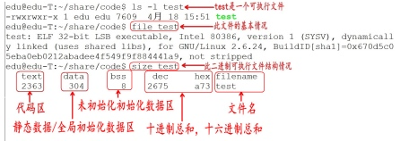
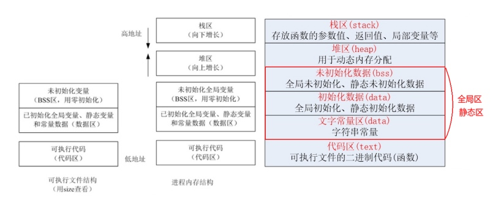
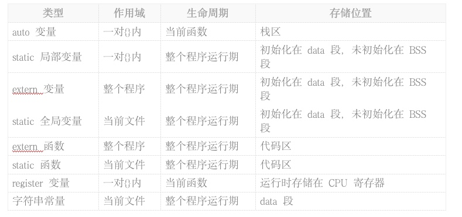
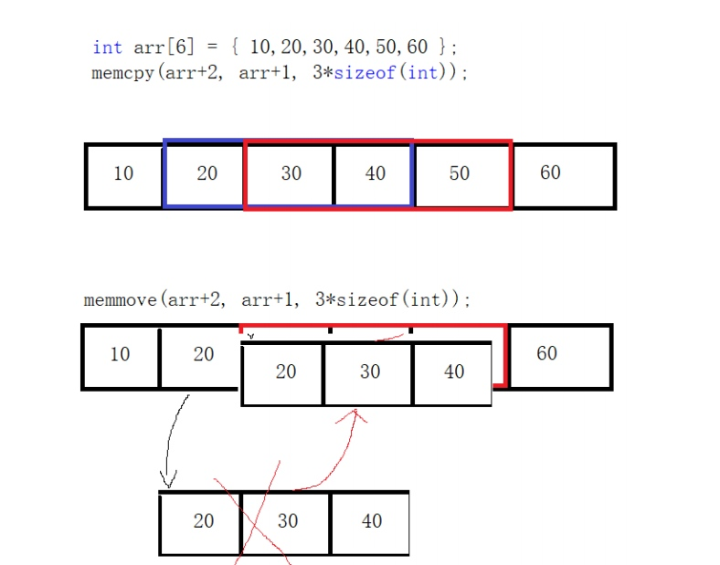

## 1 内存分区
### 1.1 作用域

* 文件作用域（进程）
* 函数作用域
* 代码块作用域

### 1.2 内存分区

| 可执行文件(非运行) | 内存(运行)    | 初始化  | 生命周期  | 变量 |
|:------:|:------:|:-------:|:-------:|:----:|
|| 堆区    | 随机| 整个进程(free()手动释放) | 
|| 栈区    | 随机     | 实时分配释放 | 普通局部变量、函数形参、函数返回值>4B(<4B:寄存器) |
|DATA段(全局区，初始化数据) BSS段(全局区，未初始化数据) | 全局区   | 0       | 进程     | 普通全局变量、静态局部变量、静态全局变量 |
|全局区| 文字常量区 |       |         |
| TEXT段 | 代码区   |        |          |

#### 1.2.1 二进制可执行文件结构(未运行)      

* 代码区（text）：只读可共享，存放cpu执行的机器指令，还规划了局部变量的相关信息
* 数据区（程序运行前给变量分配好空间）
    * 初始化数据区（data）：初始化了的全局变量和静态变量以及常量（字符串常量、const常量）    
    * 未初始化数据区（bss）：未初始化的全局变量和静态变量（程序开始执行前被内核初始化为0或NULL）

#### 1.2.2 进程内存分区


* 代码区（text）：只读可共享，存放cpu执行的机器指令，还规划了局部变量的相关信息
* 数据区
    * 全局/静态区：全局静态区的变量在编译阶段已经分配好内存空间并初始化(bss被内核初始化)，这块内存在程序运行期间一直存在，主要存储全局变量，静态变量和常量(常量区)
        * 全局区
        * 静态区
        * 常量区
            * 字符串常量区
            * 常变量区
    * 堆区（heap）：容量远远大于栈区，用于动态内存分配，位于bss区和栈区之间，手动分配和释放。
    * 栈区（stack）：先进后出结构，存放局部变量，函数参数、返回值等，在程序运行过程中由编译器自动加载和释放。




    
### 1.3 内存中的变量

| 变量 | 定义形式 | 作用范围 | 生命周期 | 存储空间 | 备注  |
|:------:|:----:|:----:|:----:|:-----:|:-----:|
| 普通局部变量 | {}中的变量 | 离他最近的{}之间 | {}结束后被释放 | 栈区 | 随机初始化 |
| 普通全局变量 | 函数外定义的变量 | 当前源文件以及其他源文件(extern修饰) | 整个进程 | 全局区 | 初始化为0 |
| 静态局部变量 | {}中加static修饰的变量 | 离他最近的{}之间 | **整个进程** | 全局区 | 初始化为0，多次初始化只有第一次有效 |
| 静态全局变量 | 函数外定义加static修饰的变量 | **只有当前源文件** | 整个进程 | 全局区 | 初始化为0 |

#### 1.3.1 普通局部变量与静态局部变量

```c
void func(void) {
    auto int num01 = 100;  // 局部变量：前面默认加auto
    static int num = 10;
    num++;
    printf("%d", num);
}

int main(void) {
    func();  // 11
    func();  // 12
    func();  // 13
    func();  // 14
    func();  // 15 静态局部变量多次初始化，只有第一次有效。
    {
        auto int num01 = 20;  // 自动局部变量：代码块作用域，存储在栈区
        static int num_static = 30;  // 静态变量：局部作用域，存储在全局区，代码块结束后空间不释放，但无法读取。
    }
}
```

#### 1.3.2 普通全局变量与静态全局变量

```c
// num.c
int num = 10;  // 全局变量：外部链接属性，前面默认加extern
static int num_static = 100;  // 静态全局变量：默认属于内部链接属性，只能在当前源文件使用，不用担心与其他源文件变量名重复
```

```c
// mian.c
int num01;  // 普通全局变量
extern int num;  // 外部全局变量：告诉编译器其他文件中有一个num，链接时在其他文件查找
int main(void) {
printf("%d", num);
}
```

### 1.5 内存中的常量
### 1.5.1 const修饰的全局常变量和局部常变量

```c
const int num01 = 10;  // 常(变)量：储存在全局区的常量区，只读

void fuc(void) {
    const int num02 = 10;  // 伪常(变)量，储存在栈区，不能直接修改，可以通过指针间接修改
}
```

### 1.5.1 字符串常量

```c
int main(void) {
    // 区分字符串常量指针和字符数组指针
    char *q1 = "hello,world!";  // 字符串常量区，只读(有些编译器可以修改字符串常量)
    char *q2 = "hello,world!";
    char *q3 = "hello,world!";  // q1,q2,q3是同一个指针
}
```

### 1.4 静态函数
* 普通函数

```c
// func.c
// 可以在其它源文件(extern修饰)使用
void test(void) {
    printf("123");
}
```

```c
// main.c
extern void test(void);
int main(void) {
    test();
} 
```

* 静态函数

```c
// func.c
// 只能在当前源文件使用
extern void test(void) {
    print("123");
}
```

## 2 内存操作函数
### 2.1 内存填充 `void *memset(void *s, int c, size_t n);`

```c
// 常用来清空内存
char buf[32] = "hello world";
memset(buf, 0, sizeof(buf));  // 清空buf,填充每一个元素。
printf("%s", buf);
```

### 2.2 内存拷贝 `void *memcpy(void *dst, const void *src, size_t n);`

```d
// 字符串操作
char dst[64] = "";
char src[64] = "hello\oworld!"
memset(dst, 0, sizeo(dst));
memcpy(dst, src, sizeof(src));
// 与strcpy的区别
strcpy(dst, src);

// 数组整体复制
int num_d[5] = {0};
int num_s[5] = {1, 2, 3, 4, 5};
memcpy(num_d, num_s, sizeof(num_s));
```

> 拷贝空间如果重叠，用memmove。
> 

### 2.3 内存移动 `void *memmove(void *dst, const void *src, size_t n);`

```c
int num[6] = {1, 2, 3, 4, 5, 6};
memcpy(arr+2, arr+1, 3*sizeof(int));
```

### 2.4 内存比较 `int memcmp(const void *s1, const void *s2, size_t n)`

```c
// 与strcmp区别
char dst[32] = "hello\0world";
char src[32] = "hello\0xixix";
strcmp(dst, src);  // =0
memcmp(dst, src, sizeof(src));  // <0 
```

## 3 堆区空间动态申请 
* `void *malloc(size_t size);  // 在堆区申请一块size大小的连续空间`、
* `void *calloc(size_t nmemb, size_t size);  // 在堆区申请nmemb块size大小的连续区域，并清零`
* `void *realloc(void *ptr, size_t size);  // 重新分配配用malloc和calloc申请的空间，需要手动清零，返回空间指针`      
如果原有空间后面空闲空间足够大，则直接在原有空间基础上扩大空间，如果不够，释放旧空间，重新寻找新空间，将旧内存的值拷贝到新内存(新扩大小的空间不回会自动清零)。

```c
// 释放(回收指针操作权限) void free(void *ptr);
void main(void) {
    int *p = NULL;
    // 申请
    p = (int *)calloc(1, sizeof(int));
    p = (int *)malloc(3);  // 必须强制类型转换
    if (p == NULL) {  // 申请失败返回NULL
        perror("申请堆区空间失败");  // 输出字符串和错误信息
        return;
    }
    // 重新分配空间，将旧内存的值拷贝到新内存(新扩大小的空间不会自动清零)，释放旧内存
    p = (int *)realloc(p, sizeof(int));
    // 清空
    // memset(p1, 0, sizeof(int));
    // 使用
    *p = 120;
    printf("%d", *p);
    // 释放:回收p地址对应空间的操作权限
    if (p != NULL)  // 防止多次释放
    {
        free(p);
        p = NULL;
    }
}
```

* malloc案例

```c
void myInputIntArray(int *arr, int n) {
    for (int i = 0; i < n; i++) {
        printf("请输入第%d个元素\n", i+1);
        scanf("%d", arr + i);
    }
}

void myOutputIntArray(int *arr, int n) {
    for (int i = 0; i < n; i++) {
        printf("arr[%d]=%d\n", i, arr[i]);
    }
}

// 简易版动态数组
// 局部数组：只能在当前函数中使用
// 堆区数组：多个函数使用，直到手动释放
void main(void) {
    int n = 0;
    printf("请输入数组元素个数\n");
    scanf("%d", &n);
    int *arr =NULL;
    arr =  (int *)malloc(n * sizeof(int));  // 申请空间
    if (arr == NULL) {
        perror("申请失败\n");
        return;
    }
    memset(arr, 0, n * sizeof(int));  // 清空空间
    myInputIntArray(arr, n);  // 输入元素
    myOutputIntArray(arr, n);  // 遍历数组
    if (arr != NUll) {
        free(arr);  // 释放
        arr = NUll;
    }
}
```

## 4 内存的注意事项
### 4.1 函数不要返回局部变量的地址,可以返回静态局部变量地址

```c
// 函数不要返回局部变量地址(函数结束后空间被释放)
int *func3(void) {
    int num = 100;  // 局部变量
    return &num;
}

// 可以返回静态局部变量地址
int *func4(void) {
    static int num = 100;  // 静态局部变量
    return &num;
}
```

### 4.2 不要返回已经被释放的堆区空间地址(操作权限已经被回收，指针还是指向原来的地址)，不要重复释放同一段堆区空间。

### 4.3 函数内部修改外部变量指针
#### 4.3.1 错误：外部变量指针做参数

```c
void myMallocInt(int *p) {
    p = (int *)malloc(sizeof(int));  // 内存泄漏
}

int main(void) {
    int *p = NUll;
    myMallocInnt(p);
    *p = 100;  // p指向NULL，无法赋值
    printf("%d", *p);
```

#### 4.3.2 外部变量指针赋值返回的地址

```c
void myMallocInt(void) {
    int *p = NUll;
    p = (int *)malloc(sizeof(int));
    return p;  // 保存在寄存器
}

int main(void) {
    int *p = NUll;
    p = myMallocInnt();
    *p = 100;
    printf("%d", *p);
```

#### 4.3.3 二级指针：函数内部修改外部指针变量的地址

```c
void myMallocInt(int **p) {
    *p = (int *)malloc(sizeof(int));
}

int main(void) {
    int *p = NUll;
    myMallocInnt(&p);
    *p = 100;
    printf("%d", *p);
```

## 5 堆区综合案例

```c
// 动态数组排序
#include <stdio.h>
#include "func.h"

int main(int argc, char *argv[]) {
    int n = 0;
    int *arr = NULL;
    int **p = &arr;  // 二级指针
    printf("请输入元素个数：");
    scanf("%d", &n);
    myMallocInt(p, n);  // 申请空间
    myInputIntArray(arr, n);  // 获取键盘输入
    mySortArray(arr, n);  // 排序
    myOutputIntArray(arr, n);  // 遍历输出
    
    return 0;
```

```c
// func.h
#ifndef C_FUNC_H
#define C_FUNC_H
extern void myMallocInt(int **arr, int n);  // 外部声明：说明该函数存在，但定义在其他源文件中。
extern void mySortArray(int *arr, int n);
extern void myInputIntArray(int *arr, int n);
extern void myOutputIntArray(int *arr, int n);
extern void myFree(int **arr);
#endif //C_FUNC_H
```

```c
// func.c
#include <stdio.h>
#include <stdlib.h>
#include <string.h>

void myMallocInt(int **arr, int n) {
    *arr = (int *)malloc(n * sizeof(int));
    memset(*arr, 0, n * sizeof(int));
}

void mySortArray(int *arr, int n) {
    for (int i = 0; i < n-1; i++) {
        for (int j = i+1; j < n; j++) {
            if (arr[i] > arr[j]) {
                int tmp = arr[i];
                arr[i] = arr[j];
                arr[j] = tmp;
        }
        }

    }
}

void myInputIntArray(int *arr, int n) {
    for (int i = 0; i < n; i++) {
        printf("请输入第%d个元素\n", i+1);
        scanf("%d", arr + i);
    }
}

void myOutputIntArray(int *arr, int n) {
    for (int i = 0; i < n; i++) {
        printf("arr[%d]=%d\n", i, arr[i]);
    }
}

// 操作的是指针，所以要传入二级指针
void myFree(int **arr) {
    if (*arr != NULL) {
        free(*arr);
        *arr = NULL;
    }
}
```

### 6 位运算
#### 6.1 位逻辑运算
* 按位取反 `~`

> ~1010 => 0101

```c
// 一个int型数a按位取反后的值是-(a+1)
int a = 3;  // 0...0011 
int b = ~a;  // 1...1100 => 0...0100 => -4
```
    
* 按位与 `&`

> 全1是1，有0则0
> 1001&1010 => 1100    

```c
// 应用：利用按位与判断奇偶性
int a = 4;
int b = a & 1;  // 最后一位保留，其余位全部置0
// 二进制最后一位为1：奇数，反之为偶数
if (b == 0) {偶数}
elif (b == 1) {奇数}
```
    
* 按位或 `|`

有1则1，全0是0
> 1001|1010 => 1011
    
```c
// 应用：控制打开某一位
char a = '\00000000'
char b = a | '\01000000' // 打开第二位
char c = a | '\xff'  // 将所有位打开
// & 关闭所有位
char d = c & ～c
// ^ 转置位：打开的位关闭 关闭的位打开
char d = b ^ '\xff'
```
    
* 按位异或 `^`

相同则0，不同则1
> 1001|1010 => 0011
> `a^b=c => a^c=b => a^b=c`
    
```c
// 应用：交换两个数 2
int a = 2;
int b = 8;
a = a ^ b;
b = a ^ b;
a = a ^ b;
```

```c
// 交换两个数 3
a = a + b
b = a - b
a = a - b
```

#### 6.2 移位运算
* 左移 <<

> 空出来的用0填充
> 每移n位相当于原值*2^n

* 右移 >>

> unsigned 类型空出来的用0填充，每移n位相当于原值*2^(-n)
> 其他类型不一定，看系统