## 1 结构体:不同类型的数据组合成一个有机的整体 `struct 结构体标签 {变量定义...};`
### 1.1 结构体类型和变量

```c
// 结构体类型：指定了一个结构体类型，它相当于一个模型，但其中并无具体数据，系统对之也不分配实际内存单元。
// 结构体类型定义：不占实际内存单元
struct stu {
    int num;
    char name[16];
    int age;
}bob, *p;  // 1 同时定义变量或指针变量：根据结构体类型内部成员状况分配空间
// 结构体变量：系统根据结构体类型（内部成员状况）为之分配空间。
// 2 单独定义变量且整体赋值
struct stu Tom = {1, "Tom", 13};
// 3 单独定义变量不初始化，单独赋值
struct stu xiaohong;
// xiaohong = {"xiaohong", 14);  // error
// 结构体成员变量赋值
void func1(void) {
    memset(&xiaohong, 0, sizeof(xiaohong));  // 清空
    xiaohong.num = 2;  // 3.1 普通变量通过点运算符操作结构体成员
    strcpy(xiaohong.name, "xiaohong");  // 3.2 指针变量通过内存操作结构体成员(数组名是符号常量)
    xiaohong.age = 17;
    scanf("%d %s %d", &bob.num, bob.name, &bob.age);  // 3.3 通过键盘对结构体成员赋值
    bob = xiaohong;  // 3.4 相同类型结构体变量整体赋值
    memset(&bob, &xiaohong, sizeof(struct stu));  // 3.5 通过memcpy进行整体赋值赋值
}
```

### 1.2 结构体数组
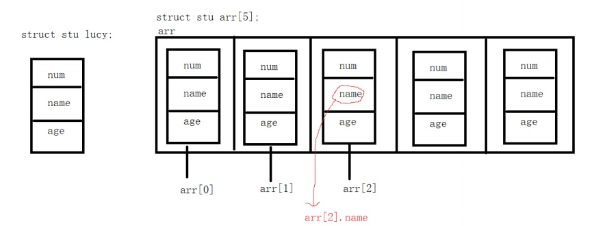

```c
struct stu {
    int num;
    char name[16];
    int age;
};

void func2(void) {
    struct stu arr[5];  // 结构体数组
    memset(arr, 0, sizeof(arr));  // 清空
    int n = sizeof(arr) / sizeof(arr[0]);
    for (int i = 0; i < n; i++) {
        // sprintf(arr[i].name, "xiao_%d", i+1);  // 通过sprintf给结构体成员赋值
        scanf("%d %s %d", &arr[i].num, arr[i].name, &arr[i].age);  // 获取键盘输出
    }
    int age_sum = 0;
    for (int j = 0; j < n; j++) {
        age_sum += arr[j].age;  // 年龄总和
    }
    printf("%.2f\n", age_sum * 1.0 / n);  // 输出平均年龄
}
```

### 1.3 结构体嵌套结构体
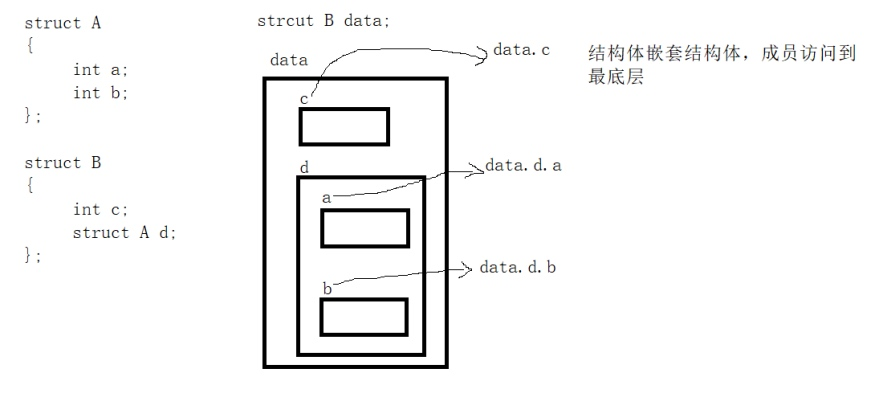


```c
struct secret {
    int size;
};

struct stu {
    int num;
    char name[16];
    int age;
    struct secret secret;
};

void func3(void) {
    struct stu xiaohei;
    memset(&xiaohei, 0, sizeof(struct stu));
    xiaohei.secret.size = 0;
    printf("%d\n", xiaohei.secret.size);
}
```

### 1.4 结构体指针变量
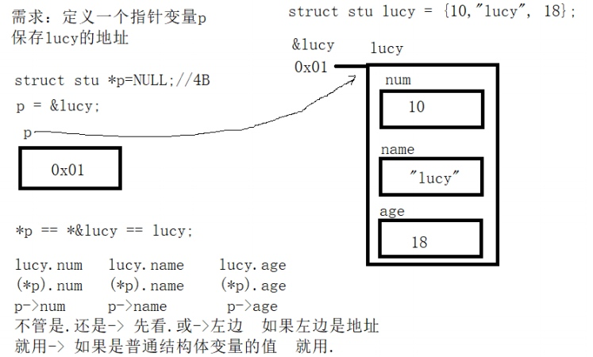

```c
void func4(void) {
    struct stu *p = NULL;  // 结构体值针变量类型：struct stu *
    p = &Tom;
    scanf("%d %s %d", &Tom.age, p->name, &p->num);  // var.xx == p->xx
    printf("%d %s %d", Tom.age, p->name, p->num);
}
```

#### 1.4.1 结构体指针变量作为函数的参数

```c
// 结构体指针变量作为函数的参数
void myInputStu(struct stu *p) {
    scanf("%d %s %d", &p->num, p->name, &p->age);  // 修改结构体成员的值
}
// 结构体数组名作为函数的参数
void myInputArray(struct stu *arr, int n) {
    for (int i = 0; i < n; i++) {
        scanf("%d %s %d", &arr[i].num, arr[i].name, &arr[i].age);  // arr[i].name = *(arr+i).name = (arr+i)->name 是char *变量
    }
}

void myOutputArray(struct stu *arr, int n) {
    for (int i = 0; i < n; i++) {
        printf("%d %s %d\n", arr[i].num, arr[i].name, arr[i].age);
    }
}

int main(int argc, char *argv[]) {
    struct stu xiaobai;
    memset(&xiaobai, 0, sizeof(xiaobai));
    myInputStu(&xiaobai);
    printf("%d %s %d", xiaobai.num, xiaobai.name, xiaobai.age);

    struct stu arr[3];
    int n = sizeof(arr) / sizeof(arr[0]);
    memset(arr, 0, sizeof(arr));
    myInputArray(arr, n);
    myOutputArray(arr, n);
    
    return 0;
}
```

#### 1.4.2 const修饰结构体指针变量

```c
void func9(void) {
    const struct stu *p1 = &Tom;  // *p1只读
//    p1->num = 2;  // error
//    (*p1).num = 2;  // error
    p1 = &xiaohong;

    struct stu * const p2 = &Tom;  // p2只读
    p2->num = 2;
    (*p2).num = 2;
//    p2 = &xiaohong;  // error

    const struct stu * const p3 = &Tom;  // p3、*p3都只读
//    p3->num = 2;  // error
//    (*p3).num = 2;  // error
//    p3 = &xiaohong;  // error
}
```

### 1.5 堆区的结构体
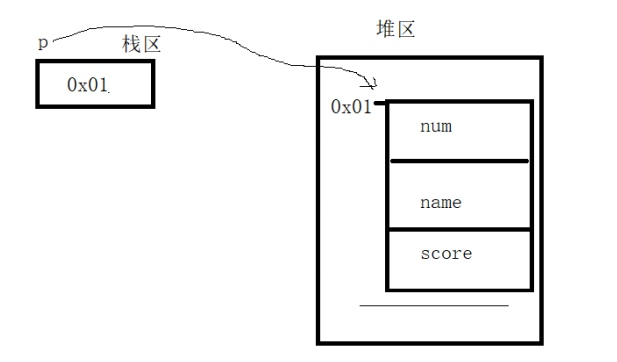

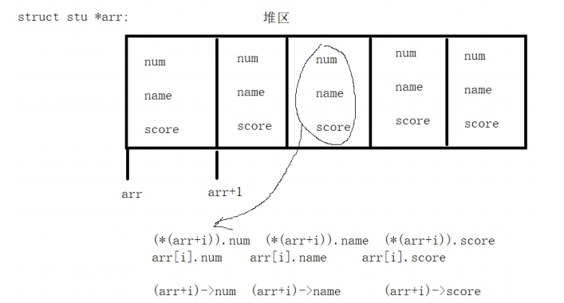

```c
// 堆区结构体数组案例
void func5() {
    int num = 0;
    printf("请输入学生的个数:");
    scanf("%d", &num);
    struct stu *arr = NULL;
    arr = (struct stu *)malloc(num * sizeof(struct stu));  // arr指向堆区申请的空间首元素地址
    memset(arr, 0, num * sizeof(struct stu));

    for (int i = 0; i < num; i++) {
        printf("请输入第%d个学生的信息\n", i+1);
        scanf("%d %s %d", &(arr+i)->num, arr[i].name, &arr[i].age);
    }

    for (int i = 0; i < num; i++) {
        printf("%d:%d %s %d\n", i+1, (arr+i)->num, arr[i].name, arr[i].age);
    }

    if (arr != NULL) {
        free(arr);
        arr = NULL;
    }
}
```


### 1.6 指针变量作为结构体成员
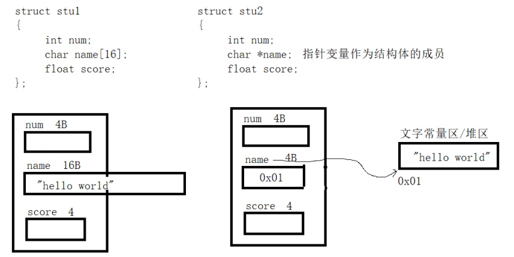

```c
// 普通变量
struct stu1 {
    int num;
    char name[16];  // 字符数组
    int age;
};
// 指针变量
struct stu2 {
    int num;
    char *name;  // 字符串指针变量
    int age;
};
```

#### 1.6.1 结构体指针成员(字符串指针变量)指向文字常量区

```c
void func6(void) {
    struct stu2 mary = {5, "mary", 19};  // name指向文字常量区"mary"的首元素地址
    printf("%s\n", mary.name);
//    mary.name[3] = 'a';  // 只读
    printf("%c\n", mary.name[3]);
}
```

#### 1.6.2 结构体指针成员指向堆区

```c
void func7(void) {
    struct stu2 luck = {6, NULL, 20};
    luck.name = (char *)malloc(sizeof("luck"));  // 字符串：char *型 在堆区申请了5B,luck.name保存了首元素地址(8B)
    memset(luck.name, 0, sizeof("luck"));  // luck.name是指针变量，保存了申请的堆区空间的首元素地址
    strcpy(luck.name, "luck");
//    printf("%lu\n", sizeof(luck.name));  // 8b
    printf("%s\n", luck.name);
    if (luck.name != NULL) {
        free(luck.name);
        luck.name = NULL;
    }
}
```

#### 1.6.3 结构体空间在堆区，结构体指针成员指向堆区
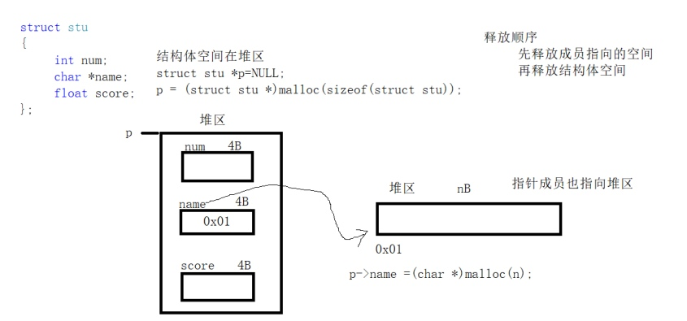

```c
void func8(void) {
    struct stu2 *p_lili = NULL;
    p_lili = (struct stu2 *)malloc(sizeof(struct stu1));
    memset(p_lili, 0, sizeof(struct stu1));
    p_lili->name = (char *) malloc(sizeof("lili"));
    memset(p_lili->name, 0, sizeof("lili"));
    scanf("%d %s %d", &p_lili->num, p_lili->name, &p_lili->age);
    printf("%d %s %d", p_lili->num, p_lili->name, p_lili->age);
    // 先释放成员指针指向空间
    if (p_lili->name != NULL) {
        free(p_lili->name);
        p_lili->name = NULL;
    }
    // 再释放结构体指针指向空间
    if (p_lili != NULL) {
        free(p_lili);
        p_lili = NULL;
    }
}
```

### 1.7 结构体赋值问题（浅拷贝与深拷贝）

```c
#include <stdio.h>
#include <stdlib.h>
#include <string.h>

struct PEOPLE1 {
	char name[32];
	int age;
};
// 栈区（浅拷贝）
void func01(void) {
	struct PEOPLE1 Tom = {"Tom", 15};
	struct PEOPLE1 Jerry = {"Jerry", 16};
	Tom = Jerry;  // 浅拷贝（逐字节拷贝）
	
	printf("%s %d\n", Tom.name, Tom.age);
}


struct PEOPLE2 {
	char *name;
	int age;
};
// 栈区（深拷贝）
void func02(void) {
	struct PEOPLE2 Tom;
	Tom.name = (char *)malloc(sizeof(sizeof(char)*32));
	strcpy(Tom.name, "Tom");
	Tom.age = 17;
	
	struct PEOPLE2 Jerry;
	Jerry.name = (char *)malloc(sizeof(sizeof(char)*32));
	strcpy(Jerry.name, "Jerry");
	Jerry.age = 18;
	
	// 浅拷贝
//	Tom = Jerry;
	
	// 深拷贝
	// 1. 释放原有堆区空间
	if (Tom.name != NULL) {
		free(Tom.name);
		Tom.name = NULL;
	}
	// 2. 重新申请堆区空间
	Tom.name = (char *)malloc(strlen(Jerry.name)+1);
	// 3. 拷贝数据
	strcpy(Tom.name, Jerry.name);
	Tom.age = Jerry.age;
	printf("%s %d\n", Tom.name, Tom.age);
	
	if (Tom.name != NULL) {
		free(Tom.name);
		Tom.name = NULL;
	}
	/* 由于浅拷贝 Tom.name == Jerry.name
	 * 造成：
	 * 	1. 堆区重复释放
	 * 	2. 内存泄漏  */
	if (Jerry.name != NULL) {
		free(Jerry.name);
		Jerry.name = NULL;
	}
}


int main(int argc, char *argv[]) {
//	func01();
	func02();
	return 0;
}
```

### 1.8 结构体嵌套一级指针
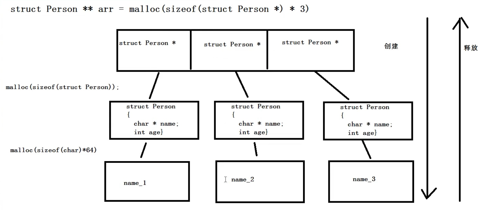

```c
#include <stdio.h>
#include <stdlib.h>
#include <string.h>

struct Person {
	char *name;
	int age;
};

struct Person **alloc_arr2(int len) {
	// 1. 在堆区创建一个结构体指针数组
	struct Person **arr = (struct Person **)malloc(sizeof(struct Person *)*len);  // arr:指向3个结构体指针
	//	int len_1 = sizeof(arr) / sizeof(arr[0]);  // error 1
	for (int i = 0;i < len;i++) {
		// 2. 在堆区给结构体指针数组中的每个结构体指针赋值
		arr[i] = (struct Person *)malloc(sizeof(struct Person));  // arr[i]:指向1个结构体
		// 3. 在堆区给结构体变量中的每个指针变量成员赋值
		arr[i]->name = (char *)malloc(sizeof(char)*32);
		sprintf(arr[i]->name, "name_%d", i+1);
		arr[i]->age = i + 18;
	}
	return arr;
}
// 打印结构体指针数组中每个结构体的成员
void print_arr(struct Person **arr, int len) {
	for (int i = 0;i < len;i++) {
		printf("%s %d\n", arr[i]->name, arr[i]->age);	
	}
}
// 释放全部堆区空间
struct Person **free_arr(struct Person **arr, int len) {
	if (arr == NULL || len <= 0) {
		perror("error");
		return NULL;
	}
	for (int i = 0;i < len;i++) {
		// 1. 先释放每个结构体中的指针成员
		if (arr[i]->name != NULL) {
			free(arr[i]->name);
			arr[i]->name = NULL;
		}
		// 2. 再释放结构体指针数组中的每个指针成员
		if (arr[i] != NULL) {
			free(arr[i]);
			arr[i] = NULL;
		}
	}
	// 3. 最后释放结构体二级指针
	free(arr);
	arr = NULL;
	
	return arr;
}

int main(int argc, char *argv[]) {
	int len = 3;
	struct Person **arr = NULL;  
	arr = alloc_arr2(len);
	print_arr(arr, len);
	arr = free_arr(arr, len);
//	printf("%d\n", arr);
	return 0;
}
```

### 1.9 结构体嵌套二级指针
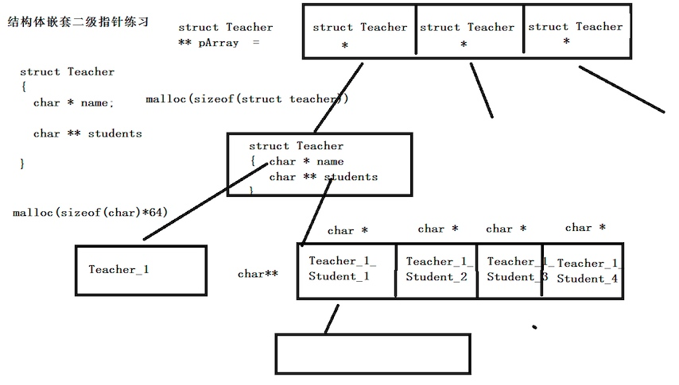

```c
#include <stdio.h>
#include <stdlib.h>
#include <string.h>

struct Teacher {
	char *name;
	char **students;
};
// 为结构体内二级指针成员申请空间
char **alloc_students(int i) {
	char **tmp = (char **)malloc(sizeof(char *)*3);  // 堆区字符串二级指针
	for (int j=0;j<3;j++) {
		tmp[j] = (char *)malloc(sizeof(char)*32);  // 堆区字符串指针
		sprintf(tmp[j], "student_%d_%d", i+1, j+1);
	}
	return tmp;
}
// 结构体申请空间
struct Teacher **alloc_space(int len) {
	struct Teacher **tmp = (struct Teacher **)malloc(sizeof(struct Teacher) * len);  // 堆区结构体二级指针
	for (int i=0;i<len;i++) {
		tmp[i] = (struct Teacher *)malloc(sizeof(struct Teacher));  // 堆区结构体一级指针
		tmp[i]->name = (char *)malloc(sizeof(char)*32);
		sprintf(tmp[i]->name, "teacher_%d", i+1);
		tmp[i]->students = alloc_students(i);
	}
	return tmp;
}
// 打印
void print_arr(struct Teacher **arr, int len) {
	for (int i=0;i<len;i++) {
		printf("%s\n", arr[i]->name);
		for (int j=0;j<3;j++) {
			printf("%s ", (arr[i]->students)[j]);
			printf("\n");
		}
	}
}
// 释放空间
void free_all(struct Teacher ***p, int len) {
	struct Teacher **arr = *p;
	if (arr == NULL || len <= 0) {
		perror("error");
		return;
	}
	for (int i=0;i<len;i++) {
		// 1. 先释放二级指针成员指向的字符串指针
		for (int j=0;j<3;j++) {
			if ((arr[i]->students)[j] != NULL) {
				free((arr[i]->students)[j]);
				(arr[i]->students)[j] = NULL;
			}
		}
		// 2. 释放二级指针成员和指针成员
		if (arr[i]->students != NULL) {
			free(arr[i]->students);
			arr[i]->students = NULL;
		}
		if (arr[i]->name != NULL) {
			free(arr[i]->name);
			arr[i]->name = NULL;
		}
		// 3. 释放结构体指针
		if (arr[i] != NULL) {
			free(arr[i]);
			arr[i] = NULL;
		}
	}
	// 4. 释放结构体数组指针
	free(arr);
	arr = NULL;
	*p = arr;
}


int main(int argc, char *argv[]) {
	int len = 3;
	struct Teacher **arr = NULL;
	arr = alloc_space(len);
	print_arr(arr, len);
	free_all(&arr, len);
	printf("%d", arr);
	return 0;
}
```

### 1.10 结构体的内存对齐
#### 1.10.1 结构体成员偏移量

```c
#include <stdio.h>
#include <stddef.h>

struct Teacher {
	char buf;
	int age;
};

// 结构体偏移量
void func01(void) {
	struct Teacher tom;
	struct Teacher *p = &tom;
	printf("%ld\n", (char *)&(p->age) - (char *)p);  // 将指针转换为char *
	printf("%lu\n", offsetof(struct Teacher, age));  // 成员age相对于结构体Teacher的偏移量
}
// 通过偏移量获取数据
void func02(void) {
	struct Teacher jerry = {'b', 13};
	struct Teacher *p = &jerry;
	printf("%d\n", *(int *)((char *)p+offsetof(struct Teacher, age)));
	printf("%d\n", *(int *)((int *)p + 1));
}

struct Teachers {
	char buf;
	int age;
	struct Teacher s;
};
// 嵌套结构体偏移量
void func03(void) {
	struct Teachers wang = {'a', 23, 'b', 13};
	struct Teachers *p = &wang;
	int offset1 = offsetof(struct Teachers, s);
	int offser2 = offsetof(struct Teacher, age);
	printf("%d\n", *(int *)((char *)p + offset1 +offser2));
	printf("%d\n", ((struct Teacher *)((char *)p + offset1))->age);
}

int main(int argc, char *argv[]) {
//	func01();
	func02();
	func03();
}
```

#### 1.10.2 内存对齐

cpu从内存中读取数据时，不是一个一个字节读取，而是按快读取的，快可能是8、8、16。
内存对齐：用空间换时间，如果没有内存对齐，访问一个变量可能会产生二次访问。
对于标准数据类型，它的地址只要是长度的整数倍
非标准数据类型（结构体）：
* 公式1:成员的地址必须是min(成员大小，对齐模数)的整数倍,不是就补齐
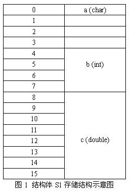

* 公式2:二次偏移：整个Struct的地址必须是min(最大成员大小，对齐模数)的整数倍,不是就补齐
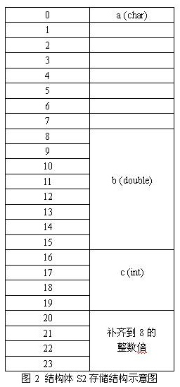
* 结构体嵌套的对齐规则：如果一个结构体B里嵌套另一个结构体A,还是以最大成员类型的大小对齐，但是结构体A的起点为A内部最大成员的整数倍的地方。

```c
#include <stdio.h>

#pragma pack (show)  // 查看对齐模数的值：8，以warning message的形式显示
//#pragma pack (1)  // 设置对齐模数为1

struct TYPE {
	char a;  // 0~3  // 0
	int b;  // 4~7  // 1～4
	char c;  // 8~11  // 5
	int d;  // 12~15  // 6～9
	double e;  // 16~23  // 10~17
};  // 24  // 18
// 结构体嵌套结构体
struct TYPE2 {
	char a;  // 1~7
	struct TYPE b;  // 8~31
	int c;  // 32~35
};  // 36+8=40


int main(int argc, char *argv[]) {
	printf("%lu\n", sizeof(struct TYPE2));  // %lu:32位无符号整数
}
```

## 2 共用体（联合体）:同一存储空间存储不同类型的数据 `union 共用体标签 {变量定义...};`
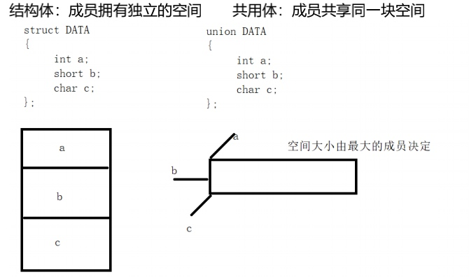

```c
union DATA {
    int a;
    short b;
    char c;
};

void func10(void) {
    printf("%lu\n", sizeof(union DATA));  // 4 共用体空间大小由最大成员决定
    union DATA data;
    data.a = 0x01020304;  // 04 03 02 01
    data.b = 0x0203;  // 03 02 02 01  // 共用体变量地址和它的各成员地址是同一地址
    data.c = 0x04;  // 04 02 02 01 ==> 1020204、204、4  a,b,c共用同一段空间，最后一次存放的成员起作用，存入新成员后原有值被覆盖
    printf("%#x %#x %#x\n", data.a, data.b, data.c);  // 共用体成员使用空间大小由成员资深类型决定
    data.a = 10;
    data.b = 20;
    data.c = 30;
    printf("%d\n", data.a+data.b+data.c);  // 90 共用体同一内存段可以存在几种不同类型的成员，每一瞬间还有一个成员起作用
}
```

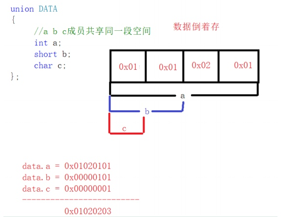

## 3 枚举类型：将变量的值一一列举出来 `enum 枚举类型{枚举列表}`

```c
enum weekday {mon = 1, tue, wed, thu, fri, sat, sun = 0};  // 枚举列表值本质是符号常量，默认从0递增
enum bool {flase, true};  // c语言不支持布尔类型，使用枚举类型定义

void func11(void) {
    enum weekday today = mon;
    printf("%d", today);
//    mon = 2;  // error 枚举值是常量，不能再赋值
}
```

## 4 typedef关键字：为一种数据类型定义一个新名字

### 4.1 简化结构体变量定义

```c
#define flag 1;  // 宏定义：发生在预处理阶段
typedef int xixint;  // 发生在编译阶段
typedef double shadouble;
typedef struct type {  // 为结构体类型取别名(指针别名)
    xixint a;
    shadouble b;
} shatype, *pType;  // shatype:struct type  pType:struct type *

void func12() {
    // struct type type1 = {1, 3.3};
    shatype type1= {1, 3.3};  // 简化
    printf("%d %.2f\n", type1.a, type1.b);
    pType p = &type1;  // shatype:struct type
    printf("%d %.2f\n", p->a, p->b);  // pType:struct type *
}
```

### 4.2 区分数据类型

```c
char* p1, p1;  // p1:char *  p2: char

type char* PCHAR
PCHAR p1, p2;  // p1:char *  p2: char *
```

### 4.3 提高可移植性

```c
long long a;
long long b;
...
// 无法移植到C89

type long long MYINT
MYINT a;
MYINT b;
...
```