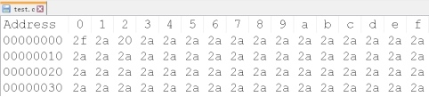
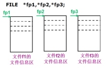
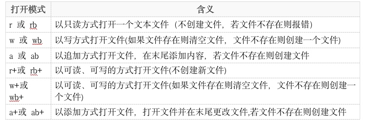
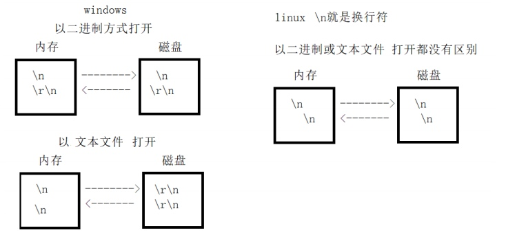
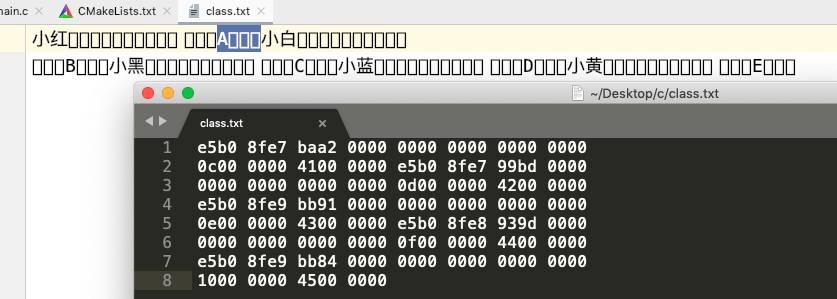
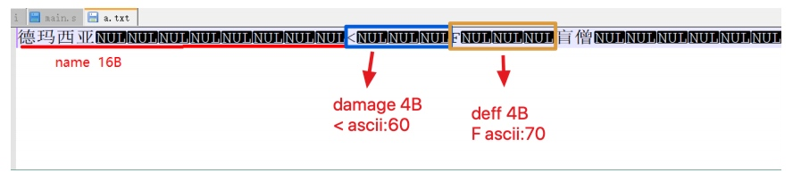
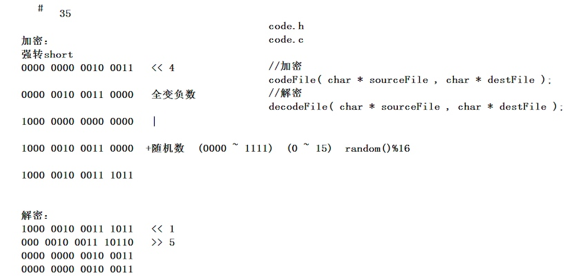
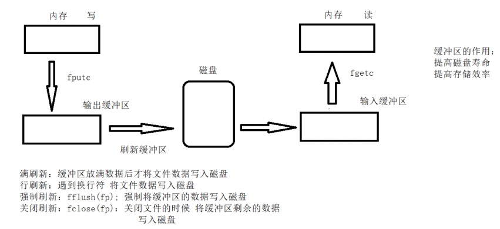

## 1 文件概述
### 1.2 磁盘文件和设备文件
* 磁盘文件：相关数据的有序集合，存储在外部介质上。
* 设备文件：操作系统中，将各个输入、输出设备看作为一个文件，他们的输入、输出等同于对磁盘文件的读和写。

### 1.3 磁盘文件的分类
* 物理上：二进制以字节单位进行顺序存储。

* 逻辑上：
    * 文本文件：字符编码
    每个字符都是单独一个字节
    5678 == `00110101``00110110``00110111``00111000`
    * 二进制文件：值编码
    根据具体应用，指定某个值是什么意思
    5678 == `00010110``00101110`

### 1.4 流 stream
C语言中，I/O操作可以看作从程序中移进或移出字节，这种搬运的过程就称为流。

## 2 文件操作
### 2.1 文件指针
操作系统通过API(函数)操作文件，而函数利用**文件指针参数（FILE *）**来识别不同文件。
文件指针指向一个FILE结构体空间，其中记录了一个文件的各种信息。


#### 2.1.1 FILE结构体类型

* fd文件描述符：stdin(标准输入)，stdout(标准输出), stderr(标准出错perror)

#### 2.1.2 获取文件状态
`int stat(const char *path, struct stat *buf)`

```c
#include <stdio.h>
#include <sys/stat.h>

int main(int argc, char *argv[]) {
    // stat()
    if (argc == 2) {
        struct stat stat_cur = {0};
        stat(argv[1], &stat_cur);
        printf("%d\n", stat_cur.st_mode);
    }

    return 0;
}
```

### 2.2 文件的打开和关闭
`FILE *fopen(const char *filename, const char *mode);  // 失败返回NULL`
`int fclose(FILE *stream)  // 成功返回0，失败返回-1`

 * `r(t)`: 文本文件打开 
 * `rb`：二进制形式打开

#### 2.2.1 文本流和二进制流模式打开
 * Unix、Linux：文本文件和文件纸文件都是以`\n`结尾，两种模式打开文件没有区别
 * Windows：文本文件以`\r\n`结尾，二进制文件以`\n`结尾（判断文件是在哪个系统中读写的）
     * 文件流模式：
         * 读取时将`\r\n`转换为`\n`
         * 写入时将`\n`转换为`\r\n`
     * 二进制流模式：原样输出
 

### 2.3 文件的读写
#### 2.3.1 文件结尾 
`int feof(FILE *stream);  // 判断最后一次读取的内容，到文件结尾返回非零值，未到返回0`
* 文本文件：EOF文件结束符(end of file)，文本文件中ascii代码值的范围是0~255，不可能出现-1，所以可用EOF作为文件结束标志，而数据以二进制存放在文件时，会有-1的出现，因此只能用feof()来判断文件是否结束。

#### 2.3.2 文件的按字符读写
`int fgetc(FILE *stream);`
`int fputc(int ch, FILE *stream);`

 ```c
 // 文件打开关闭和按字符读写
 void func01(void) {
    FILE *f = NULL;  // 定义文件指针(FILE结构体指针)
    f = fopen("./a.txt", "r");  // 返回文件信息(结构体)首元素地址
    if (f == NULL) {  // 必须判断文件是否成功打开
        perror("fopen");  // 字符串写函数名称判断哪个函数出错
        // errno宏:错误代码，每个错误代码对应相应的错误
        return;
    }

    char buf[] = "hello world!";
    for (int i = 0; i<strlen(buf); i++) {  // buf[i] != 0
        fputc(buf[i], f);  // 逐字符写入文件
    }

    while (!feof(f)) {  // 判断是否到文件尾，未到返回0
        char ch = 0;
        ch = fgetc(f);  // 逐字符读取文件
        
// #if 0(1) code #endif  相当于注释 
#if 0
	char ch;
	while(!feof(file))
	{
	   ch =	fgetc(file);

	   if (feof(file))
	   {
		   break;
	   }

	   printf("%c", ch);
	}
#endif

//        if (feof(f)) {  // 到文件末尾返回非零值
//            break;
//        }
        printf("%c", ch);
    }

    fclose(f);  // 保存文件信息(内存缓冲区的数据写入文件中)，释放空间(指针和缓存区)
}
```

```c
//案例：键盘获取输入写入文件，:quit退出
void func02(char *filename) {
    FILE *fp = NULL;
    fp = fopen(filename, "w");
    if (fp == NULL) {
        perror("fopen");
        return;
    }

    while(1) {
        char buf[128] = "";
        fgets(buf, sizeof(buf), stdin);  // 从键盘获取输入输出到字符串中
        if (!strncmp(buf, ":quit", sizeof(":quit")-1)) {
            break;
        }
        for (int i = 0; buf[i] != 0; i++) {
            fputc(buf[i], fp);

        }
    }

    fclose(fp);
}
 ```
 
#### 2.3.3 文件的行读写
`int fgets(char *str, int size, FILE *stream)  // 读到换行符，文件尾或者已经读了n-1个字符后，加上'\0'保存到str, 读到文件尾或出错返回NULL`
`int fputs(const char *str, FILE *stream);  // 字符串结束符'\0'`
* 读：读到str中，再输出到屏幕
* 写：从str或字符串常量写入到文件中

```c
#include <stdio.h>

// fputs()
void func01(void) {
	FILE *fp = fopen("./02.txt", "w");
	if (fp == NULL) {
		perror("fopen");
		return;
	}
	char *arr[] = {
		"窗前明月光\n",
		"疑是地上霜\n",
		"举头望明月\n",
		"低头思故乡\n"
	};
//	printf("%lu\n", sizeof(arr)/sizeof(arr[0]));
	for (int i=0; i<sizeof(arr)/sizeof(arr[0]); i++) {
		fputs(arr[i], fp);
	}
	fclose(fp);
}
// fgets()
void func02(void) {
	FILE *fp = fopen("./02.txt", "r");
	if (fp == NULL) {
		perror("fopen");
		return;
	}
	char buf[32] = "";
//	while (!feof(fp)) {
//		fgets(buf, sizeof(buf), fp);
//		if (feof(fp)) {
//			break;
//		}
//		printf("%s", buf);
//	}
	while (fgets(buf, sizeof(buf), fp)) {  // 读到文件尾或出错返回NULL
											// 读到换行符，文件尾或者已经读了n-1个字符后，加上'\0'保存到str
		printf("%s", buf);
	}
	fclose(fp);
}
int main(int argc, char *argv[]) {
	func01();
	func02();
}
```

#### 2.3.4 案例：四则运算出题和解题
* 出题：随机生成两个数字和一个运算符组包到str中，按行循环输出到文件中。
* 解题：逐行读区文件str,解包得到数字和运算符，通过switch语句判断运算符来对数字进行操作，得到结果后组包到新str中，输出到新文件。

```c
// 案例：四则运算之出题存储到文件
void func04(void) {
    srand(time(NULL));
    int num1 = 0, num2 = 0;
    char arr[] = "+-*/";
    char cmd = 0;

    FILE *fp = NULL;
    fp = fopen("test.txt", "w");
    if (fp == NULL) {
        perror("fopen");
        return;
    }

    int n = 50;
    for (int i = 0; i < n; i++) {
        num1 = rand() % 100 + 1;  // 0~100
        num2 = rand() % 100 + 1;  // 0~100
        cmd = arr[rand() % 4];  // 0~3

        char msg[128] = "";
        sprintf(msg, "%d%c%d=\n", num1, cmd, num2);  // 组包
        fputs(msg, fp);
    }

    fclose(fp);
}
```

```c
// 案例：四则运算之解题存储到文件
void func05(void) {
    FILE *fp1 = fopen("test.txt", "r");
    FILE *fp2 = fopen("answer.txt", "w");
    if (!fp1 || !fp2) {
        perror("fopen");
    }
    
    char str[128] = "";
    while (fgets(str, sizeof(str), fp1)) {  // 读到文件尾或出错返回NULL
        int num1 = 0, num2 = 0;
        char cmd = 0;
        sscanf(str,"%d%c%d=", &num1, &cmd, &num2);  // 解包
        int result = 0;
        switch (cmd) {
            case '+':
                result = num1 + num2;
                break;
            case '-':
                result = num1 - num2;
                break;
            case '*':
                result = num1 * num2;
                break;
            case '/':
                result = num1 / num2;
                break;
            default:
                break;
        }

        char answer[128] = "";
        sprintf(answer, "%d%c%d=%d\n", num1, cmd, num2, result);  // 组包
        fputs(answer, fp2);
    }

    fclose(fp1);
    fclose(fp2);
}
```

#### 2.3.5 文件的快读写：不做类型转换，速度快，适用于大文件拷贝（不查看内容）
* 写：将内存数据原样输出到文件
`size_t fwirte(const void *p, size_t szie, size_t n, FILE *stream);  // 成功返回n，失败返回0`

```c
// fwrite() 
void func01(void) {
    PEOPLE class1[5] = { {"小红", 12, 'A'},  // 结构体数组
                         {"小白", 13, 'B'},
                         {"小红", 14, 'C'},
                         {"小红", 15, 'D'},
                         {"小红", 16, 'E'} };
    FILE *fp = fopen("class.txt", "w");
    if (!fp) {
        perror("fopen");
        return;
    }
    fwrite(class1, sizeof(PEOPLE), 5, fp);  // 结构体指针，块大小，块数，文件指针
    fclose(fp);
}
```




* 读：将文件原样读区到内存中
`size_t fread(void *p, size_t size, size_t n, FILE *stream);  读到文件尾结束，返回成功读到的块数，失败返回0`

```c
// fread()
void func02(void) {
    FILE *fp = fopen("class.txt", "r");
    if (!fp) {
        perror("fopen");
        return;
    }
    PEOPLE class1[16];
    memset(class1, 0, sizeof(class1));

    int n = 0;
    n = fread(class1, sizeof(PEOPLE), 16, fp);  // 读到文件结尾结束，返回成功读读取到内存的块数

    for (int i = 0; i < n; i++) {
        printf("%d:%s %d %c\n", i+1, class1[i].name, class1[i].age, class1[i].grade);
    }

    fclose(fp);
}
```

#### 2.3.4 文件的格式化读写
* 读
`int fscanf(FILE *p, const char *format, ...);  // 返回成功转换的参数数目`
* 写
`int fprintf(FILE *p, const char *format, ...);  // 返回成功转换的参数数目`

```c
// fscanf() fprintf()
void func03(void) {
    FILE *fp = fopen("format.txt", "r");
    if (!fp) {
        perror("fopen");
        return;
    }

    char name[16] = "";
    int age = 0;
    char grade = 0;
    fprintf(fp, "%s %d %c\n", "小红", 16, 'A');  // 写文件 从内存fprintf到文件(屏幕)中
    fscanf(fp, "%s %d %c\n", name, &age, &grade);  // 读文件 从文件(屏幕)中fscanf到内存
    printf("%s %d %c\n", name, age, grade);

    fclose(fp);
}
```

#### 2.3.5 案例：读取文件对其中数值排序保存到新文件中

```c
// 案例：读取文件对其中数值排序保存到新文件中
// 生成文件
void func04(int n) {
    srand(time(NULL));
    FILE *fp = fopen("number.txt", "w");
    if (!fp) {
        perror("fopen");
        return;
    }

    int num = 0;
    for (int i = 0; i < n; i++) {
        num = rand() % 1000 + 1;
        fprintf(fp, "%d\n", num);
    }

    fclose(fp);
}
void mySort(int *arr, int n) {
    for (int i = 0; i < n; i++) {
        for (int j = i+1; j < n; j++) {
            if (arr[i] > arr[j]) {
                int tmp = arr[i];
                arr[i] = arr[j];
                arr[j] = tmp;
            }
        }
    }
}
// 排序
void func05() {
    FILE *fp_p = fopen("number.txt", "r");
    FILE *fp_a = fopen("answer_num.txt", "w");
    if (!fp_p || !fp_a) {
        perror("fopen");
        return;
    }

    int arr[100] = {0};
    for (int i = 0; i < 100; i++) {
        fscanf(fp_p, "%d\n", arr + i);
    }

    mySort(arr, 100);
    for (int j = 0; j < 100; j++) {
        fprintf(fp_a, "%d\n", arr[j]);
    }

    fclose(fp_p);
    fclose(fp_a);
}
```

#### 2.3.6 文件的随机读写
* `long ftell(FILE *p);  // 返回当前文件流位置（距首部字节数）`
* `void rewind(FILE *p);  // 文件流指针复位`
* `long fseek(FILE *p, long offset, int whence);  // 设置文件流指针(文件指针, 偏移数, 当前位置:SEEK_SET SEEK_CUR SEEK_END)`

```c
// rewind() fseek() ftell()
void func06(void) {
    FILE *fp = fopen("random.txt", "w+");
    if (!fp) {
        perror("fopen");
        return;
    }

    fputs("hello world!", fp);
    long loc = 0;
    loc = ftell(fp);  // 获取文件流指针位置（距首部字节数）：尾
    printf("%ld\n", loc);
//    rewind(fp);  // 文件流指针复位
    fseek(fp, -2, SEEK_CUR);  // 设置文件流指针位置
    // 如果用sizeof()，需要进行类型转换，因为sizeof()返回的是无符号整型
    loc = ftell(fp);
    printf("%ld\n", loc);
    char buf[32] = "";
    fgets(buf, sizeof(buf), fp);
    printf("%s\n", buf);

    fclose(fp);
}
```

#### 2.3.7 案例：测量文件的长度，将文件内容保存在堆区中读取

```c
// 案例：测量文件的长度，将文件内容保存在堆区中读取
void func07(void) {
    FILE *fp = fopen("format.txt", "r");
    if (!fp) {
        perror("fopen");
        return;
    }
    // 获取文件流指针偏移量
    fseek(fp, 0, SEEK_END);
    int len = (int)ftell(fp);
    // 从堆区申请len+1个字节
    char *p = (char *)malloc(len+1);  // `\0`不算
    memset(p, 0, len+1);
    // 复位文件流指针
    rewind(fp);
    // 将数据fread入堆区
    fread(p, len, 1, fp);
    // 从堆区中printf数据
    printf("%s", p);
    // 释放堆区空间
    if (p != NULL) {
        free(p);
        p = NULL;
    }
}
```

#### 2.3.8 案例：配置文件键值对读写
1. 获取文件的有效行数
2. 解析文件,放入结构体数组中
3. 根据key访问相应的value

```c
#include <stdio.h>
#include <stdlib.h>
#include <string.h>

struct ConfigInfo {
	char key[64];
	char value[64];
};

// 1. 获取文件有效行数
int get_lines(const char *filepath) {
	FILE *fp = fopen(filepath, "r");
	if (fp == NULL) {
		perror("fopen");
		return -1;
	}
	char buf[128] = "";
	int num = 0;
	while (!feof(fp)) {
		fgets(buf, sizeof(buf), fp);
//		printf("%s", buf);
		if (strchr(buf, ':')) {
//			printf("%s", buf);
			num++;
		}
	}
	fclose(fp);
//	printf("%d", num);
	return num;
}
// 2. 解析文件,放入数组中
struct ConfigInfo *parseFile(const char *filepath, int lines) {
	FILE *fp = fopen(filepath, "r");
	if (fp == NULL) {
		perror("fopen");
		return NULL;
	}
	struct ConfigInfo *p = malloc(sizeof(struct ConfigInfo)*lines);
	char buf[128] = "";
	int i = 0;
	while (!feof(fp)) {
		fgets(buf, sizeof(buf), fp);
		if (strchr(buf, ':')) {
			memset(p[i].key, 0, sizeof(p[i].key));
			memset(p[i].value, 0, sizeof(p[i].value));
			
			strcpy(p[i].key, strtok(buf, ":"));
			strcpy(p[i].value, strtok(NULL, ":"));	
			p[i].value[strlen(p[i].value)-1] = 0;  // 去除回车
			i++;
		}
		memset(buf, 0, sizeof(buf));
	}
	fclose(fp);
	
	return p;
}
// 3. 根据key访问相应的value
void get_value(const char *key, struct ConfigInfo *p, int lines) {
	for (int i=0;i<lines;i++) {
		if (strcmp(key, p[i].key) == 0) {
			printf("%s\n", p[i].value);
		}
	}
}

void free_all(struct ConfigInfo *p) {
	if (p != NULL) {
		free(p);
		p = NULL;
	}
}


int main(int argc, char *argv[]) {
	const char *filepath = "./06.txt";
	int lines = get_lines(filepath);
//	printf("%d\n", lines);
	struct ConfigInfo *p = parseFile(filepath, lines);
	get_value("heroAtk", p, lines);
	get_value("heroInfo", p, lines);
	free_all(p);
	p = NULL;
	
	return 0;
}
```

#### 2.3.9 文件的加密和解密



### 2.4 文件的重命名和删除
* 重命名
`int rename(const char *oldpath, const char *newpath);`
* 删除
`int remove(const char *pathname);`

### 2.5 文件的缓冲区


* 写：内存 => 输出缓冲区 => 磁盘
系统在输出缓冲区和磁盘(大空间，fclose后进行磁盘修正)中同时开辟空间，先输出到缓冲区中，刷新到磁盘。
* 读：磁盘 => 输出缓冲区 => 内存

#### 2.5.1 刷新缓冲区
* 满刷新

```c
// 满刷新
// 缓存区满之后刷新到屏幕
#include <unisto.h>

void func08(void) {
    for (int i = 0; i < 100000; i++) {
        printf("hello world!");
        usleep(1000 * 10);
    }
}
```

* 关闭刷新

```c
// 关闭刷新
void func09(void) {
    printf("hello world!");
//    while (1);  // 死循环，无法关闭刷新
    return;
}
```

* 行刷新

```c
// 行刷新
void func10(void) {
    printf("hello world!\n");  // 行刷新
    while (1);  // 死循环，无法关闭刷新
    return;
}
```

* 强制刷新
`int fflush(FILE *stream);  // 更新缓冲区，让缓冲区的数据立马写到文件（设备文件）中`

```c
// 强制刷新
void func11(void) {
    printf("hello world!");  
    fflush(stdout);  // 标准输出(屏幕)文件指针
    while (1);  // 死循环，无法关闭刷新
    return;
}
```