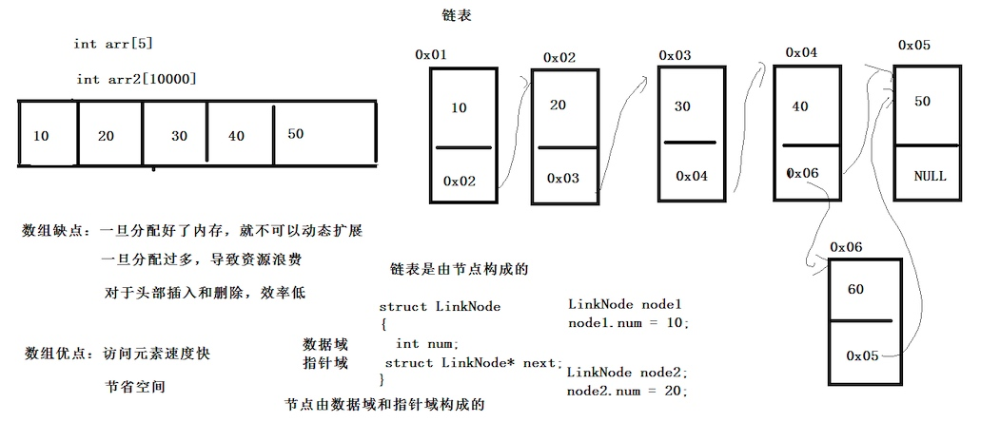
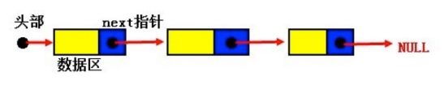
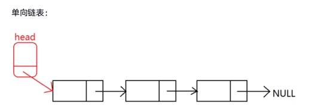
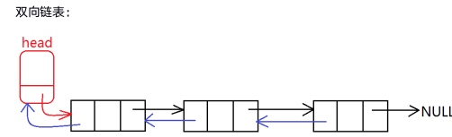
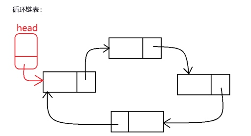

## 1 链表


链表是一种数据结构，它通过指针将一些数据结点接成一个数据链。
* 头结点
    * 指针域
* 结点
    * 数据域：存储数据
    * 指针域：存储下一个结点的指针



```c
// 定义结点结构体
struct LinkNode {
    int num;  // 数据域
    struct LinkNode;  // 指针域
};
```

### 1.1 结构体的自身引用
* 结构体不可以嵌套本类型的结构体变量
* 结构体不可以嵌套本类型的结构体指针变量

```
struct Student {
    char name[64];
    int age;
    struct Student mate;  // 此时结构体类型的成员还没有确定，编译器无法分配内存；
    struct Student *p_mate  // 指针变量字节数确定，编译器可确定内存分配
}
```

## 2 链表分类
### 2.1 静态链表（栈区）和 动态链表（堆区）

```c
#include <stdio.h>
#include <stdlib.h>

// 定义节点结构体
struct LinkNode {
	int num;  // 数据域
	struct LinkNode *next;  // 结构域
};

// 1 静态链表
void func01(void) {
	// 创建节点
	struct LinkNode node1 = { 10, NULL };
	struct LinkNode node2 = { 20, NULL };
	struct LinkNode node3 = { 30, NULL };
	struct LinkNode node4 = { 40, NULL };
	struct LinkNode node5 = { 50, NULL };
	// 建立节点之间的关系
	node1.next = &node2;
	node2.next = &node3;
	node3.next = &node4;
	node4.next = &node5;
	// 遍历链表
	struct LinkNode *pCurrent = &node1;
	while (pCurrent != NULL) {
		printf("%d\n", pCurrent->num);
		pCurrent = pCurrent->next;
	}
}
// 2 动态链表
void func02(void) {
	// 为节点申请栈区空间
	struct LinkNode *p1 = malloc(sizeof(struct LinkNode));
	struct LinkNode *p2 = malloc(sizeof(struct LinkNode));
	struct LinkNode *p3 = malloc(sizeof(struct LinkNode));
	struct LinkNode *p4 = malloc(sizeof(struct LinkNode));
	struct LinkNode *p5 = malloc(sizeof(struct LinkNode));
	// 建立节点间关系
	p1->num = 100;
	p1->next = p2;
	p2->num = 200;
	p2->next = p3;
	p3->num = 300;
	p3->next = p4;
	p4->num = 400;
	p4->next = p5;
	p5->num = 500;
	p5->next = NULL;
	// 遍历节点
	struct LinkNode *pCurrent = p1;
	while (pCurrent != NULL) {
		printf("%d\n", pCurrent->num);
		pCurrent = pCurrent->next;
	}
	// 释放栈区空间
	free(p1);
	free(p2);
	free(p3);
	free(p4);
	free(p5);
}

int main(int argc, char *argv[]) {
//	func01();
	func02();
}
```

### 2.2 单向链表、双向链表、循环列表




## 3 链表操作
* 链表初始化
* 遍历链表
* 插入结点
* 删除节点
* 清空链表
* 销毁链表

```c
// linkedlist.h
#pragma onece

#include <stdio.h>
#include <stdlib.h>

struct LinkNode {
	int num;
	struct LinkNode *next;
};

struct LinkNode *init_linkedlist(void);  // 创建链表，返回头节点
int foreach_linkedlist(struct LinkNode *p_header);  // 遍历链表
int insert_node_right(struct LinkNode *p_header, int oldVal, int newVal);  // 插入节点
int insert_node_left(struct LinkNode *p_header, int oldVal, int newVal);
int del_node(struct LinkNode *p_header, int delVal);  // 删除节点
int reverseLL(struct LinkNode *p_header);  // 反转列表
int clear_ll(struct LinkNode *p_header);  // 清空链表（保留头节点）
int destory_ll(struct LinkNode *p_header);  // 销毁链表
```

```c
// linkedlist.c
#include "linkedlist.h"

struct LinkNode *init_linkedlist(void) {
	// 创建头节点
	struct LinkNode *p_header = malloc(sizeof(struct LinkNode));
	p_header->next = NULL;
	// 添加节点
	struct LinkNode *p_tail = p_header;
	int num = -1;
	while (1) {
		printf("请输入数值：\n");
		scanf("%d", &num);
		if (num == -1) {
			break;
		}
		struct LinkNode *p = malloc(sizeof(struct LinkNode));
		p->num = num;
		p->next = NULL;
		p_tail->next = p;
		p_tail = p;
	}
	return p_header;
}

int foreach_linkedlist(struct LinkNode *p_header) {
	if (p_header == NULL) {
		return -1;
	}
	struct LinkNode *p_cur = p_header->next;
	printf("------开始遍历链表------\n");
	while (p_cur != NULL) {
		printf("%d\n", p_cur->num);
		p_cur = p_cur->next;
	}
	
	return 0;
}

int insert_node_right(struct LinkNode *p_header, int oldVal, int newVal) {
	if (p_header == NULL) {
		return -1;
	}
	struct LinkNode *p_cur = p_header->next;
	while (p_cur != NULL) {
			if (oldVal == p_cur->num) {
				struct LinkNode *p_new = malloc(sizeof(struct LinkNode));
				p_new->num = newVal;
				struct LinkNode *tmp = p_cur->next;
				p_cur->next = p_new;
				p_new->next = tmp;
				return 0;
			}
			p_cur = p_cur->next;
		}
		
	return -2;
}

int insert_node_left(struct LinkNode *p_header, int oldVal, int newVal) {
	if (p_header == NULL) {
		return -1;
	}
	struct LinkNode *p_cur = p_header;
	while (p_cur != NULL) {
			if (oldVal == p_cur->next->num) {
				struct LinkNode *p_new = malloc(sizeof(struct LinkNode));
				p_new->num = newVal;
				struct LinkNode *tmp = p_cur->next;
				p_cur->next = p_new;
				p_new->next = tmp;
				return 0;
			}
			p_cur = p_cur->next;
		}
		
	return -2;
}

int del_node(struct LinkNode *p_header, int delVal) {
	if (p_header == NULL) {
		return -1;
	}
	struct LinkNode *p_pre = p_header;
	struct LinkNode *p_cur = p_header->next;
	while (p_cur != NULL) {
		if (p_cur->num == delVal) {
			p_pre->next = p_cur->next;
			free(p_cur);
			return 0;
		}
		p_pre = p_cur;
		p_cur = p_cur->next;
	}
	
	return -2;
}

// 反转
int reverseLL(struct LinkNode *p_header) {
	if (p_header == NULL) {
		return -1;
	}
	struct LinkNode *p_pre = p_header->next;
	struct LinkNode *p_cur = p_pre->next;
	struct LinkNode *p_next = p_cur->next;
	p_pre->next = NULL;  // 将第二个结点的next设为NULL
	while (p_cur != NULL) {  // cur==NULL时 pre是最后一个结点
		p_next = p_cur->next;  // 保存下一个结点地址
		p_cur->next = p_pre;
		p_pre = p_cur;
		p_cur = p_next;
	}
	p_header->next = p_pre;  // 将头结点与最后一个结点相连
	return 0;
}

int clear_ll(struct LinkNode *p_header) {
	if (p_header == NULL) {
		return -1;
	}
	struct LinkNode *p_cur = p_header->next;
	while (p_cur != NULL) {
		struct LinkNode *p_next = p_cur->next;  // 记录释放节点链接的节点地址
		free(p_cur);  // 释放当前节点
		p_cur = p_next;  // 节点往后移动
	}
	p_header->next = NULL;
	printf("------链表清空成功------\n");
	
	return 0;
}

int destory_ll(struct LinkNode *p_header) {
	if (p_header == NULL) {
		return -1;
	}
	struct LinkNode *p_cur = p_header;
	while (p_cur != NULL) {
		struct LinkNode *p_next = p_cur->next;  // 记录释放节点链接的节点地址
		free(p_cur);  // 释放当前节点
		p_cur = p_next;  // 节点往后移动
	}
	printf("------链表销毁成功------\n");
	
	return 0;
}
```

```c
// main.c
#include <stdio.h>
#include "linkedlist.h"

int main(int argc, char *argv[]) {
	struct LinkNode *p_header = init_linkedlist();
	
//	insert_node_right(p_header, 30, 35);
//	insert_node_left(p_header, 30, 25);
	
//	del_node(p_header, 30);
	
	reverseLL(p_header);
	foreach_linkedlist(p_header);
	
//	clear_ll(p_header);
//	foreach_linkedlist(p_header);
	
	destory_ll(p_header);
	
	return 0;
}
```