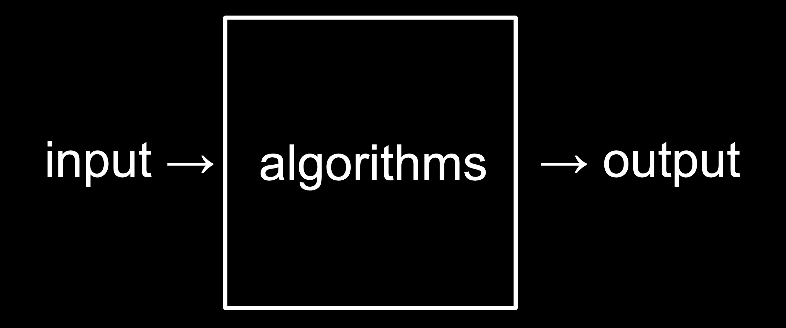
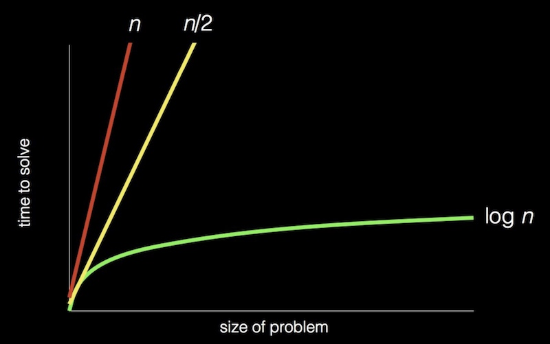

## 1 Computational Thinking


* 晶体管 ==> bit(b 位) ==》 Byte(B 字节) ==> KB ==> MB(兆) ==> GB(吉) ==> TB(太)
* $(01000001)_2$ = $(65)_{10}$ = `'A'`

## 2 Algorithms


### 2.1 Pseudocode(伪代码)

```
_Pick up_ phone book
_Open to_ middle of phone book
_Look at_ the page
If (Smith is on page)
    _Call_ Mike
Else if (Smith is earlier in book)
    _Open to_ middle of left half of book
    Go back to line 3
Else if (Smith is later in book)
    _Open to_ middle of right half of book
    Go back to line 3
Else
    _Quit_    
```

* functions
* conditions
* Boolean expressions
* loops
* variables
* threads
* events
* ...

## 3 [Scratch](https://scratch.mit.edu/projects/editor/?tutorial=getStarted)