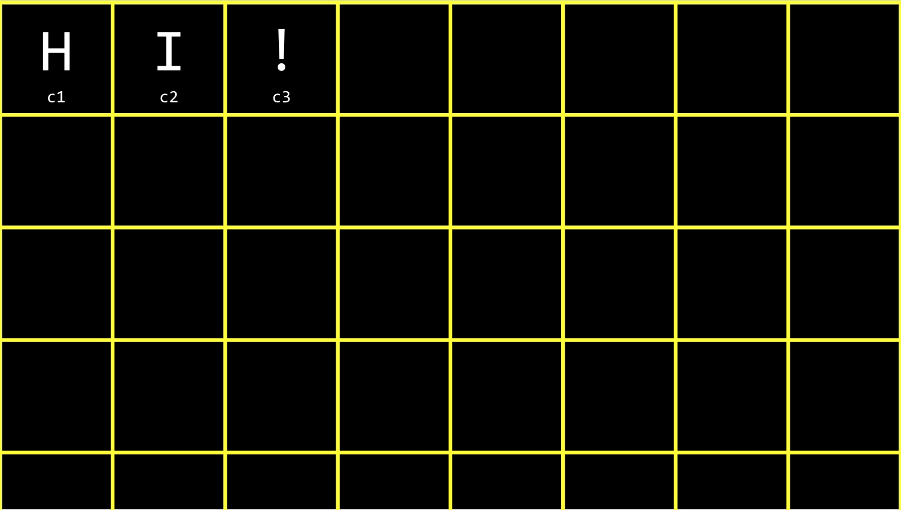
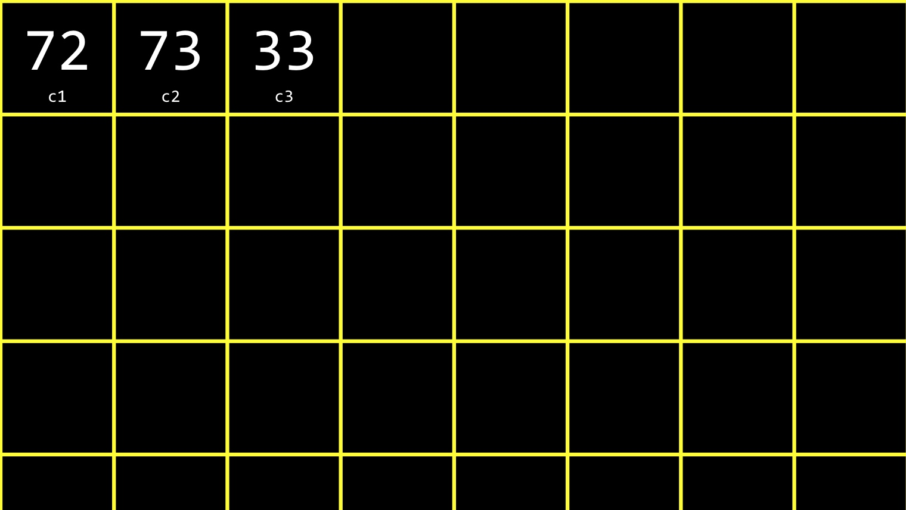
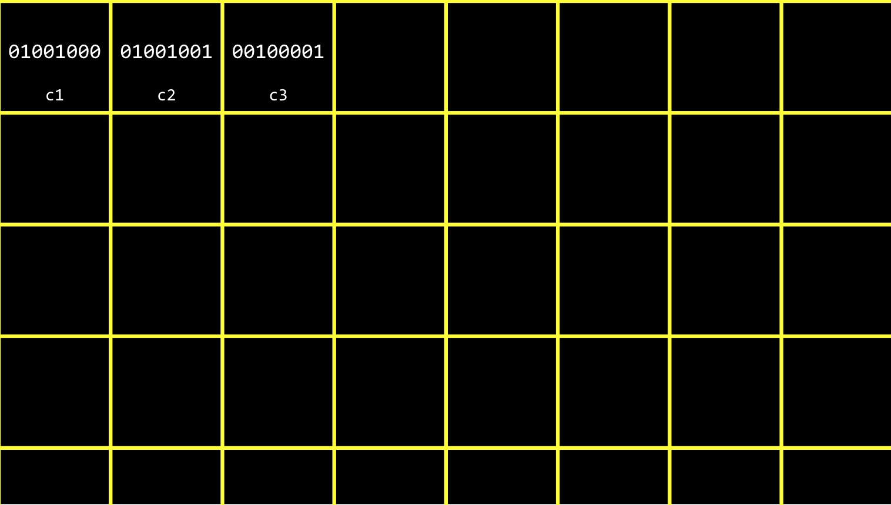
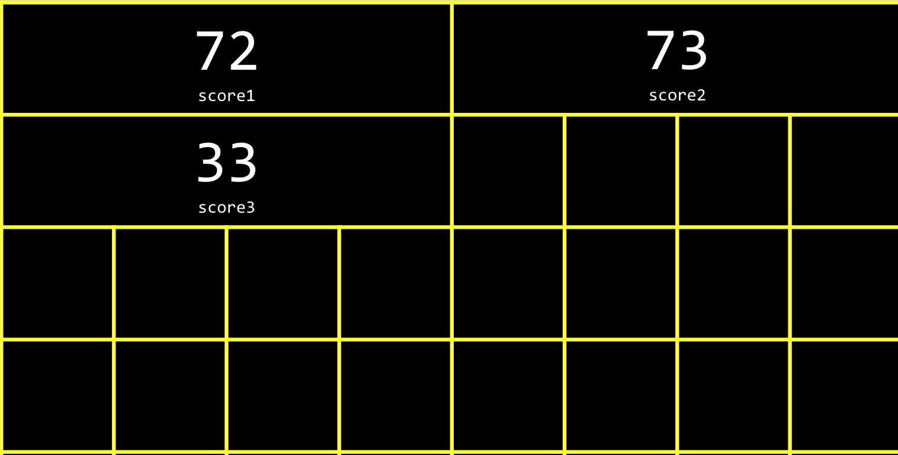
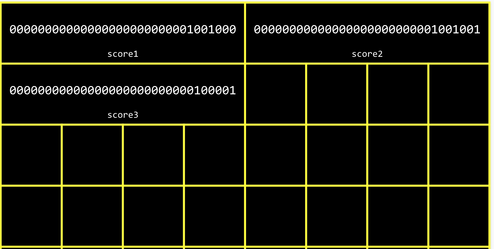
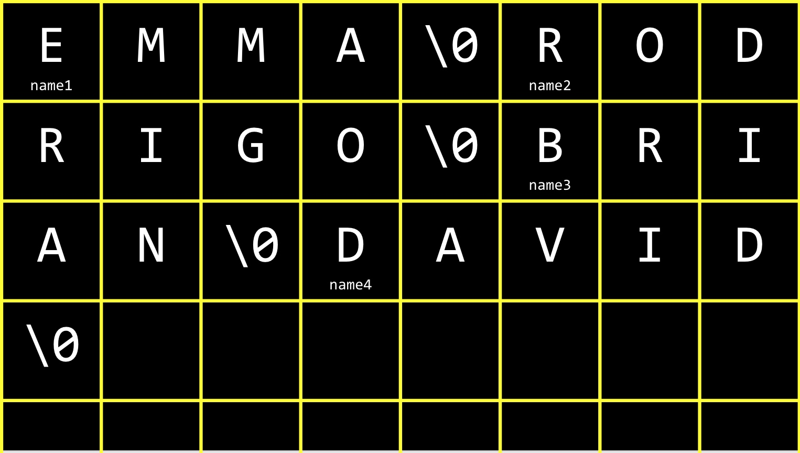
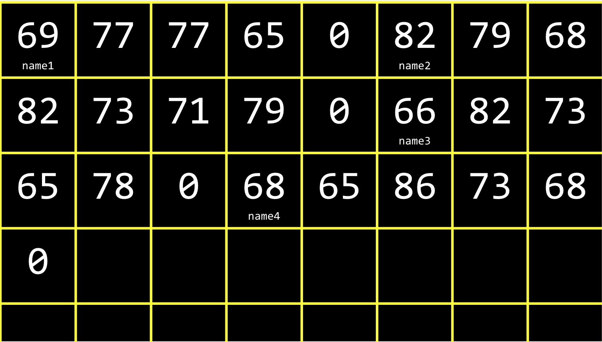
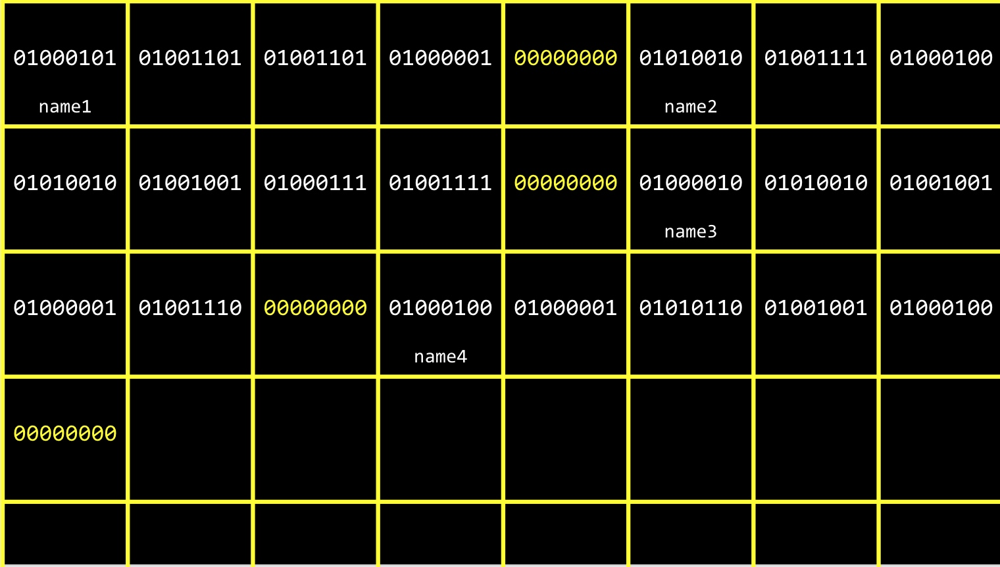
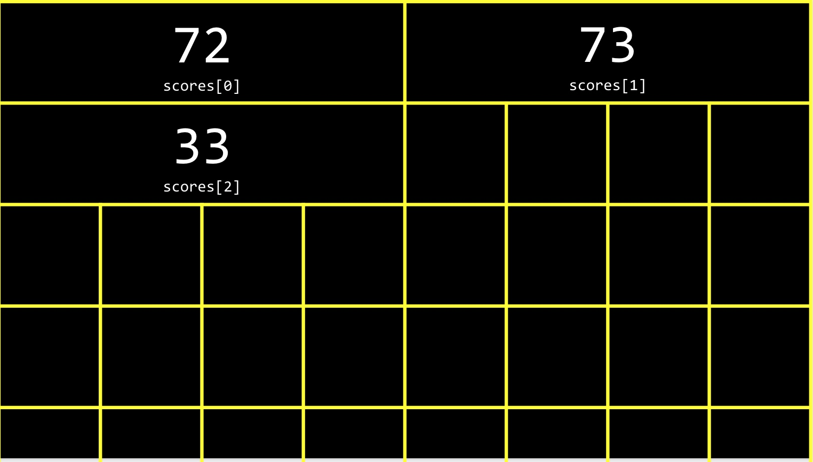

## 1 C语言程序的编译
* preprocessing     
`#include <stdio.h>` ==> `int printf(string format, ...); ...` 
* compiling
高级语言 ==> 汇编语言
* assembling(汇编)
汇编语言 ==> 机器语言
* linking
源代码编译后的机器语言 + 头文件预处理后的机器语言 ==> `*.out`

## 2 内存中的char、int、string、array
* char: 1byte




* int: 4byte



* string




* array


## 3 数组参数：求平均分

```c
// 求平均分
#include <stdio.h>

float avg(int length, int array[]);

int main(void) {
    int n;
    printf("num: ");
    scanf("%d", &n);

    int score[n]； // 定义数组
    for (int i = 0; i < n; i++) {
        printf("score[%d]: ", i+1);
        scanf("%d", &score[i]);
    }

    printf("Average: %.1f", avg(n, score));

    return 0;
}

// 数组作为参数
float avg(int length, int array[]) {
    int sum = 0;
    for (int i = 0; i < length; i++) {
        sum += array[i];
    }

    return sum / (float)length;
}
```

## 4 命令行参数（command-line arguments）

```c
// argc.c
// 让程序接受命令行参数
#include <cs50.h>
#include <stdio.h>

int main(int argc, string argv[])
{
    if (argc == 2)
    {
        printf("hello, %s\n", argv[1]);
    }
    else
    {
        printf("missing command-line argument\n");
        return 1; // 退出代码
    }
    return 0;
}
```

`./argc zuoyiming`
* argc: 参数数目
* argv: 从命令行中获取字符串数组
    * argv[0]: ./argc
    * argv[1]: zuoyiming