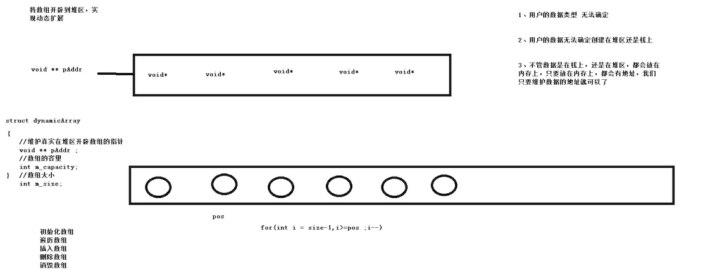

[动态数组](https://github.com/Yiming-Zuo/C/tree/master/%E6%95%B0%E6%8D%AE%E7%BB%93%E6%9E%84/01.%E5%8A%A8%E6%80%81%E6%95%B0%E7%BB%84)：将数组开辟到堆区，存放每一个元素，实现动态扩展


## 1 需求
分文件编写，方便重复使用
## 2 功能
动态数组结构体：

```c
struct dynamicArray {
    char **pAdrr;  // 维护真实数组(用户数据指针的集合)的指针
    int capacity;
    int size;
};
```

1. 初始化数组     
    `struct dynamicArray *init_arr(int capacity);`
    * 用户的数据类型无法确定
    * 用户的数据无法确定实在堆区还是栈上
    * 需要直接维护用户数据的地址(void *data)
2. 插入元素     
    `int insert_ele(struct dynamicArray *myarr, void *data, int pos);`
3. 遍历数组     
    `void foreach_arr(struct dynamicArray *myarr, void(*print_func)(void *));`
4. 删除元素      
    `int remove_arr(struct dynamicArray *myarr, int pos);  // 按位置`      
    `int remove_arr_values(struct dynamicArray *myarr, void *data, int(*compare_func)(void *, void*));  // 按位置`
5. 销毁数组    
    `int destory_arr(struct dynamicArray *myarr);`