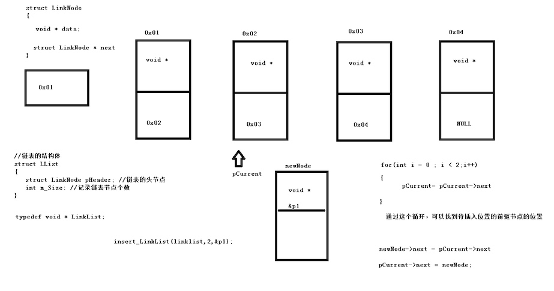
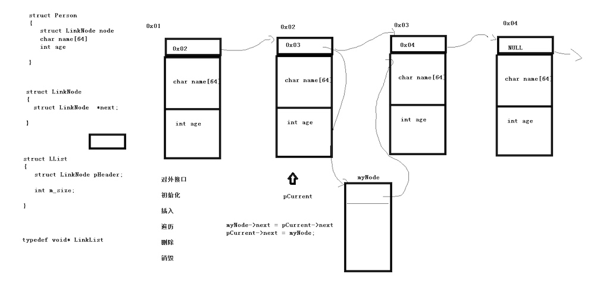

## 1 [单向链表](https://github.com/Yiming-Zuo/C/tree/master/%E6%95%B0%E6%8D%AE%E7%BB%93%E6%9E%84/02.%E5%8D%95%E5%90%91%E9%93%BE%E8%A1%A8)
每个结点的数据区记录用户数据的指针

### 1.1 链表结构
* 结点结构体    

```c
struct LinkNode {
    void *data;
    struct LinkNode *next;
};
```

* 链表结构体    

```c
struct LList {
    struct LinkNode Header;
    int size;
};
```

`typedef void * LinkedList;  // 隐藏链表结构体，防止用户更改数据`

### 1.2 功能
1. 初始化链表     
`LinkedList init_ll(void);`
2. 插入数据    
`int insert_node(LinkedLink myll, void *data, int pos);
3. 遍历链表   
`void foreach_ll(LinkedLink myll, void(*print_func)(void *));`
4. 删除结点     
`int remove_node(LinkedLink myll, int pos);  // 位置`      
`int remove_node_value(LinkedLink myll, void *data, int(*compare_func)(void *, void *));  // 值`
5. 查看指定结点      
`void inquire_node(LinkedLink myll, int pos, void(*print_func)(void *));`
6. 清空链表     
`int clear_ll(LinkedLink myll);`
7. 销毁链表     
`int destory_ll(LinkedList mylist);`

## 2 [单向链表企业级版本](https://github.com/Yiming-Zuo/C/tree/master/%E6%95%B0%E6%8D%AE%E7%BB%93%E6%9E%84/03.%E5%8D%95%E5%90%91%E9%93%BE%E8%A1%A8%E4%BC%81%E4%B8%9A%E7%BA%A7%E7%89%88%E6%9C%AC)
用户数据的前四个字节是结点结构体，只维护指针域，记录了下一个结点的位置


### 2.1 链表结构
* 结点结构体    

```c
struct LinkNode {
    struct LinkNode *next;
};
```

* 链表结构体    

```c
struct LList {
    struct LinkNode Header;
    int size;
};
```

`typedef void * LinkedList;  // 隐藏链表结构体，防止用户更改数据`

* 用户数据

```c
struct Student {
    struct LinkNode Node;
    char name[64];
    int age;
};
```

### 2.2 功能

1. 初始化链表     
`LinkedList init_ll(void);`   
2. 插入元素     
`int insert_ele(LinkedList mylist, int pos, void *data);`
3. 遍历链表     
`void foreach_ll(LinkedList mylist, void(*print_func)(struct LinkNode *));`
4. 删除元素     
`int remove_ele(LinkedList mylist, int pos);  // 位置`    
`int remove_value(LinkedList mylist, void *data, int(*compare_func)(void *, void *));  // 值`
5. 销毁链表    
`int destory_ll(LinkedList mylist);`