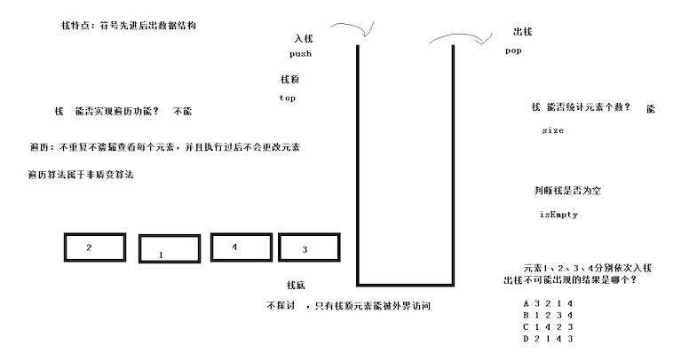
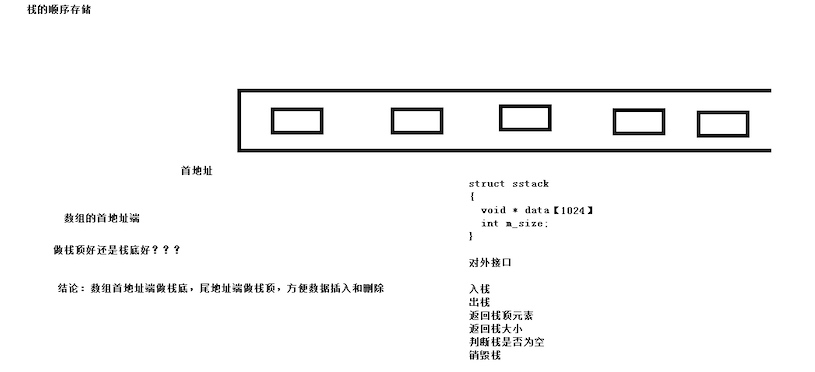
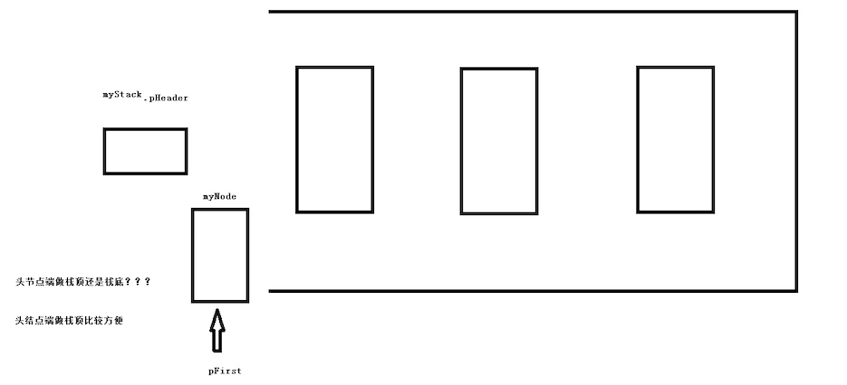
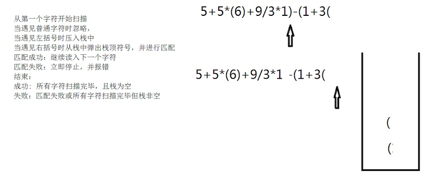
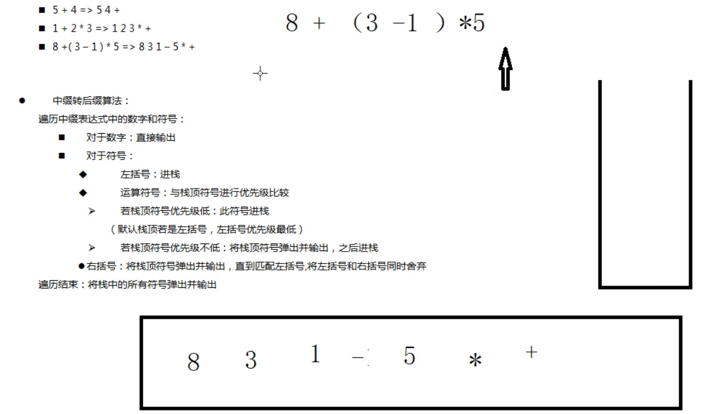
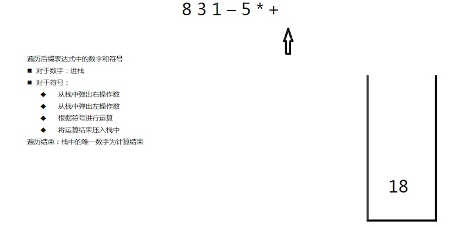

## 1 栈
* 栈是一种先进后出的数据结构
* 栈不能实现遍历功能
    * 遍历：不重复不遗漏的查看每个元素，并且遍历后不会更改元素，属于**非质变算法**


## 2 [栈的顺序存储](https://github.com/Yiming-Zuo/C/tree/master/%E6%95%B0%E6%8D%AE%E7%BB%93%E6%9E%84/04.%E6%A0%88%E7%9A%84%E9%A1%BA%E5%BA%8F%E5%AD%98%E5%82%A8)
利用指针数组模拟出栈先进后出的数据结构，数组尾地址做栈顶


### 2.1 栈的结构体

```c
# define MAX 1024;
typedef void * sstack;
// 结构体放到.c文件中，隐藏结构体
struct sstack {
    void *data[MAX];
    int size;
}
```

### 2.2 功能

```c
sstack init_sstack(void);  // 初始化栈
int push_sstack(sstack p, void *data);  // 用户数据入栈
int pop_sstack(sstack p);  // 用户数据出栈
int sizeof_sstack(sstack p);  // 返回栈大小
int isEmpety(sstack p);  // 返回栈是否为空
void top_sstack(sstack p, void(*print_func)(void *));  // 查看栈顶元素
int destory_sstack(sstack p);  // 销毁栈
```

## 3 [栈的链式存储](https://github.com/Yiming-Zuo/C/tree/master/%E6%95%B0%E6%8D%AE%E7%BB%93%E6%9E%84/05.%E6%A0%88%E7%9A%84%E9%93%BE%E5%BC%8F%E5%AD%98%E5%82%A8)
利用链表模拟栈的先进后出的数据结构，链表的头结点连接栈顶元素

### 3.1 栈的结构体

```c
// 结点
struct LinkNode {
	struct LinkNode *next;
};
typedef void * Linkstack;
// 链表
struct Lstack {
	struct LinkNode Header;
	int size;
};
// 用户数据
struct Student {
	struct LinkNode Node;
	char name[64];
	int age;
};
```

### 3.2 功能

```c
Linkstack init_lstack(void);  // 初始化栈
int push_lstack(Linkstack mystack, void *data);  // 入栈
int pop_lstack(Linkstack mystack);  // 出栈
int sizeof_lstack(Linkstack mystack);  // 查看栈大小
int isEmpety(Linkstack mystack);  // 判断栈是否为空
void *top_lstack(Linkstack mystack);  // 返回栈顶元素
int destory_lstack(Linkstack mystack);  // 销毁栈
```

## 4 [栈的应用案例一：就近匹配](https://github.com/Yiming-Zuo/C/tree/master/%E6%95%B0%E6%8D%AE%E7%BB%93%E6%9E%84/06.%E6%A0%88%E7%9A%84%E5%BA%94%E7%94%A8%E6%A1%88%E4%BE%8B%EF%BC%9A%E5%B0%B1%E8%BF%91%E5%8C%B9%E9%85%8D)
使用栈先进后出的数据结构检查字符串的括号使用是否规范

## 5 栈的应用案例二：后缀表达式与中缀表达式
### 5.1 中缀表达式 -> 后缀表达式


### 5.2 基于后缀表达式的运算

