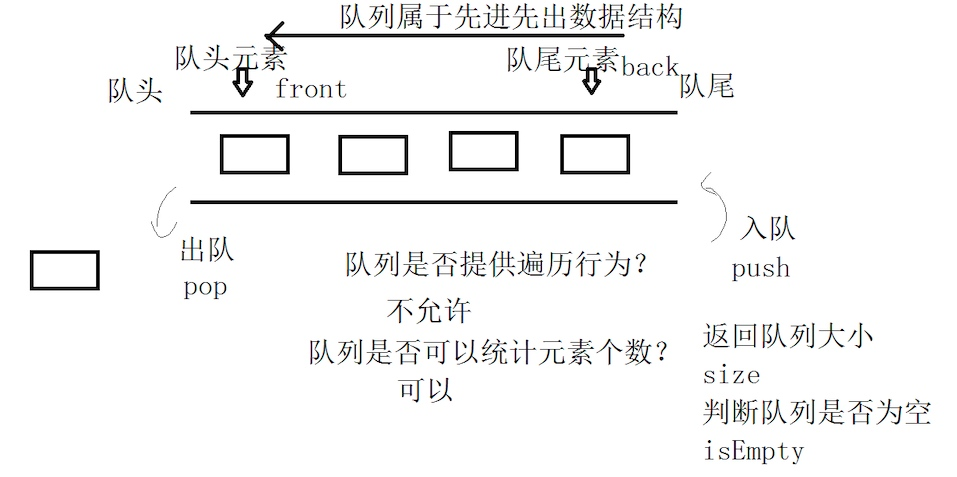
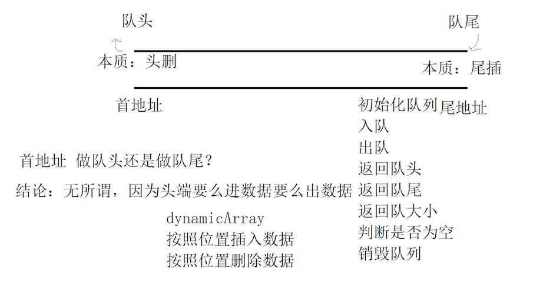
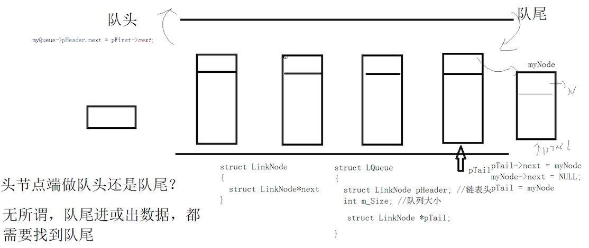

## 1 队列
先进先出的数据结构
* 入队：push
* 出队：pop
* 队首：front
* 队尾：back



## 2 队列的顺序存储


```c
// 利用动态数组实现队列先进先出的数据结构
#include <stdio.h>

#define MAX 1024

typedef void * SeqQueue;

SeqQueue init_queue(void);  // 初始化队列
int push_queue(SeqQueue myqueue, void *data);  // 入队
int pop_queue(SeqQueue myqueue);  // 出队
void *front_queue(SeqQueue myqueue);  // 返回队头元素
void *back_queue(SeqQueue myqueue);  // 返回队尾元素
int size_queue(SeqQueue myqueue);  // 返回队列大小
int isEmpety_queue(SeqQueue myqueue);  // 判断队列是否为空
int destory_queue(SeqQueue myqueue); // 销毁队列
```

## 2 队列的链式存储


```c
// 使用链表实现队列先进先出的数据结构
#pragma once
#include <stdio.h>
#include <stdlib.h>

typedef void * LinkQueue;

struct LinkNode {
	struct LinkNode *next;
};

struct LQueue {
	struct LinkNode Header;  // 头结点 固定
	int size;
	struct LinkNode *p_tail;  // 尾结点 维护
};

LinkQueue init_queue(void);  // 初始化队列
int push_queue(LinkQueue myqueue, void *data);  // 入队
int pop_queue(LinkQueue myqueue);  // 出队
void *front_queue(LinkQueue myqueue);  // 返回队头元素
void *back_queue(LinkQueue myqueue);  // 返回队尾元素
int size_queue(LinkQueue myqueue);  // 返回队列大小
int isEmpety_queue(LinkQueue myqueue);  // 判断队列是否为空
int destory_queue(LinkQueue myqueue); // 销毁队列
```