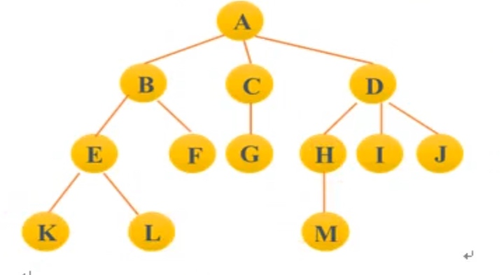
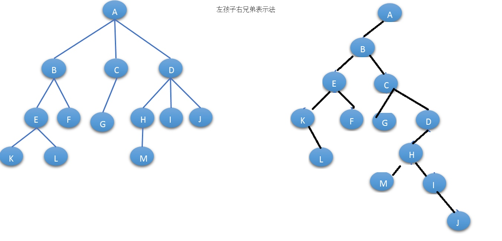
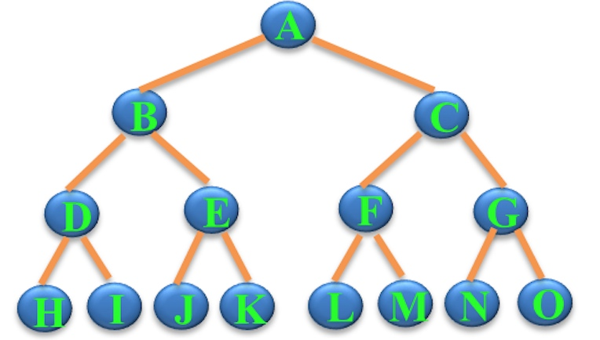
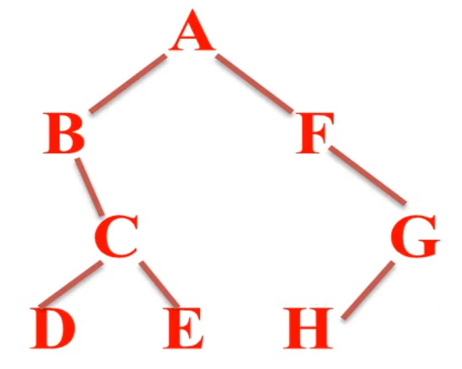
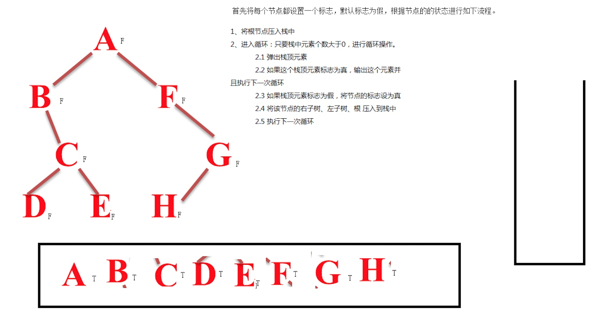

## 1 树

* 根
* 叶子
* 结点
* 结点的度
* 树的度（结点度的最大值）：3
* 树的深度、高度（层数）：4
* 有序树（二叉树）
* 无序树
* 表示方法：
    * 图形表示法
    * 文字表示法     
    A(B(E(K, L), F), C(G), D(H(M), I, J))
    * 左孩子右兄弟表示法：将多叉树转换为二叉树     
    * 

## 2 二叉树

* 满二叉树
* 完全二叉树          
最后一层只缺少右边的若干结点

### 2.1 二叉树的性质
1. 二叉树第i层上最多有2^i-1个结点
2. 深度为k的二叉树最多有2^(k)-1个结点
3. 一颗二叉树，若度为2的结点数有n个，则叶子数为n+1个
4. 具有n个结点的完全二叉树的深度为logn+1
5. 完全二叉树，编号为i的结点，其左孩子为2i，右孩子为2i+1，双亲为i/2

### 2.2 二叉树的遍历

* 先序遍历：先根 再左 再右    
`ABCDEFGH`
* 中序遍历：先左 再根 再右    
`BDCEAFHG`
* 后序遍历：先左 再右 再根     
`DECBHGFA`

### 2.3 递归函数求二叉树叶子数和深度

### 2.4 二叉树的非递归遍历

