## 1 Internet
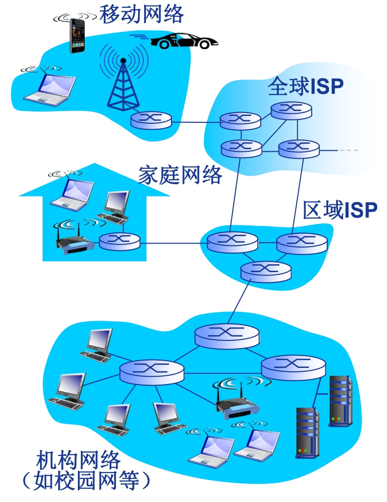
* Internet 是ISP(Internet Service Provider)网络互连的“网络的网络”
    * 主机(hosts)/端系统(end systems)
    * 通信链路
    * 分组交换：路由器(routers)、交换机(switches)
* Internet 为网络应用提供API

### 1.1 Internet 结构

* IXP：Internet exchange point 连接一级ISP
* 内容提供商网络(Google): 运行自己的网络，就近为其用户提供服务、内容

## 2 网络协议
> 计算机网络中数据交换实现约定的规则

* 语法
* 语义
* 语序

## 3 计算机网络的结构
### 3.1 网络边缘
* 主机/端系统
* 网络应用程序
    * C/S(Client/Server)应用模型
    * P2P应用模型

### 3.2 网络介质
#### 类型
* 数字用户线路(DSL)：独占
    利用不同**载波**传输声音、数据
* 电缆网络共享：共享
    **频分多路复用**：在不同的载波上传输不同的频道

#### 接入方式
* 家庭接入

```
    hosts---路由器/防火墙/NAT---电缆/DSL调制解调器---电话线/电视电缆---连接头端
          |
  hosts-------无线接入点
```

* 机构接入

```
    hosts
      |
hosts---交换机---机构路由器---连接ISP的机构接入链路
                    |
                    ----交换机---机构邮件、web服务器
// 端系统通常连接以太网交换机
```

* 无线接入
    * 无线局域网 LANs
    * 广域无线接入 3G、4G、LTE
    
### 3.3 网络核心
* Internet
* 路由器/交换机

#### 网络核心的关键功能：数据交换
* 路由 routing：通过**路由算法**得到本地转发表确定分组从源主机到目的主机的传输路径
* 转发 forwarding：将分组从路由器的输入端口交换至正确的输出端口

## 4 数据交换
### 4.1 电路交换
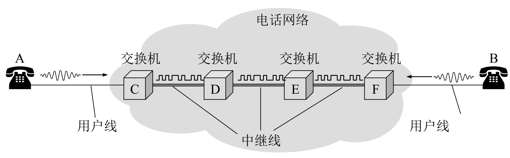

典型：电话网络
1. 建立连接
2. 通信
3. 释放连接

电路交换独占资源，而不是独占线路，因为电路交换可以通过**多路复用技术**共享**中继线**

#### 多路复用


> 多路复用技术将链路/网络资源划分为“资源片”分配给各路calls，每路独占分配到的资源片进行通信，资源片可能闲置idle没释放

* 频分多路复用 FDM frequency division multiplexing
    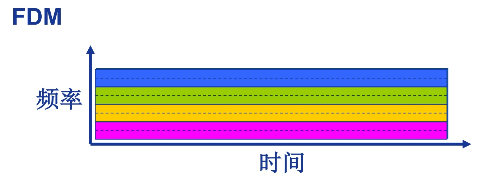
    有线电视网络
    各个用户占用不同的频率带宽资源
    
* 时分多路复用 TDM time division multiplexing
    
时分多路复用就是将时间划分为一段段等长的时分复用帧，每个用户在每个TDM帧上占用固定序号的时隙，所有用户在不同的时间占用相同的频带宽度

* 波分多路复用 WDM wavelength division multiplexing
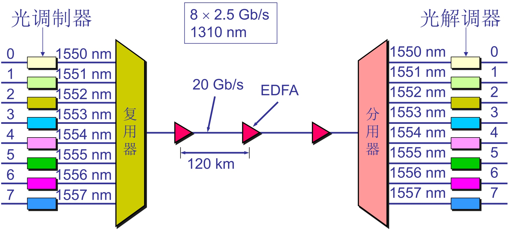
波分复用就是光的频分复用

* 码分多路复用 CDM code division multiplexing
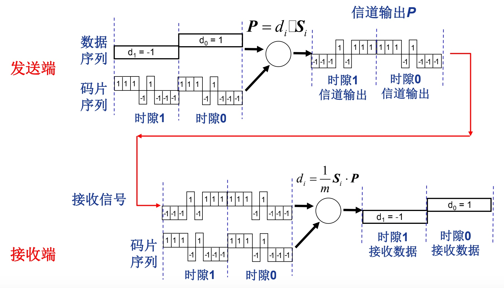

广泛应用于无线链路共享
每个用户分配一个唯一的m bit码片序列，各用户码片序列相互正交，所有用户共享相同的频率载波，利用各自码片序列编码和解码数据
编码信号 = 原始数据 * 码片序列

### 4.2 报文交换
报文：源发送信息的整体

### 4.3 分组交换
分组交换就是将报文分拆成一个个小的数据包进行传输，需要进行报文的拆分和重组，会产生额外的开销
* 统计多路复用 statistical multiplexing
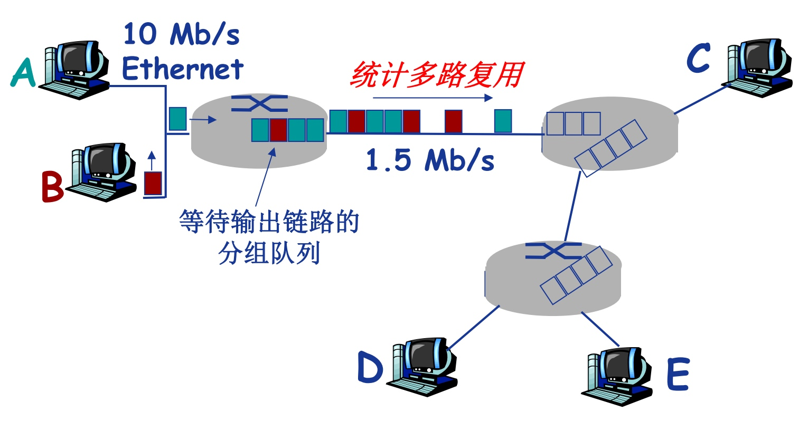
按需共享线路

* 存储-转发交换方式：报文交换(完整报文)和分组交换(较小分组)都采用存储-转发的交换方式

#### 4.4 分组交换 vs 报文交换
> 8b: bits = 1B: Byte
> 10MB = 1.25mb


报文：M bits
链路带宽：R bps
分组大小：L bits
路由器数：n
跳步数：h=n+1
* 报文交换：**串行**转发报文
时延 = h*M/R
* 分组交换：**并行**转发报文
T = M/R + nL/R


* 分组交换允许更多用户同时使用网络-网络资源充分共享
* 分组交换适用于突发数据传输网络（间隔、随机性）-资源充分共享、无需呼叫建立
* 分组交换可能会发生拥塞：分组延迟和丢失-需要协议处理可靠数据传输和拥塞控制
* 电路交换可以提供电路级的带宽和性能保障

## 5 计算机网络性能
* 速率/数据率：数据传输额定速率 bps
* 带宽：数字信道所能传送的最高数据率 bps
* 时延
    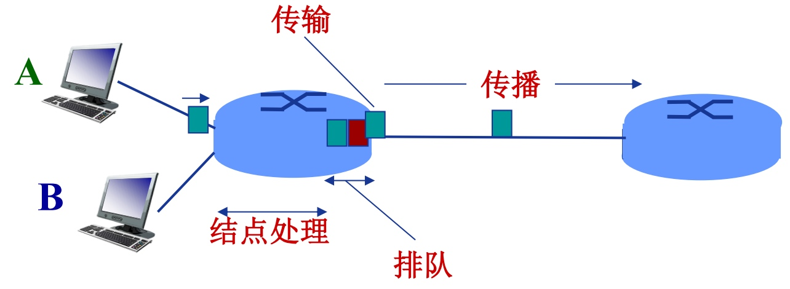

    * d_proc 结点处理延迟
        * 差错检测
        * 确定输出链路
    * d_queue 排队延迟
        * 等待输出链路可用
        * 流量强度 La平均分组到达速率/R -》1 平均排队延迟很大
    * d_trans 传输延迟
        * L分组长度/R链路带宽
    * d_prop 传播延迟
        * d物理链路长度/s信号传播速度
* 时延带宽积 = 传播时延 * 带宽
        传播过程中这段链路能容纳的最大比特数
* 丢包
    * 分组到达已满缓存队列后将被丢弃
    * 丢弃分组可能由前序结点或源重发，也可能不重发
    * 丢包率
* 吞吐量/率 Throughput    
    * 发送端与接受端之间的传送数据速率 bps = 瓶颈链路的数据率
    * 瓶颈链路：端到端路径上，限制端到端吞吐量的链路
    
## 6 计算机网络体系结构

> 分层网络结构：是计算机网络的各层极其协议的集合
>
> 每一层都需要遵循本层的协议，使用下层提供的服务，实现本层的功能，向上提供功能
>
> 相邻层通过接口进行交互，同层之间通过服务访问点SAP交换原语/发送请求，指定请求的特定服务

### 6.1 OSI 参考模型

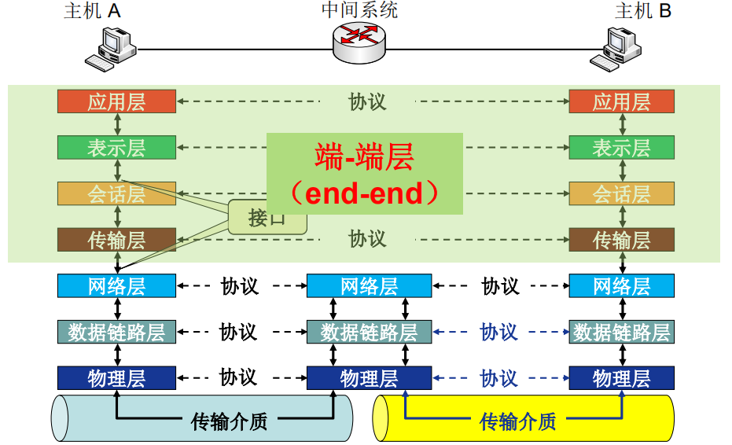

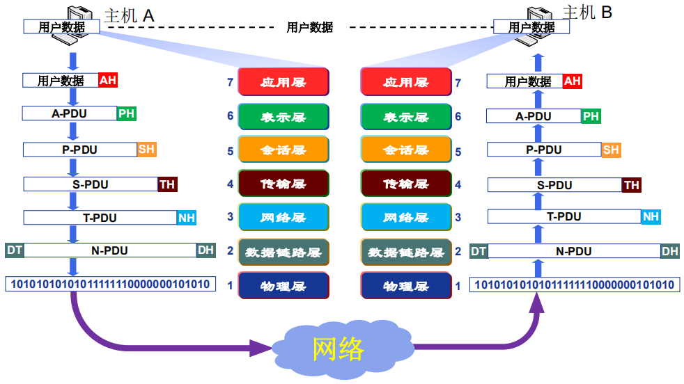

数据封装：增加**控制信息**，构造协议数据单元 PDU

* 地址：标识发送端/接收端
* 差错检测编码：用于差错检测或纠正
* 协议控制：实现协议功能的附加信息：优先级、服务质量 Qos、安全控制


#### 6.1.1 物理层


完成单一比特流的传输

* 传输模式
  * 单工 Simplex：电视 单向
  * 半双工 half-duplex：对讲机 交期双向
  * 全双工 full-duplex：双向


#### 6.1.2 数据链路层

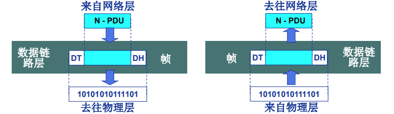

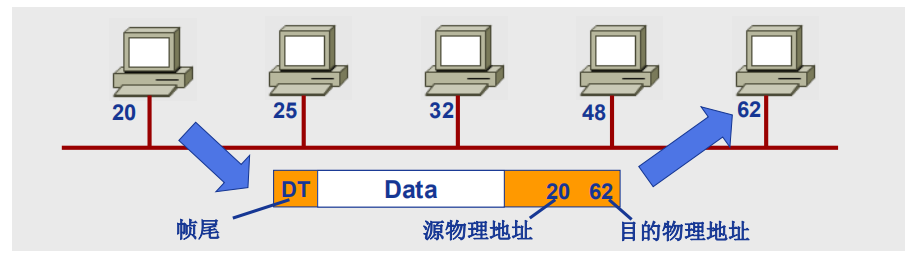

* 组帧 Framing，以帧为数据单位在物理链路上进行node-to-node数据传输
  * 物理寻址
    * 帧头：发送端/接收端物理地址
  * 帧尾：差错检测
* 功能：
  * 流量控制：避免淹没接收端
  * 差错控制：检测并重传损坏或丢失帧，并避免重复帧
  * 访问控制：在任意时刻决定哪个设备拥有链路控制使用权


#### 6.1.3 网络层

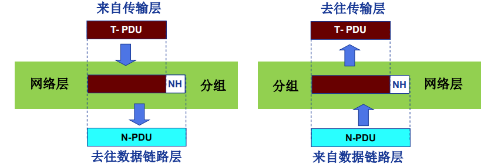

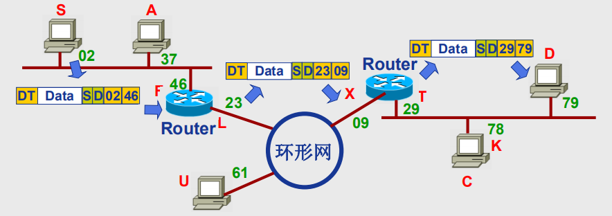

* 逻辑寻址（IP地址），负责源主机到目的主机数据分组的交付
* 功能
  * 路由
  * 分组转发


#### 6.1.4 传输层

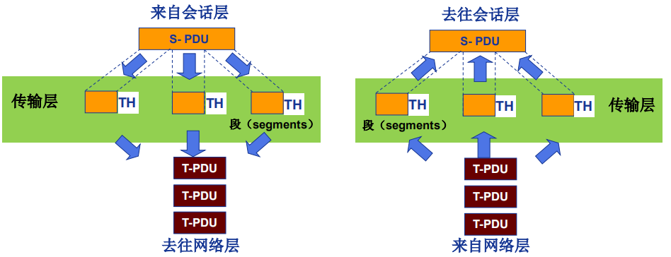

> 负责端到端进程间完整报文的传输

* 功能：

  * 分段与重组
  * SAP寻址：确保将完整报文提交给正确进程，如端口号

  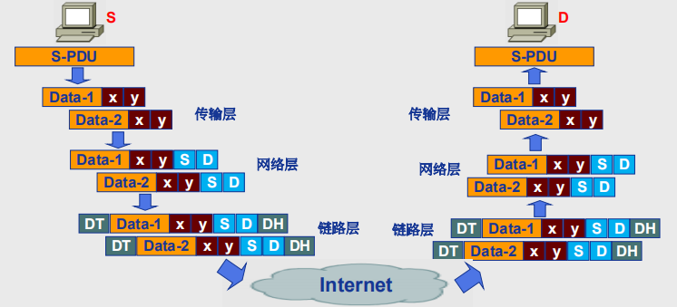

  * 连接控制
  * 流量控制
  * 差错控制

#### 6.1.5 *会话层

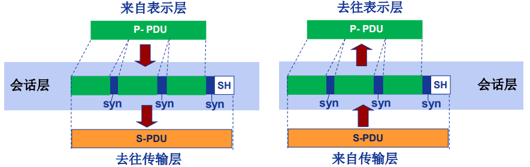

* 会话控制：建立、维护和删除会话
* 同步：在数据流中插入“同步点”（恢复）

#### 6.1.6 表示层


* 编码/解码
* 加密/解密
* 压缩/解压缩

#### 6.1.7 应用层

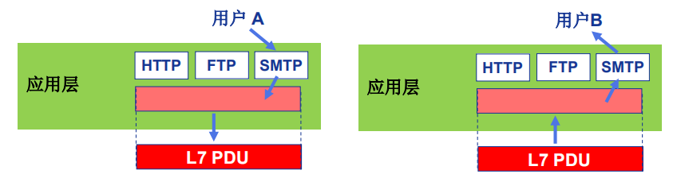

> 支持用户通过用户代理（浏览器）或网络接口使用网络（服务）

* 文件传输 FTP
* 电子邮件 SMTP
* Web HTTP

### 6.2 TCP/IP 参考模型

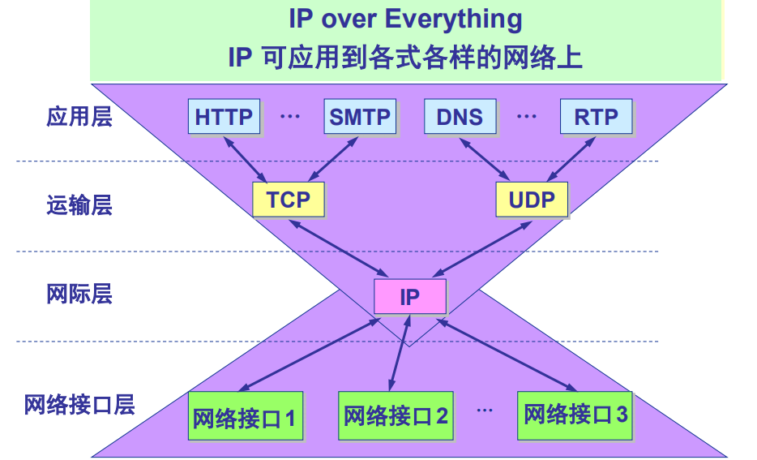

* 应用层： 支持各种网络应用 报文
  * FTP、SMTP、HTTP
* 传输层：进程-进程的数据传输 段
  * TCP，UDP
* 网络层：源主机到目的主机的数据分组路由和转发 数据报
  * IP协议、路由协议
* 链路层：相邻结点的数据传输 帧
  * 以太网Ethernet、802.11Wifi、PPP
* 物理层：比特传输

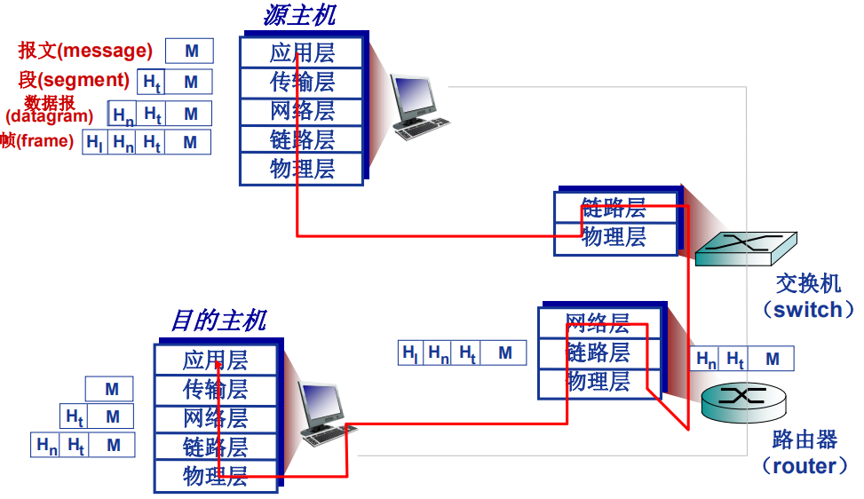