# 1 网络应用的体系结构

* C/S 客户机服务器结构
* P2P 点对点结构
* Hybrid 混合结构
  * 文件搜索采用C/S结构
  * 文件传输采用P2P结构

# 2 网络应用进程间通信

## 2.1 Socket套接字

进程间通信利用Socket发送/接收消息实现

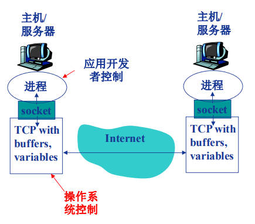

## 2.2 寻址进程

IP地址 +端口号

## 2.3 应用层协议

HTTP，SMTP，DNS...

协议的内容：

* 消息类型：请求消息、相应消息
* 消息语法：字段
* 消息语义
* 规则：何时发送/响应消息

# 3 网络应用的需求与传输层服务

* 需求
  * 数据丢失/可靠性 文件传输
  * 时间/延迟 网络游戏
  * 带宽：某些应用只有带宽达到最低要求时才有效 网络视频
  * 安全性
* 传输层服务
  * TCP
    * 面向连接
    * 可靠传输
    * 流量控制：发送方不会发送速度过快，超过接收方的接受能力
    * 拥塞控制：当网络负载过重时能够限制发送方的发送速度   
    * 不提供时间/延迟保障
    * 不提供最小带宽保障
  * UDP
    * 无连接
    * 不可靠、无其他保障
    * 只提供基本服务，网络层自由

# 3 Web应用

## 3.1 对象寻址

网页包含多个对象

对象寻址：URL 统一资源定位符 scheme://host:port/path

## 3.2 HTTP协议

* 超文本传输协议

* C/S结构
  * browser
  * web server
* 无状态： 服务器不会维护任何有关客户端过去所发送请求的消息

 # 4 HTTP连接

## 4.1 响应时间分析

* RTT round trip time：从客户端发送一个很小的数据包到服务器并返回所经历的时间

* 响应时间 time = 2RTT + 文件发送时间

  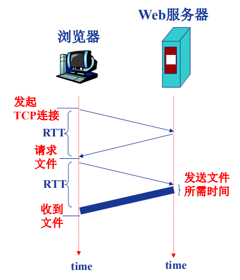

## 4.2 HTTP连接

* 非持久性连接：每个TCP连接(可以并行)最多允许传输一个对象，2nRTT
* 持久性连接：每个TCP连接(保持连接)允许传输多个对象，1+nRTT
  * 无流水的持久性连接：客户端只有收到前一个响应后才会发送新的请求
  * 带有流水机制的持久性连接：客户端只要遇到一个引用对象就尽快发出请求 2RTT

 # 5 HTTP消息格式

* 请求消息 request

  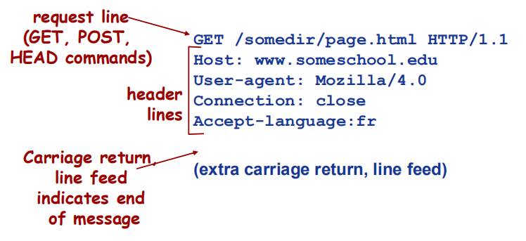

  * GET 获取数据

  * POST 提交数据
  * HEAD 测试，请server不要将所请求的对象放入相应消息中
  * PUT 上传文件
  * DELETE 删除文件

* 响应消息 respond

  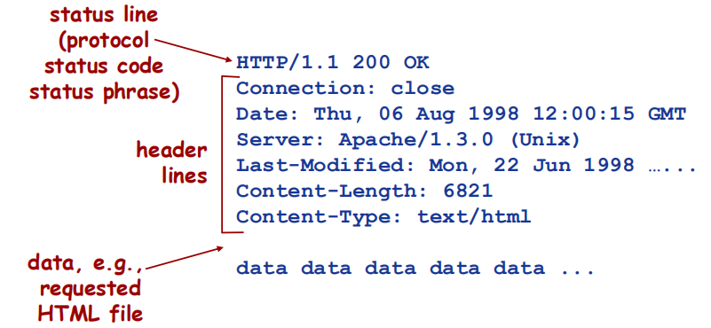

  * 200 ok
  * 404 not found
  * 400 bad request
  * 301 moved permanently
  * 505 http version not supported

# 6 Cookie技术

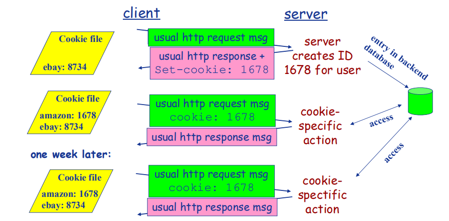

* cookie组件
  * HTTP响应消息的cookie头部行
  * HTTP请求消息的cookie头部行
  * 客户端主机上的cookie文件，由浏览器管理
  * web服务器端后台数据库 
* 作用
  * 身份认证保持
  * 购物车
  * 推荐
  * web e-mail

# 7 Web缓存/代理服务器技术

* 缓存服务器既充当服务器，也充当客户端

* 条件性GET方法

  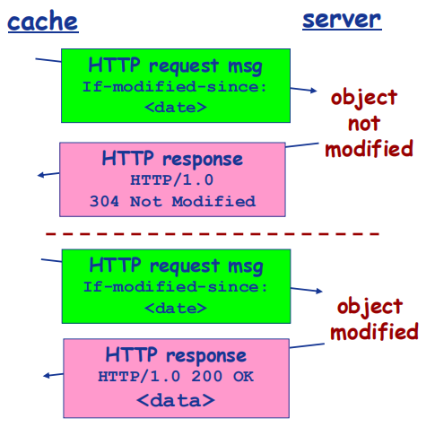

  * 在HTTP请求消息中声明所持有版本的日期
  * 如果缓存版本是新的，响应消息中不包含对象
  * 304 not modified

# 8 Email应用

* 异步应用

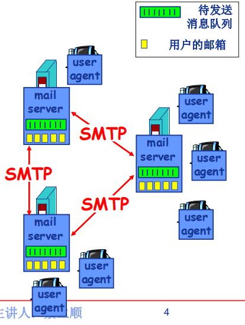

## 8.1 SMTP协议 simple mail transfer protocol

* 持久性连接

* TCP传输

* 多个对象在由多个部分构成的消息中发送 HTTP：每个对象封装在独立的响应消息中

* 命令/响应式交互模式

  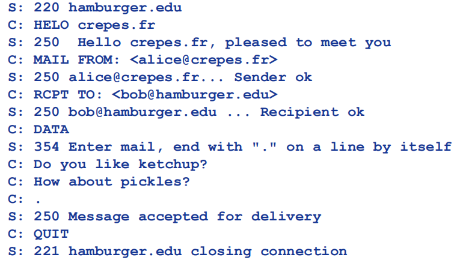

# 9 Email消息格式与邮件访问协议

## 9.1 Email消息格式

* 文本消息格式标准
* MIME 多媒体邮件扩展

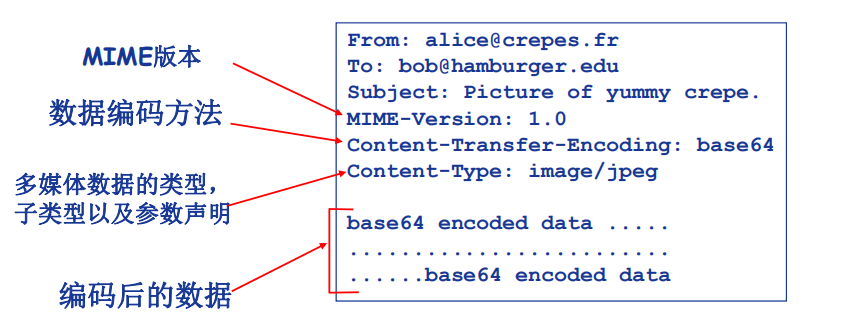

## 9.2 邮件访问协议

* POP3 post office protocol
  * 认证/授权
  * 下载并删除
  * 下载并保持
  * 无状态
* IMAP internet mail access protocol
  * 有状态
  * 可搜索
* HTTP 网页邮箱

# 10 DNS 概述

* 多层命名服务器构成的分布式数据库
* 负载均衡：一个域名映射多个web服务区 
* 用应用层协议实现Internet核心功能
* 本地域名服务器 -》 根域名服务器 -》 顶级域名服务器 -》 权威域名服务器
* 本地域名服务器
  * 每个ISP有一个本地域名服务器作为默认域名解析器
  * 本地域名服务器一般会缓存顶级域名服务器的映射

## 10.1 迭代查询

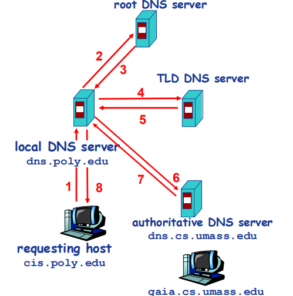

## 10.2 递归查询

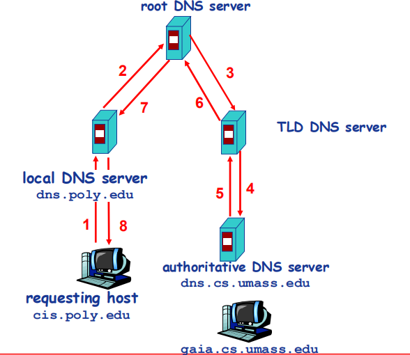

# 11 DNS记录

RR(resource records) format:(name, value, type, ttl) time to live

* TYPE = A (主机域名，IP地址)
  * (dns1.zuoyiming.com, 212.212.212.1, A)
* TYPE = NS (域，权威域名解析服务器的主机域名)
  * (zuoyiming.com, dns1.zuoyiming.com, NS)
* TYPE = CNAME (域名别名，真实域名)
* TYPE = MX (name, 邮件服务器)

# 12 P2P应用：文件分发

* BitTorrent

  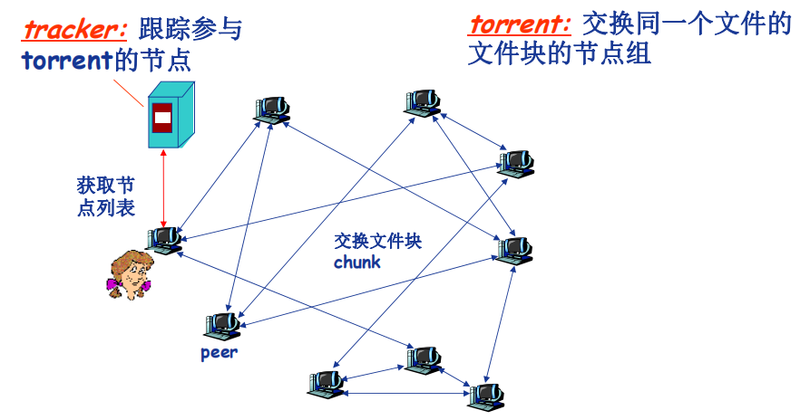

* 文件划分为256KB的chunk
* 节点加入torrent
  * 没有chunk，逐渐积累
  * 向tracker注册以获取节点清单，与某些节点建立连接
    * 定期查询每个邻居持有的chunk列表，请求获取确实的chunk（稀缺有限）
* 下载同时向其他节点上传chunk
  * 发送chunk tit-for-tat 一报还一报
    * 向4个邻居发送chunk：正在向其发送chunk且速率最快的4个
    * 每10秒重新评估top4
    * 每30秒随机选择一个节点，向其发送chunk（变化机制）
* 获取完整文件后，可离开可留下

# 13 P2P应用：索引技术

* 文件共享 电驴
  * (文件，IP+port)
* 即时消息 QQ
  * (用户，IP)

## 13.1 集中式索引

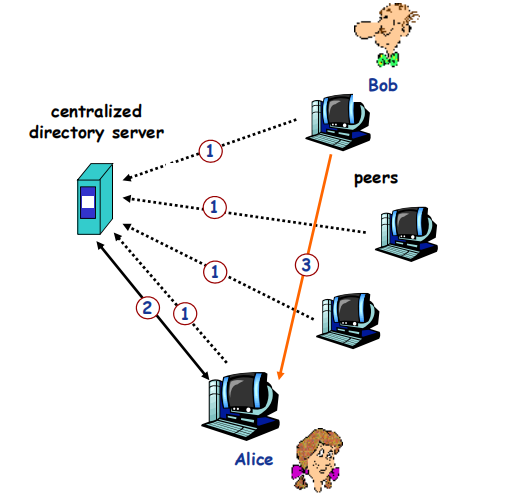

* 节点加入时，服务器建立其索引
* 建立连接时 P2P

## 13.2 洪泛式查询

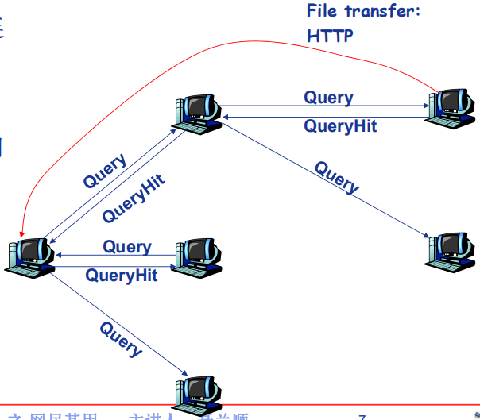

* 完全分布式架构
* 每个节点只对其共享的文件建立索引
* 覆盖网络：Graph
  * 查询时通过已建立的TCP连接发送
  * 节点转发查询消息
  * 查询命中，利用反向路径发回查询节点

* 文件传输时 P2P

# 13.3 层次式覆盖网络 Skype

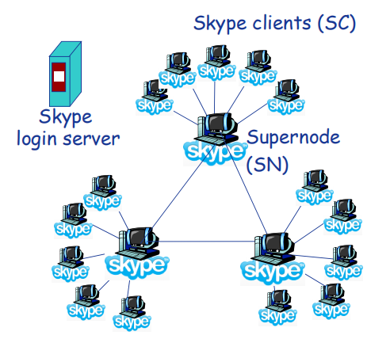

* 超级节点
  * 超级节点建立子节点共享文件的索引
  * 通话时 P2P 本质上